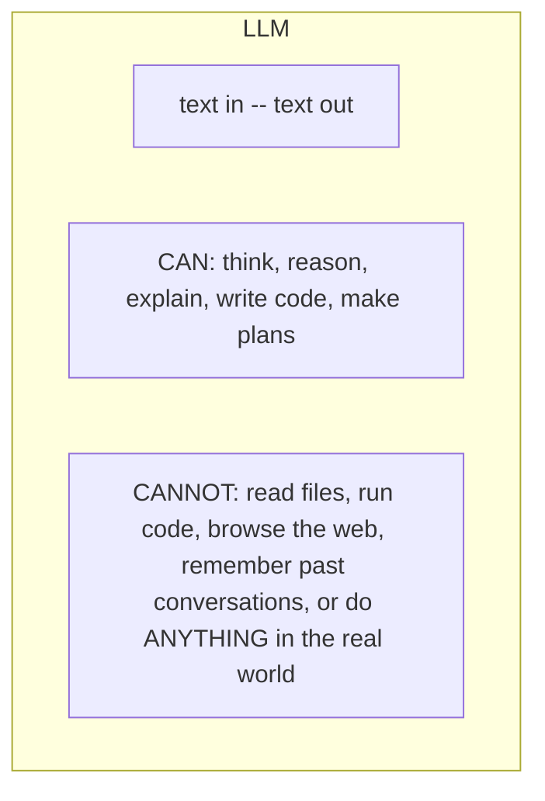
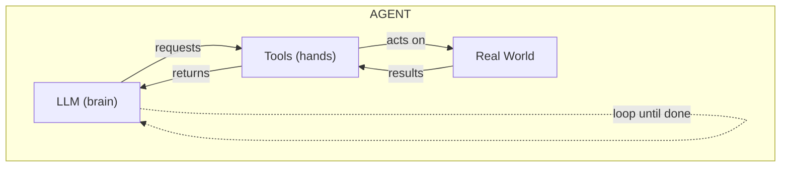
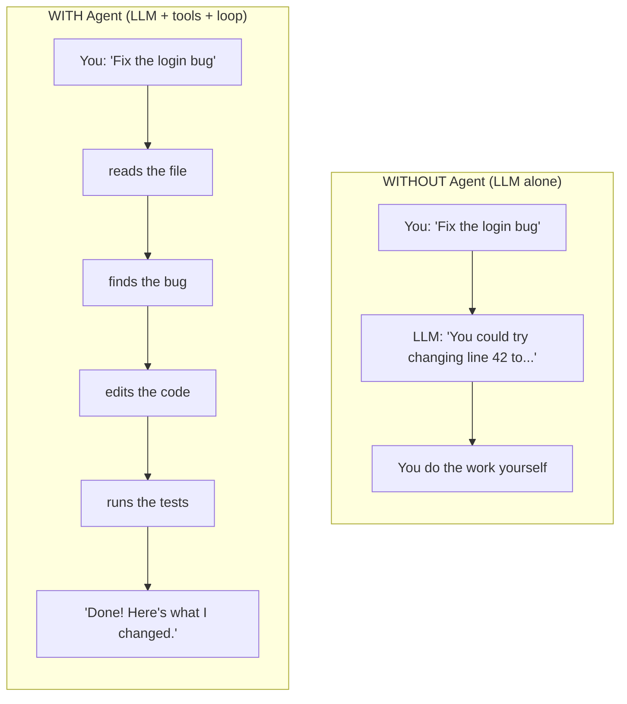
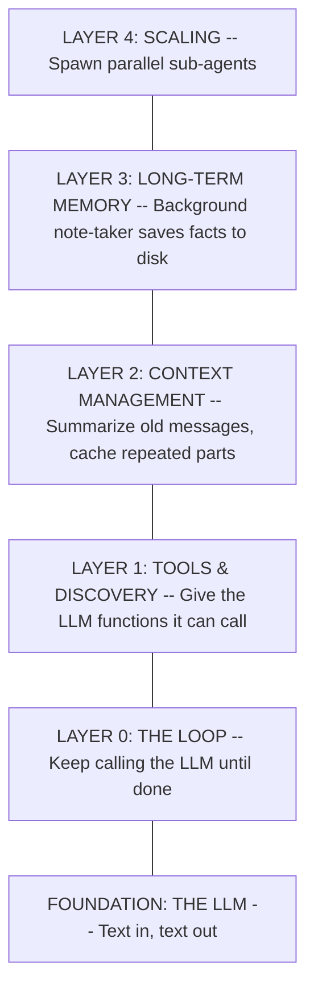
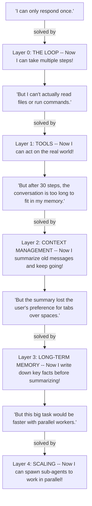
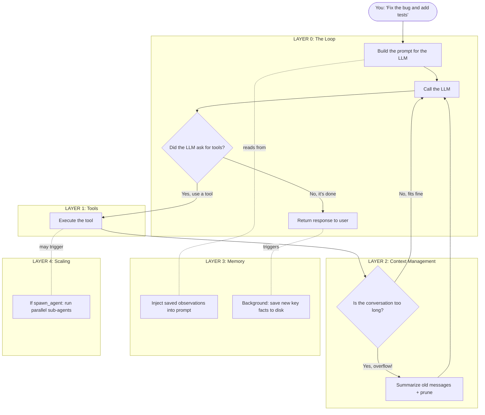
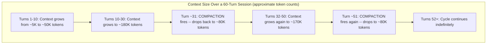
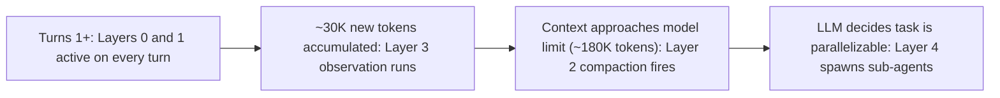

# AI Agent Architecture Guide

> How AI agents work under the hood. No prior LLM knowledge required.

---

> **Viewing Mermaid diagrams:** This document uses [Mermaid](https://mermaid.js.org/) flowchart syntax. If you are reading this in a plain text editor and see raw `flowchart TD` blocks rather than visuals, you can render them by: opening this file in VS Code with the "Markdown Preview Mermaid Support" extension, pasting any block into [mermaid.live](https://mermaid.live), or opening this file in GitHub's web UI. Every diagram in this document also has a plain-text description immediately below it, so the content is fully accessible without rendering.

---

## Quick Reference: Key Terms

Several terms are used heavily before the glossary at the end. Here they are upfront:

| Term | Plain English |
|------|--------------|
| **LLM** | The AI model (e.g., Claude, GPT). Thinks in text. Can't do anything else on its own. |
| **Token** | How LLMs measure length. 1 token is roughly 1 word or 4 characters. "200K tokens" means roughly 200,000 words. |
| **Context Window** | The LLM's short-term memory for a single conversation. Has a hard size limit (e.g., 200K tokens for Claude Sonnet). Once full, nothing new fits without removing something old. |
| **System Prompt** | Instructions you (the developer) write that the LLM reads on every call. Unlike the user's chat messages, the system prompt does not appear in the chat UI — but you write it, own it, and can read and edit it. In this codebase the default lives at `src/backend/agent/prompts/normal_prompt.txt`. You can override it per-deployment with `resources/prompts/system.md`. |
| **Tool** | A TypeScript function that the LLM can request to run. The LLM describes which tool to call and what arguments to pass; the agent loop executes the function and returns the result. |
| **Agent Loop** | The core cycle: call the LLM, execute any tools it requests, feed results back, call again — repeat until no more tools are requested. |
| **Compaction** | When the conversation grows too long: summarize everything so far into a compact message, discard old messages, and continue from the summary. |
| **Pruning** | Replacing old, large tool result outputs with `[Old tool result content cleared]` to save space without losing the conversational flow. |
| **Prompt Caching** | An Anthropic API feature. You mark a prefix of your prompt as static; the API caches it server-side. On subsequent calls with the same prefix, the cached portion is read at ~10% of the normal token price — roughly 90% cheaper. It is automatic once the prefix is stable; no opt-in call is required. |
| **Observational Memory** | A background note-taker that reads new conversation and distills key facts into a compact log saved to disk, so those facts survive compaction. |
| **Sub-agent** | A separate copy of the agent that handles one sub-task in its own isolated conversation context, in parallel with the parent. |
| **Skill** | A downloadable instruction set the LLM can activate on demand (e.g., "Here's how to do code review"). Loaded lazily, not at startup. |
| **Plugin / MCP** | An external service that registers new tools with the agent at runtime. MCP (Model Context Protocol) is the standard protocol for this. |
| **Code Mode** | Instead of many individual tool definitions, give the LLM one `execute_code` tool plus TypeScript APIs. Saves tokens, preserves the prompt cache, and reduces round trips. |

---

## 1. Start Here: What Is an LLM?

You've used ChatGPT or Claude. You type something, it types back. That's an **LLM** -- a Large Language Model.

An LLM is incredibly smart, but also incredibly limited. It's a **brain in a jar**:



_Diagram: A single box labeled "LLM" containing three items — what goes in (text), what it can do (think, reason, plan), and what it cannot do (act on the real world in any way)._

If you ask an LLM "fix this bug," it can only **tell you how**. It can't actually open the file and fix it. It has no hands.

---

## 2. What Is an Agent?

An agent wraps the LLM with **tools** (hands) and a **loop** (persistence) so it can actually do work.

**The formula: LLM + Tools + Loop = Agent**



_Diagram: The LLM requests a tool call; the tool acts on the real world (reads a file, runs a command, etc.); the world returns a result back through the tool to the LLM. A dotted arrow from the LLM back to itself represents the loop that keeps this cycle going._

Here's the difference in practice:



_Diagram: Two parallel examples side-by-side. Without an agent: user asks, LLM replies with advice, user must do the work. With an agent: user asks and the agent autonomously reads the file, finds the bug, edits the code, runs tests, and reports back._

**What does a tool look like in code?**

Each tool is a TypeScript object with a `definition` (a JSON schema that tells the LLM how to call it) and an `execute` function (which the agent loop runs). Here is a simplified version of the `read` tool from `src/backend/tools/read.tool.ts`:

```typescript
// The LLM sees the `definition` and knows it can call this tool.
// The agent loop sees `execute` and knows how to actually run it.
export const readTool: Tool = {
  definition: {
    name: 'read',
    description: 'Read the contents of a file.',
    inputSchema: {
      type: 'object',
      properties: {
        file_path: { type: 'string', description: 'Relative path to the file' }
      },
      required: ['file_path']
    }
  },
  execute: async (input, context) => {
    const content = await readFile(
      resolve(context.projectPath, input.file_path as string), 'utf-8'
    )
    return { output: content, isError: false }
  }
}
```

The LLM never calls `execute` directly. When it wants to use a tool, it emits a structured JSON message like:

```json
{ "name": "read", "input": { "file_path": "src/app.ts" } }
```

The agent loop intercepts this, finds the matching function in the tool registry (`src/backend/tools/registry.ts`), calls `execute`, and feeds the result back to the LLM as the next message.

**What does "done" mean? Can the loop run forever?**

The loop exits when the LLM's stop reason is not `tool_use` — meaning the model finished its turn without requesting any more tools. From `src/backend/agent/agent-loop.ts`:

```typescript
if (event.stopReason === 'tool_use' && pendingToolCalls.length > 0) {
  continueLoop = true   // LLM asked for tools -- keep going
} else {
  continueLoop = false  // LLM is done
}
```

There is no hard step count limit in the current loop implementation. The loop continues as long as the LLM requests tools. The only external termination path is cancellation via `AbortController` (e.g., the user clicks "Stop" in the UI, or a parent agent is cancelled).

---

## 3. The Five Layers

A working agent isn't just "LLM + tools + loop." As you build one, you hit problems. Each problem needs a new layer to solve it.

Think of it like building a house -- you start with the foundation and add floors:



_Diagram: A vertical stack of six boxes. At the bottom is the LLM foundation. Above it, in order from bottom to top: Layer 0 (the loop), Layer 1 (tools), Layer 2 (context management), Layer 3 (long-term memory), Layer 4 (scaling). Each layer rests on the one below it._

Here's the key idea: **each layer exists because the layer below it has a problem.**



_Diagram: A chain of alternating problem and solution boxes. Each problem flows to a layer that solves it, which then reveals the next problem, until all four layers above Layer 0 have been justified._

> **You don't need all layers.** A simple agent only needs Layer 0 + Layer 1. Add more layers as your use case demands it.
>
> **Are these layers already built?** Yes. All five layers (L0-L4), including the L1+ enhancements described in Section 6, are already implemented in `src/backend/agent/`. You do not need to build them from scratch. The guides explain how they work so you can configure, tune, and extend them.

---

## 4. How the Layers Work Together

When the user sends a message, every layer plays a role. Here's what happens:



_Diagram: The user's message enters the Loop (Layer 0). The loop builds a prompt, reading saved facts from Layer 3 (Memory). The LLM is called. If it requests a tool, Layer 1 executes it; if that tool is `spawn_agent`, Layer 4 creates a parallel sub-agent. After each tool call, Layer 2 checks whether the conversation is too long and summarizes if so. The loop repeats until the LLM signals it is finished. When the loop ends, Layer 3 runs in the background to save new observations._

**Read the diagram like this:**
1. Your message enters the **Loop** (Layer 0).
2. The loop builds a prompt. **Memory** (Layer 3) injects past observations into it.
3. The LLM is called. If it requests a tool, **Tools** (Layer 1) executes it. If that tool is `spawn_agent`, **Scaling** (Layer 4) creates a parallel worker.
4. After tool execution, **Context Management** (Layer 2) checks if the conversation is too long. If so, it summarizes.
5. The loop repeats until the LLM has no more tool requests.
6. After the loop ends, **Memory** (Layer 3) quietly saves key facts for next time.

**Where is Layer 3 memory stored?**

Observations are written to a JSON file at `.storage/<session-id>/observations.json`. The file persists between sessions — if the user reopens a session later, the observations are still there. Memories accumulate and are appended to on each observation run; they are never automatically evicted.

A sample observations file looks like:

```json
{
  "observations": "* (14:05) User prefers tabs over spaces\n* (14:10) Working in src/auth/login.ts — fixing JWT expiry bug",
  "lastObservedMessageId": "msg_abc123",
  "updatedAt": "2025-01-15T14:10:00.000Z"
}
```

**What happens when a sub-agent fails?**

If a sub-agent errors or times out, the error message is returned to the parent agent as the tool result. The parent can then decide how to proceed — retry, use a different approach, or surface the failure to the user. Sub-agents do not share context with each other or with the parent; each runs in its own isolated conversation.

---

## 5. What Happens Over a Long Conversation

The layers don't all kick in at once. They activate as the conversation grows.

**Context size over time** — the conversation grows until compaction fires, then resets and grows again, cycling indefinitely:



_Diagram: A linear sequence of six boxes. Context grows steadily, approaches the model limit, compaction fires and resets the context size, then it grows again. This sawtooth cycle repeats indefinitely, allowing the conversation to run without hitting the hard context limit._

**Which layer activates when** — approximate order in a typical session:



_Diagram: Four boxes in a horizontal sequence showing the rough order in which layers become active. Layers 0 and 1 are always active. Layer 3 fires periodically based on how many new tokens have appeared. Layer 2 fires when the context is nearly full. Layer 4 is used only when the LLM itself decides to parallelize._

**Where do these thresholds come from, and are they configurable?**

- **Layer 3 observation threshold (30K tokens):** The `messageTokens` field in `ObservationalMemoryConfig`, defined in `src/backend/agent/observational-memory.ts`:

  ```typescript
  const OM_DEFAULTS: Required<ObservationalMemoryConfig> = {
    enabled: true,
    model: '',         // empty = use the same model as the main agent
    messageTokens: 30_000   // <-- this threshold
  }
  ```

  The check is "have more than 30K tokens of new (unobserved) conversation accumulated since the last observation run?" — not a turn count. It is configurable per-session by passing `observationalMemory: { messageTokens: N }` when calling `runAgent()`. The turn numbers in the diagram above (e.g., "Turn ~15") are rough examples for a conversation with average message sizes, not a hardcoded turn count.

- **Layer 2 compaction threshold:** Compaction fires when `isOverflow()` returns true in `src/backend/agent/compaction.ts`. The function checks whether total tokens in the last LLM call are within `COMPACTION_BUFFER` (20,000 tokens) of the model's context limit. For a 200K-token model, that means compaction fires at roughly 180K total tokens. This is measured from actual token usage reported by the API, not an estimate. These constants (`COMPACTION_BUFFER`, `MAX_OUTPUT_TOKENS`) are defined at the top of `compaction.ts` and can be adjusted there.

- **Layer 4 (sub-agents):** There is no automatic threshold. The LLM decides when to call `spawn_agent` based on its own judgment about whether a task can be parallelized. The system prompt describes the tool's purpose; the model decides when to use it.

**About prompt caching and the ~90% cost figure:**

Anthropic charges roughly 10% of the normal input-token price for tokens read from cache (versus 100% for freshly processed tokens). That is where "saves ~90% cost" comes from — it applies to the cached prefix only, not the entire conversation. The cache is populated automatically; no explicit opt-in API call is required. The requirement is that the cached prefix must be byte-for-byte identical across calls. The agent loop in `agent-loop.ts` achieves this by calling `buildSystemPrompt()` once before the loop starts (so it does not change mid-conversation) and by sorting tool definitions alphabetically to ensure a stable ordering.

**Resolving the Layer 3 timing — two statements that look contradictory:**

- Section 4 says "Memory saves key facts *after the loop ends*."
- The diagram above says "Layer 3 fires when ~30K new tokens have accumulated."

Both are true. The `observe()` function is *called* after every loop completion, but it only *does work* when the unobserved token threshold has been crossed. So the observation is attempted on every turn, but it actually runs only when enough new content has built up. The 30K figure is the internal gate; the turn numbers in the timeline are illustrative only.

The agent can work **indefinitely** -- the context never overflows because Layer 2 keeps resetting it, and Layer 3 ensures nothing important is forgotten.

---

## 6. Where to Go Next: Detailed Guides

The sections above give you a mental model of the full system. Each layer has its own document with the specific problem it solves, step-by-step examples, and the exact files that implement it.

| | Layer | Guide | What you'll learn |
|-|-------|-------|-------------------|
| L0 | The Loop | [agent-loop.md](./agent-loop.md) | The foundation -- how a while loop turns a one-shot LLM into a multi-step worker |
| L1 | Tools | [tool-execution.md](./tool-execution.md) | How the LLM requests actions (read files, run commands) and the loop executes them |
| L1+ | Discovery | [progressive-discovery.md](./progressive-discovery.md) | Loading skills and plugins on demand so the LLM isn't overwhelmed by 100+ tools |
| L1+ | Code Mode | [code-mode.md](./code-mode.md) | Replacing N tool definitions with 1 `execute_code` tool to cut tokens, preserve cache, and reduce round trips |
| L2 | Context | [context-management.md](./context-management.md) | Caching, compaction, and pruning to keep conversations within the LLM's memory limit |
| L3 | Memory | [observational-memory.md](./observational-memory.md) | A background note-taker that saves important facts before compaction throws them away |
| L4 | Scaling | [subagents.md](./subagents.md) | Spawning parallel sub-agents to handle independent tasks at the same time |

**What is "L1+"?** Progressive Discovery and Code Mode are enhancements to Layer 1, not independent new layers. They solve problems that only appear once you have tools (Layer 1) working. "L1+" signals that they sit between Layer 1 and Layer 2 in the stack. You do not need them for a working agent; they become important at scale (many tools, large plugin ecosystems). Both are fully implemented — see `src/backend/tools/activate-skill.tool.ts` and the MCP manager at `src/backend/mcp/mcp-manager.ts`.

> **Read the guides in order.** Layer 0 starts with zero assumptions. Each subsequent guide explains the problem introduced by the previous layer and what changes are needed.

---

## 7. Glossary

| Term | Plain English |
|------|--------------|
| **LLM** | The AI model (e.g., Claude, GPT). Thinks in text. Can't act on the real world without tools. |
| **Token** | How LLMs measure length. 1 token is roughly 1 word or 4 characters. |
| **Context Window** | The LLM's short-term memory. Has a hard limit (e.g., 200K tokens for Claude Sonnet). Once full, old content must be removed or summarized before anything new can fit. |
| **System Prompt** | Instructions the developer writes that the LLM reads on every call. Not shown to the end user in the chat UI, but fully visible and editable by the developer. Default in this codebase: `src/backend/agent/prompts/normal_prompt.txt`. Override path: `resources/prompts/system.md`. |
| **Tool** | A TypeScript function exposed to the LLM via a JSON schema definition. The LLM requests a tool by name and arguments; the agent loop runs the actual function. All built-in tools: `src/backend/tools/`. |
| **Agent Loop** | The `while (continueLoop)` loop in `src/backend/agent/agent-loop.ts`. Calls the LLM, executes tools, appends results, repeats until the LLM stops requesting tools. |
| **Compaction** | Triggered when the conversation approaches the model's context limit. The LLM writes a structured summary; old messages are replaced with it. Implemented in `src/backend/agent/compaction.ts`. |
| **Pruning** | A lighter operation than compaction: replaces old tool result outputs with `[Old tool result content cleared]` to recover space while keeping the message structure. Also in `compaction.ts`. |
| **Prompt Caching** | Anthropic API feature: a stable prompt prefix is cached server-side after the first call. Subsequent calls that reuse the same prefix pay ~10% of the normal input-token price for the cached portion. Happens automatically when the system prompt is stable across loop iterations. |
| **Observational Memory** | A secondary LLM call that reads new conversation and distills key facts into a compact log, saved to `.storage/<session-id>/observations.json`. Threshold: 30K unobserved tokens (configurable). Implemented in `src/backend/agent/observational-memory.ts`. |
| **Sub-agent** | Triggered by the `spawn_agent` tool (`src/backend/tools/spawn-agent.tool.ts`). Creates a new isolated agent session, runs it to completion, returns the result to the parent agent. |
| **Skill** | A downloadable instruction set the LLM activates on demand via the `activate_skill` tool. Loaded from `.skills/` directory at runtime. |
| **Plugin** | An external service that registers new tools with the agent at runtime. |
| **MCP** | Model Context Protocol. The standard way to connect LLMs to external tools and plugins. Managed by `src/backend/mcp/mcp-manager.ts`. |
| **Code Mode** | Instead of many individual tool definitions, give the LLM one `execute_code` tool that accepts TypeScript. Dramatically reduces the token cost of tool definitions and keeps the prompt cache stable. |
