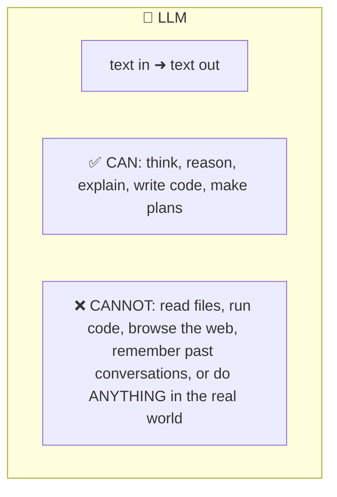
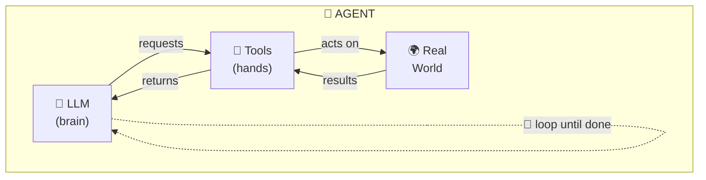
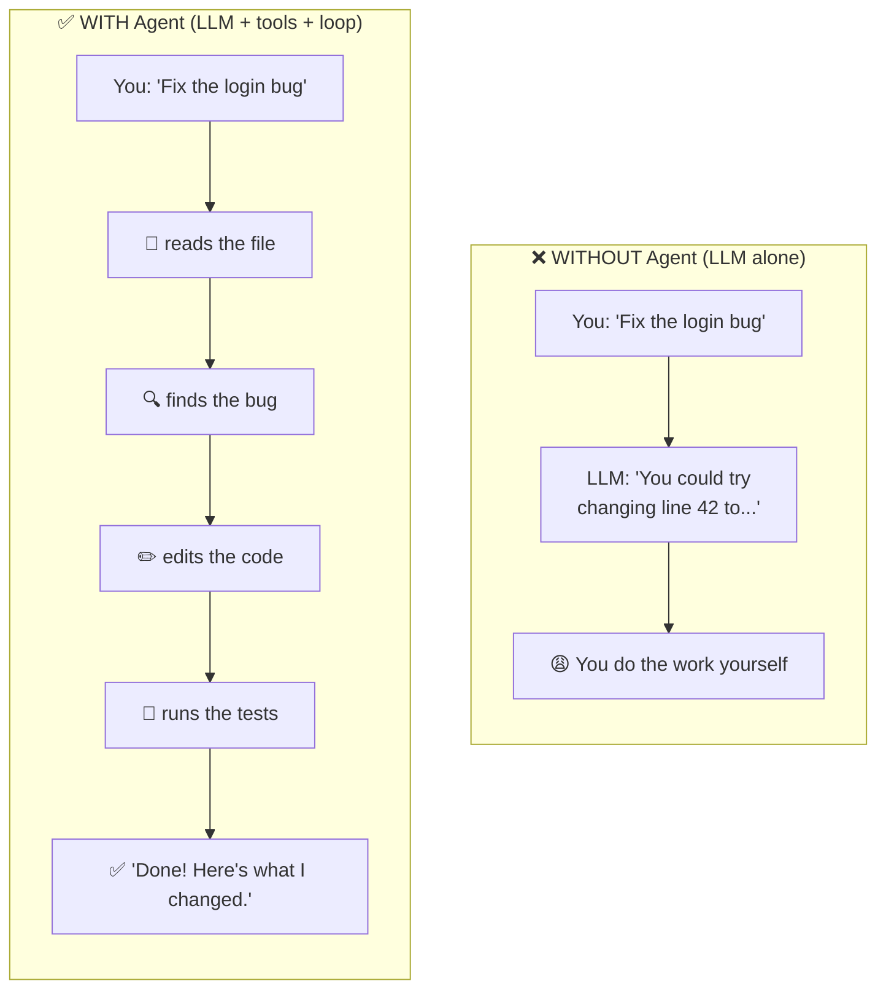
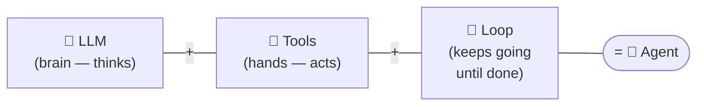
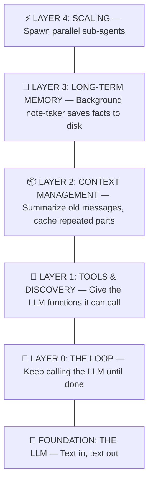
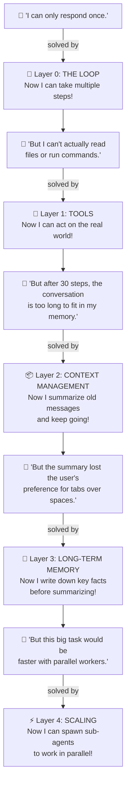
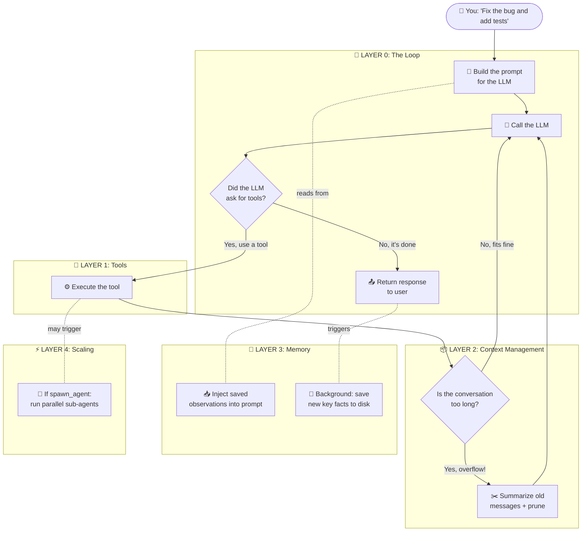
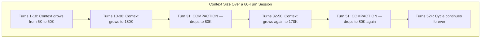
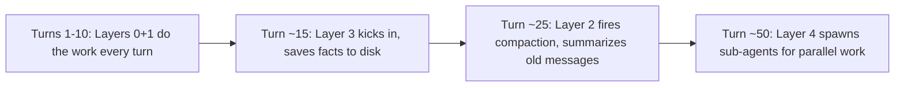

# AI Agent Architecture Guide

> How AI agents work under the hood. No prior LLM knowledge required.

---

## 1. Start Here: What Is an LLM?

You've used ChatGPT or Claude. You type something, it types back. That's an **LLM** -- a Large Language Model.

An LLM is incredibly smart, but also incredibly limited. It's a **brain in a jar**:

If you ask an LLM "fix this bug," it can only **tell you how**. It can't actually open the file and fix it. It has no hands.

---

## 2. What Is an Agent?

An agent wraps the LLM with **tools** (hands) and a **loop** (persistence) so it can actually do work:

Here's the difference in practice:

That's it. The formula is:

---

## 3. The Five Layers

A working agent isn't just "LLM + tools + loop." As you build one, you hit problems. Each problem needs a new layer to solve it.

Think of it like building a house -- you start with the foundation and add floors:

Here's the key idea: **each layer exists because the layer below it has a problem.**

> **You don't need all layers.** A simple agent only needs Layer 0 + Layer 1. Add more layers as your use case demands it.

---

## 4. How the Layers Work Together

When the user sends a message, every layer plays a role. Here's what happens:

**Read the diagram like this:**
1. Your message enters the **Loop** (Layer 0)
2. The loop builds a prompt. **Memory** (Layer 3) injects past observations into it.
3. The LLM is called. If it requests a tool, **Tools** (Layer 1) executes it. If that tool is `spawn_agent`, **Scaling** (Layer 4) creates a parallel worker.
4. After tool execution, **Context Management** (Layer 2) checks if the conversation is too long. If so, it summarizes.
5. The loop repeats until the LLM has no more tool requests.
6. After the loop ends, **Memory** (Layer 3) quietly saves key facts for next time.

---

## 5. What Happens Over a Long Conversation

The layers don't all kick in at once. They activate as the conversation grows. Here's what a 60-turn session looks like:

**Read the chart like this:**
- The line going **up** = the conversation is growing (more messages, more tool results)
- The line going **down** = compaction fired (old messages summarized, context freed)
- **Layer 0 + 1** are always active (the loop runs tools every turn)
- **Layer 2** kicks in when the line approaches the limit (caching saves money throughout; compaction saves space at overflow)
- **Layer 3** runs periodically (every ~30K new tokens) to save important facts
- **Layer 4** activates when the LLM decides a task can be parallelized

The agent can work **indefinitely** -- the context never overflows because Layer 2 keeps resetting it, and Layer 3 ensures nothing important is forgotten.

---

## 6. Detailed Guides

Each layer has its own document explaining the problem, solution, and step-by-step examples. Read them in order -- each builds on the previous:

| | Layer | Guide | What you'll learn |
|-|-------|-------|-------------------|
| L0 | The Loop | [agent-loop.md](./agent-loop.md) | The foundation -- how a while loop turns a one-shot LLM into a multi-step worker |
| L1 | Tools | [tool-execution.md](./tool-execution.md) | How the LLM requests actions (read files, run commands) and the loop executes them |
| L1+ | Discovery | [progressive-discovery.md](./progressive-discovery.md) | Loading skills and plugins on demand so the LLM isn't overwhelmed by 100+ tools |
| L1+ | Code Mode | [code-mode.md](./code-mode.md) | Replacing N tool definitions with 2 generic tools (`search_apis` + `execute_code`) to cut tokens, preserve cache, and reduce round trips |
| L2 | Context | [context-management.md](./context-management.md) | Caching, compaction, and pruning to keep conversations within the LLM's memory limit |
| L3 | Memory | [observational-memory.md](./observational-memory.md) | A background note-taker that saves important facts before compaction throws them away |
| L4 | Scaling | [subagents.md](./subagents.md) | Spawning parallel sub-agents to handle independent tasks at the same time |

> **Read them in order!** Each layer assumes you've read the ones before it. Layer 0 starts with zero assumptions. Each subsequent layer explains the problem created by the previous layer and what changes are needed at lower layers.

---

## 7. Glossary

New to this? Here are the key terms:

| Term | Plain English |
|------|--------------|
| **LLM** | The AI model (e.g., Claude, GPT). Thinks in text. Can't do anything else. |
| **Token** | How LLMs count words. 1 token ≈ 1 word ≈ 4 characters. |
| **Context Window** | The LLM's short-term memory. Has a hard limit (e.g., 200K tokens). |
| **System Prompt** | Secret instructions the LLM reads every time. You don't see them. |
| **Tool** | A function the LLM can ask to run. Like "read this file" or "run this command." |
| **Agent Loop** | The core cycle: ask the LLM what to do → do it → ask again → repeat. |
| **Compaction** | When the conversation is too long: summarize old messages and continue. |
| **Pruning** | Replacing old, large tool outputs with "[cleared]" to save space. |
| **Prompt Caching** | Don't re-read the same instructions every call. Saves ~90% cost. |
| **Observational Memory** | A background note-taker that writes down key facts to a file. |
| **Sub-agent** | A copy of the agent that handles one sub-task independently, in parallel. |
| **Skill** | A downloadable instruction set. "Here's how to do code review." |
| **Plugin** | An external service that gives the agent new tools at runtime. |
| **Code Mode** | Instead of many tool definitions, give the LLM 2 generic tools (`search_apis` + `execute_code`). The LLM searches for methods, then writes code. Saves tokens, preserves cache, reduces round trips. |
| **MCP** | Model Context Protocol. A standard way to connect LLMs to external tools. |
