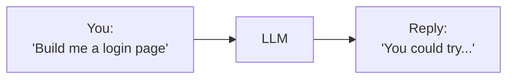
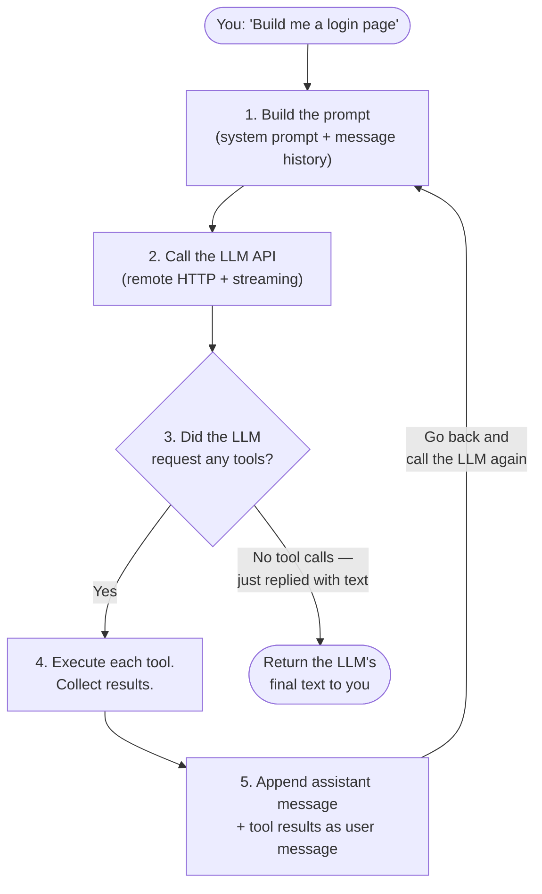
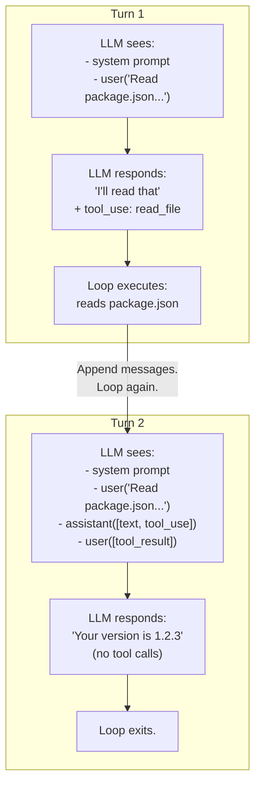
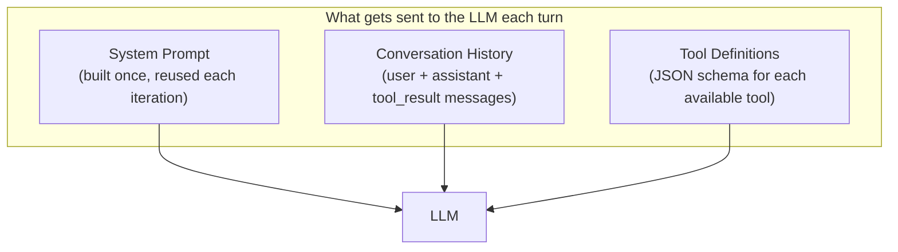
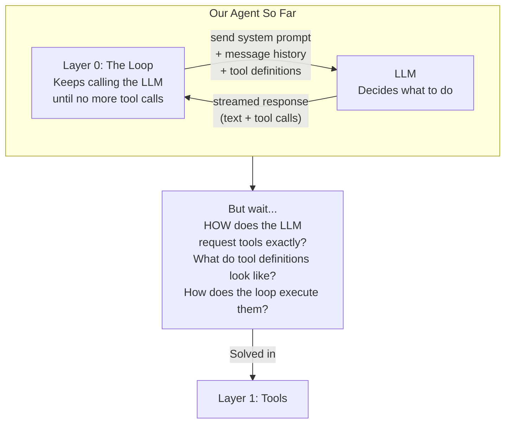

# Layer 0: The Agent Loop

> **Prerequisite:** Read the [README](./README.md) first (sections 1-3).
>
> **What you know so far:** An LLM is a brain that takes text in and produces text out. It can't do anything in the real world. The README glossary defines "Tool" as a function the LLM can ask to run.
>
> **What this layer solves:** The LLM can only respond once, but real tasks need many steps.

---

## The Problem

When you send a message to an LLM, you get **one reply**. That's it. One shot.



But building a login page isn't a one-step task. It requires:

1. Look at existing files to understand the project
2. Create new files
3. Start a dev server
4. Check if it looks right
5. Fix any bugs
6. Repeat until it works

A single LLM reply can't do any of that. It can only suggest what to do. **You** have to do every step yourself.

**How do you make a one-shot text machine do multi-step work?**

---

## The Solution: A Loop

Wrap the LLM in a **while loop**. Keep calling the LLM until it stops requesting tools.

Each pass through the loop is called a **turn** (or **iteration**). A turn encompasses one LLM call plus the execution of all tools that call requested. The next turn begins when the loop feeds those tool results back to the LLM.

### A note on terminology: "tool" vs. "action"

Throughout this document you may see both words. They mean the same thing here:

- **Tool** is the precise term. It is the word used in the Anthropic and OpenAI APIs, in the README glossary, and in all subsequent layer docs. A tool is a named function the LLM can ask the loop to execute.
- **Action** is shorthand sometimes used in plain-English explanations — "the LLM requested an action" means "the LLM issued a tool call."

Whenever you open the code or read Layer 1 onwards, you will see "tool" everywhere. The two words are interchangeable in this document.

---

## How Messages Work

Before looking at the loop, you need to understand one thing about LLMs: **they have no memory.** Every time you call the LLM API (a remote HTTP call over the network), it starts completely fresh. It has no knowledge of previous calls.

So how does it "remember" what happened? **You send the entire conversation every time.**

The conversation is a list of **structured message objects**. Each message has a `role` that tells the LLM who sent it:

| Role | Who sends it | Example content |
|------|-------------|-----------------|
| `user` | You (or the loop on your behalf) | Your question, or the result of a tool call |
| `assistant` | The LLM | Its reply text, plus any tool calls it requests |

In code these look like:

```typescript
// The messages array grows as the conversation progresses
const messages: LLMMessage[] = [
  {
    role: 'user',
    content: [{ type: 'text', text: 'Read my package.json and tell me the version.' }]
  },
  {
    role: 'assistant',
    content: [
      { type: 'text', text: "I'll read that file." },
      { type: 'tool_use', id: 'tc_1', name: 'read_file', input: { path: 'package.json' } }
    ]
  },
  {
    role: 'user',          // tool results are sent as a user message
    content: [
      { type: 'tool_result', tool_use_id: 'tc_1', content: '{ "version": "1.2.3" }' }
    ]
  }
]
```

Note that tool results are sent back as `user` role messages (not a special role). This is an Anthropic and OpenAI API requirement — the roles must strictly alternate: `user`, `assistant`, `user`, `assistant`, ...

Each turn works like this:

1. **Get the existing messages** (everything from previous turns)
2. **Send all of them** to the LLM along with the system prompt
3. **The LLM responds** with a new `assistant` message (text and/or tool calls)
4. **Append that assistant message** to the list
5. **If the assistant message contained tool calls**, execute each tool, collect the results, and append a `user` message containing those results. Then go to step 2.
6. **If the assistant message contained no tool calls**, the loop exits and the LLM's final text is returned to you.

```
Turn 1:  messages = [
           user("Read package.json...")
         ]
         → send to LLM
         → LLM responds: assistant([text("I'll read it"), tool_use("read_file")])
         → append assistant message
         → execute read_file tool
         → append user([tool_result(...)])

Turn 2:  messages = [
           user("Read package.json..."),
           assistant([text("I'll read it"), tool_use("read_file")]),
           user([tool_result({ "version": "1.2.3" })])
         ]
         → send to LLM
         → LLM responds: assistant([text("Your version is 1.2.3")])
         → no tool calls → loop exits
```

The list keeps growing. Each turn, the LLM sees **everything** that happened before — because you literally send it all again.

> **Why is this expensive?** Good question. Sending the full history on every call means cost and latency scale with conversation length. That is the most natural follow-up concern after learning this design, and it is real. Layer 2 (Context Management) addresses it with compaction and prompt caching. For now, understand the design and accept the tradeoff.



**The termination condition:** the loop exits when the LLM's response contains no tool calls. That is it. There is no "I'm done" signal — the absence of a tool call request is the signal. The LLM decides when to stop requesting tools by simply not including any `tool_use` blocks in its response.

---

## What Happens Step by Step

Let's trace through a real example: you ask the agent "Read my package.json and tell me the version."

### Turn 1: The LLM Needs to Read a File

```mermaid
sequenceDiagram
    participant You
    participant Loop as Agent Loop
    participant LLM

    You ->> Loop: "Read my package.json<br/>and tell me the version"
    Loop ->> LLM: [system prompt + user message]
    LLM -->> Loop: (stream) "I'll read that file."
    LLM -->> Loop: (stream) tool_use: read_file("package.json")
    Note over Loop: Stream ends. Tool call found.<br/>Execute it.
    Loop ->> Loop: Reads package.json from disk.<br/>Gets: { "version": "1.2.3" }
    Note over Loop: Append assistant message + tool result.<br/>Go back to step 2.
```

The LLM's streamed response is accumulated by the loop. When the stream ends, the loop inspects the accumulated `assistant` message for tool calls. If it finds any, it executes them.

### Turn 2: The LLM Has the Answer

```mermaid
sequenceDiagram
    participant Loop as Agent Loop
    participant LLM

    Loop ->> LLM: [system prompt]<br/>+ user("Read package.json...")<br/>+ assistant([text, tool_use(read_file)])<br/>+ user([tool_result({ "version": "1.2.3" })])
    LLM -->> Loop: (stream) "Your version is 1.2.3"
    Note over Loop: Stream ends. No tool calls.<br/>Loop exits. Return text to user.
```

No tool calls in the response. The loop ends. The LLM's final text is returned to you.

### The Full Picture



By Turn 2, the LLM sees your original message, its own previous response (including the tool call), and the tool result. That's how it "remembers" — you re-send everything.

> **What happens if a tool fails?** If a tool returns an error, the loop appends the error output as the `tool_result` content with `is_error: true`. The loop does not abort. The LLM sees the error on the next turn and can decide how to respond — retry with different input, ask the user for help, or stop.

---

## Streaming: How the LLM Response Arrives

The LLM API does not wait until it has a complete response before sending anything. It **streams** tokens as it generates them — one chunk at a time over a persistent HTTP connection. This is why text appears word-by-word in the UI.

The important implication for the loop: **text tokens and tool call requests arrive in the same stream, in sequence.** They are not separate channels. The action request is embedded inside the LLM's response, not delivered separately.

```mermaid
sequenceDiagram
    participant LLM
    participant Loop as Agent Loop
    participant You

    Note over LLM,Loop: The LLM's single HTTP response streams in chunks
    LLM -->> Loop: chunk: "I'll"        → forward to UI
    LLM -->> Loop: chunk: " create"     → forward to UI
    LLM -->> Loop: chunk: " a login"    → forward to UI
    LLM -->> Loop: chunk: " page"       → forward to UI
    LLM -->> Loop: chunk: tool_use_start("write_file")  → buffer
    LLM -->> Loop: chunk: tool_input({ path: "login.tsx", content: "..." })
    LLM -->> Loop: stream end (stop_reason: "tool_use")
    Note over Loop: Stream finished. Inspect accumulated assistant message.<br/>Found tool call → execute it.
```

In the actual code (`agent-loop.ts`), the loop handles three stream event types:

```typescript
// Simplified from src/backend/agent/agent-loop.ts
for await (const event of adapter.stream({ messages, systemPrompt, tools })) {
  switch (event.type) {
    case 'text-delta':
      // Accumulate text and forward to UI for real-time display
      currentTextPart.text += event.text
      yield { type: 'text-delta', data: { delta: event.text } }
      break

    case 'tool-call':
      // Full tool call ready (name + input) — queue for execution after stream ends
      pendingToolCalls.push({ id: event.id, name: event.name, input: event.input })
      break

    case 'message-complete':
      // Stream finished. Check stop reason.
      if (event.stopReason === 'tool_use' && pendingToolCalls.length > 0) {
        continueLoop = true   // execute tools and loop again
      } else {
        continueLoop = false  // no tools → loop exits
      }
      break
  }
}
// After the stream: execute any queued tool calls
```

The key point: the loop does not execute tools during streaming. It accumulates all tool calls from the stream and executes them together after the stream ends. Only then does it loop back for the next LLM call.

---

## The System Prompt: The LLM's Rulebook

Every time the loop calls the LLM, it sends a **system prompt** along with the conversation history.

For developers: the system prompt is not hidden. You can read it at `src/backend/agent/prompts/normal_prompt.txt` and override it by placing a file at `resources/prompts/system.md` in your project. The `getSystemPrompt()` function in `src/backend/agent/context.ts` loads it.

The system prompt is **built once per user turn** (before the loop starts) and reused across all LLM iterations within that turn. Keeping it stable is important for prompt caching — if it changed every iteration, cached tokens would be invalidated.



The system prompt is dynamically composed and includes:

- **Base instructions** — the contents of `normal_prompt.txt` (or your override)
- **Instruction files** — contents of `CLAUDE.md` / `AGENTS.md` found in the project directory
- **Observational memory** — key facts saved from previous sessions (Layer 3)
- **Available skills** — instruction sets discovered from the project (Layer 1+)
- **Available apps** — external app integrations enabled for this session
- **Project config** — setup/run commands from the project config file

The tool definitions are sent separately as structured JSON schema (one object per tool), not as text in the system prompt. This is a feature of the Anthropic and OpenAI APIs — tools are a first-class parameter of the API call.

---

## Special Behaviors

### Asking the User a Question

The flowchart above shows two outcomes from an LLM call: tool calls (continue loop) or no tool calls (exit loop). There is actually a third outcome: the `ask_question` tool.

`ask_question` is a regular tool in the tool registry. But the loop handles it differently from all other tools: instead of executing it and immediately continuing, the loop **suspends execution** and waits for the user to respond.

Mechanically, this works using a `Promise` that does not resolve until the user submits their answer through the UI:

```typescript
// Simplified from src/backend/agent/agent-loop.ts
if (tc.name === 'ask_question') {
  // Emit a 'question' event to the frontend — the UI shows the question
  yield { type: 'question', data: { questionId, questions } }

  // The loop suspends here. The Promise won't resolve until
  // answerQuestion(sessionId, questionId, answers) is called
  // by the API route handler when the user submits their answer.
  const answers = await new Promise<QuestionAnswer[]>((resolve) => {
    activeSessions.get(sessionId)!.pendingQuestions.set(questionId, resolve)
  })

  // Loop resumes here with the user's answers as the tool result
  toolResults.push({ type: 'tool_result', tool_use_id: tc.id, content: formatAnswers(answers) })
}
```

The loop's async generator is simply `await`-ing the Promise. The Node.js event loop continues running other requests while this session waits. The Promise is resolved by a separate API call (`POST /api/sessions/:id/answer`) that the frontend makes when the user clicks Submit.

```mermaid
sequenceDiagram
    participant LLM
    participant Loop as Agent Loop
    participant FrontendAPI as Frontend / API

    LLM ->> Loop: tool_use: ask_question<br/>"Which database: PostgreSQL or MySQL?"
    Loop ->> FrontendAPI: yield { type: 'question', questions: [...] }
    Note over Loop: await Promise (suspended — not blocking Node.js)
    FrontendAPI ->> Loop: POST /api/sessions/:id/answer<br/>{ answers: [{ selected: ["PostgreSQL"] }] }
    Note over Loop: Promise resolves. Loop resumes.
    Loop ->> LLM: tool_result: "User answered: PostgreSQL"
```

### Stopping the Agent

You can cancel a running agent at any time. When you call `cancelAgent(sessionId)` (triggered by the `DELETE /api/sessions/:id/agent` endpoint):

1. **The `AbortController` is triggered.** The loop checks `abortController.signal.aborted` at the top of each iteration and also passes the signal to the LLM adapter. The adapter calls `response.body.cancel()` on the fetch stream, which immediately terminates the HTTP connection to the LLM API.
2. **The in-progress LLM stream stops.** The `for await` loop over the stream ends because the readable stream is cancelled.
3. **Tool execution checks the abort signal.** Each tool receives the `abortSignal` in its context. Long-running tools (like shell commands via PTY) check the signal and terminate the child process when it fires.
4. **The loop exits the `while` loop** because `abortController.signal.aborted` is `true` at the top of the next iteration check.
5. **Any tools that were mid-execution are marked `stopped`** in the stored message parts, so the UI reflects the interrupted state correctly.
6. **The partial assistant message is saved to disk.** Even a cancelled turn persists whatever the LLM produced before the cancellation, so you can see what it was doing.

### What If the Loop Runs Forever?

There is no explicit turn-limit constant in the current codebase. The loop runs until:

1. The LLM produces a response with no tool calls (normal exit).
2. The user cancels via the Stop button (abort signal).
3. The LLM API returns an error (e.g., rate limit, network failure) — the loop emits an error event and exits.
4. A context overflow triggers compaction, after which the loop continues normally. If the compaction itself fails (e.g., the summary is also too large), the loop errors out.

The practical safeguard against infinite loops is cost: each iteration costs tokens. An LLM that repeats the same tool call indefinitely will quickly exhaust a budget. Monitoring the `usage` events emitted by the loop lets you enforce a cost budget at the API layer if needed.

> **Repetition detection** is not implemented in the current loop. If the LLM requests the same tool with the same input twice in a row, the loop will execute it both times. Detecting and breaking repetition cycles is a future safeguard to add.

---

## The System Prompt Is Built Each User Turn

A common question: does the system prompt change between iterations of the inner `while` loop?

**No.** In `agent-loop.ts`, `buildSystemPrompt()` is called **once before the `while` loop starts** and the result is stored in `const systemPrompt`. Every LLM call within the same user turn uses the same system prompt. This is intentional: a stable system prompt allows the LLM API to cache it and avoid re-reading it on every iteration (saving ~90% of input token cost for the system prompt portion).

Dynamic context — like a skill that gets activated mid-turn — is injected via `tool_result` messages, not by mutating the system prompt.

---

## What We Have So Far

After Layer 0, our agent looks like this:



**The loop is the foundation.** Everything else we build (tools, context management, memory, sub-agents) plugs into this loop. That's why it's Layer 0.

---

## Key Takeaways

1. **The agent loop is a while loop** — keep calling the LLM until it stops requesting tools (no `tool_use` blocks in the response)
2. **"Tool" and "action" are the same thing** — "tool" is the precise API term; "action" is informal shorthand
3. **LLMs have no memory** — every API call starts fresh; you must re-send the entire message list each turn
4. **Messages have roles** — `user` for your input and tool results, `assistant` for LLM responses; the API requires strict alternation
5. **Text and tool calls arrive in the same stream** — the loop accumulates them, then executes tool calls after the stream ends
6. **The system prompt is dynamically composed** — it includes base instructions, instruction files, memory injections, and skill/app context; developers can read and override it
7. **`ask_question` pauses the loop** — it suspends on a `Promise` until the user submits an answer via a separate API call; it does not block Node.js
8. **Stopping the agent aborts the fetch stream** — the `AbortController` cancels the HTTP connection to the LLM API and propagates to tool execution

---

> **Next:** [Layer 1: Tools](./tool-execution.md) — How does the LLM specify tool calls? How does the loop execute them? What do tool definitions look like?
