# Layer 1+: Code Mode

> **Prerequisite:** Read [Layer 1: Tools](./tool-execution.md) and [Layer 1+: Progressive Discovery](./progressive-discovery.md) first.
>
> **What you know so far:** The loop (Layer 0) calls the LLM. The LLM uses tools (Layer 1) to act on the world. Tools are sent as definitions on every call. Progressive Discovery (Layer 1+) loads tools on demand. Context Management (Layer 2) uses prompt caching to reduce cost -- but tool changes break the cache.
>
> **What this layer solves:** Even with progressive discovery, each tool definition costs tokens and tools change the cache prefix. What if you could give the LLM access to hundreds of tools while only sending **two** tool definitions?

> **Quick orientation for new readers:** This document references "cache breakpoint 1" (BP1) and "cache breakpoint 2" (BP2) from [Context Management](./context-management.md). BP1 is the prefix checkpoint at the end of the system prompt; BP2 is the checkpoint at the end of the tool definitions. A "cold turn" is a turn where one of these checkpoints is invalidated, causing the entire conversation to be reprocessed at full cost. "Plugin activation" refers to the on-demand loading step from [Progressive Discovery](./progressive-discovery.md). MCP (Model Context Protocol) is a standard protocol through which external services expose tools to the agent.

---

## When to Use Code Mode vs Traditional Tools

Code mode is not always better. Before reading how it works, understand when to use it:

```mermaid
flowchart TD
    subgraph USE_CODE ["Use Code Mode (search + execute)"]
        direction TB
        U1["External APIs with many endpoints\n(Sentry, Figma, databases)"]
        U2["Tasks that chain multiple\nAPI calls together"]
        U3["Large plugin ecosystems\n(50+ tools across services)"]
        U4["When cache stability matters\n(long conversations)"]
        U5["When the LLM doesn't know\nwhich plugin to use"]
    end

    subgraph USE_TRADITIONAL ["Use Traditional Tools"]
        direction TB
        T1["Built-in tools\n(read/write/edit files, run commands)"]
        T2["Simple, single-step tools\n(take screenshot, ask question)"]
        T3["Tools that need direct\nfilesystem or OS access"]
        T4["Small tool sets\n(under 25 tools total)"]
    end
```

A practical setup uses **both**: built-in tools stay as traditional tool definitions, while plugin capabilities are exposed through code mode. Built-in tools like `read_file` and `edit_file` are not routed through code mode because they need direct OS access that cannot be safely proxied through a code sandbox, and because they already exist as well-defined single-step operations with no batching benefit.

---

## The Problem

Layer 1+ (Progressive Discovery) solves the "too many tools at startup" problem by loading tools on demand. But it creates four new problems:

### Problem 1: Tool Definitions Are Expensive

Each tool definition costs tokens. A tool with a name, description, and input schema typically costs **50-200 tokens**. That doesn't sound like much, until you have a lot of them:

```
22 built-in tools:         ~5,000 tokens
+ 10 Sentry tools:         ~2,000 tokens
+ 15 Figma tools:          ~3,000 tokens
+ 30 database tools:       ~6,000 tokens
= 77 tools:                ~16,000 tokens (sent EVERY call)
```

And this is modest. Cloudflare's API has **2,500+ endpoints**. As individual tool definitions, that would cost roughly **2 million tokens** -- per call.

### Problem 2: Tool Changes Break the Cache

As we explained in [Context Management](./context-management.md#the-plugin-activation-problem-cold-turns), prompt caching is **prefix-based**. Tool definitions sit at cache breakpoint 2. Every time a plugin activates or deactivates, the tool list changes, causing a **cold turn** where the entire conversation history gets reprocessed:

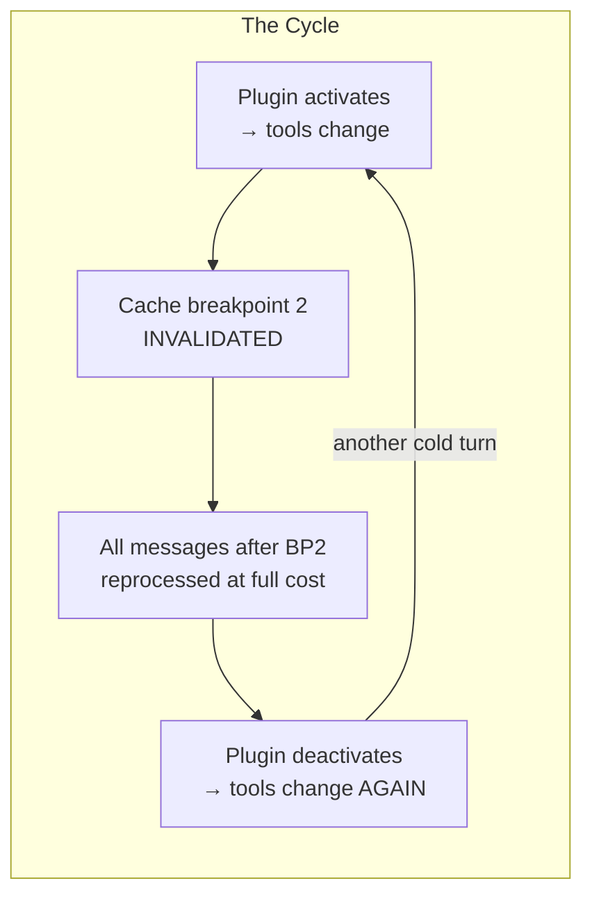

Progressive discovery mitigates this (load on demand, not all at once), but every activation still costs a cold turn.

### Problem 3: Tool Calling Is Inefficient for Multi-Step Tasks

Each traditional tool call is a separate round trip through the LLM: the LLM generates a tool call, the loop executes it, the result is appended to the conversation, and the LLM is called again. A task that needs five API calls requires five round trips.

Each round trip adds latency (1-5 seconds per LLM call) and re-sends the entire conversation as input tokens. Code mode collapses multiple API calls into a single `execute_code` call, reducing a five-step task to two round trips (one search, one execute).

There is a secondary, related argument: LLMs have seen vastly more TypeScript/JavaScript code in their training data than they have seen tool-call protocol blocks. This means that for APIs with many similar-looking methods, LLMs may write more accurate code against a TypeScript signature than they make tool calls against a JSON Schema definition. This claim is based on reasoning about training data distribution rather than a published study, so treat it as a plausible hypothesis rather than a proven fact. The round-trip reduction is the more concrete and measurable benefit.

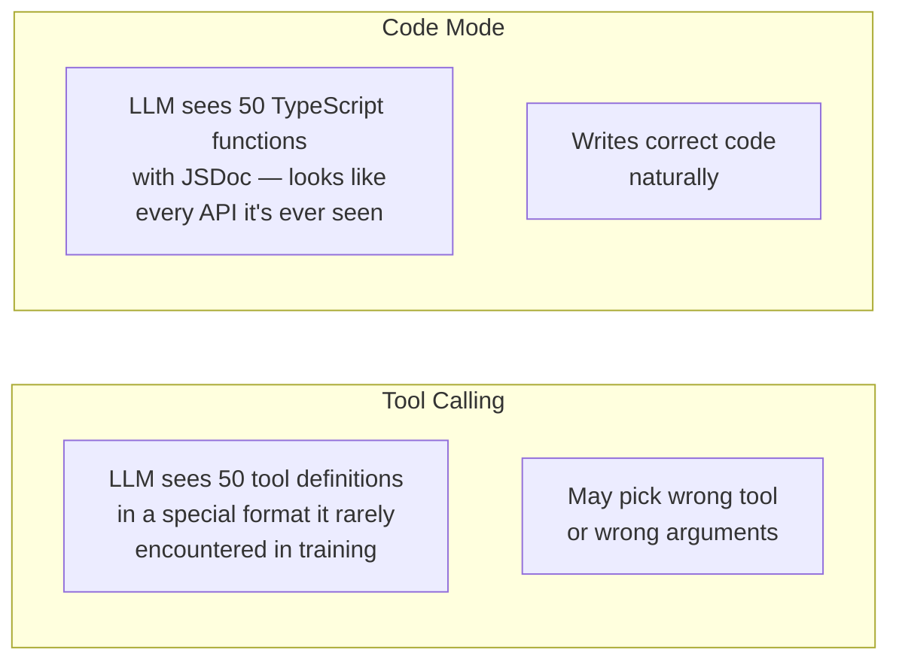

### Problem 4: Dumping the Full API Is Wasteful

Even if you replace tool definitions with TypeScript API definitions (more compact), you still face a question: **when do you show the LLM the API surface?**

If you load the full TypeScript API when a plugin activates, you're dumping potentially thousands of method signatures into the conversation. A plugin with 100 methods might have 3,000 tokens of TypeScript definitions. The LLM might only need 2 of those methods.

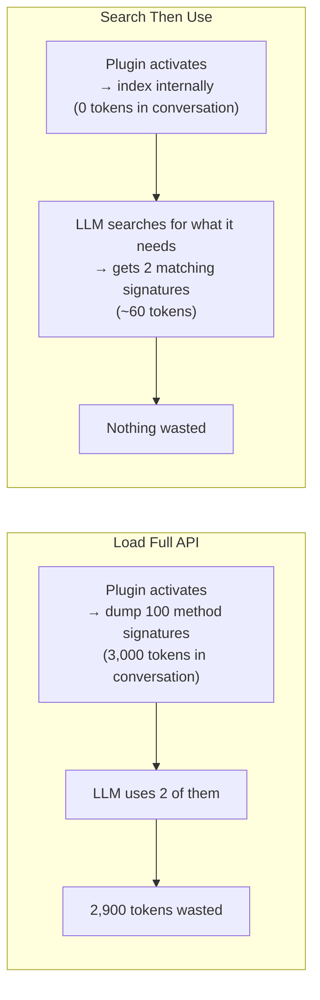

**How do you give the LLM access to hundreds of capabilities cheaply, without breaking the cache, with fewer round trips, without dumping the full API surface?**

---

## The Solution: Two Generic Tools

Instead of sending N tool definitions (one per plugin capability), send just **two generic tools** that work with any plugin:

| Tool | Purpose | Input |
|------|---------|-------|
| **`search_apis`** | Discover available methods across all active plugins | A natural language query |
| **`execute_code`** | Run code that calls the discovered methods | TypeScript/JavaScript code |

The LLM **searches first** to find what it needs, then **writes code** that calls those methods. Think of it like a developer using an IDE: you search the API docs, find the right methods, then write code.

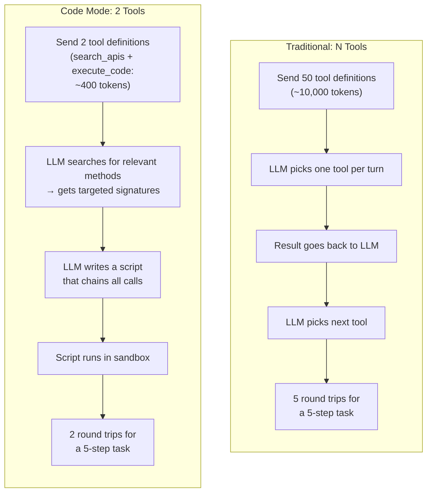

---

## What the LLM Actually Sees: The Raw API Calls

> **If you read [Layer 1: Tools](./tool-execution.md), you saw what traditional tool calls look like in raw HTTP payloads. This section shows the same thing for code mode — the actual JSON that flows between your loop and the LLM.**

### The Two Tool Definitions (Sent Every Call)

Here is the literal `tools` array that gets sent to the API. This is all the LLM ever sees about plugin capabilities — two generic tools, no matter how many plugins are connected:

```json
{
  "model": "claude-sonnet-4-20250514",
  "max_tokens": 4096,
  "system": "You are a helpful coding assistant. When you need to interact with external services (error tracking, design tools, databases, etc.), use search_apis to discover available methods, then use execute_code to call them.",

  "tools": [
    {
      "name": "read",
      "description": "Read the contents of a file...",
      "input_schema": { "..." : "..." }
    },
    {
      "name": "edit",
      "description": "Edit a file...",
      "input_schema": { "..." : "..." }
    },
    {
      "name": "search_apis",
      "description": "Search for available API methods across all connected services. Returns TypeScript signatures for matching methods. Use this to discover what methods are available before writing code with execute_code.",
      "input_schema": {
        "type": "object",
        "properties": {
          "query": {
            "type": "string",
            "description": "Natural language description of what you're looking for, e.g. 'list errors by project' or 'get design components'"
          }
        },
        "required": ["query"]
      }
    },
    {
      "name": "execute_code",
      "description": "Execute JavaScript/TypeScript code in a sandboxed environment. The code can call API methods discovered via search_apis. Available globals are injected per-plugin (e.g., sentry.*, figma.*, db.*). Use console.log() to output results — return values are not captured. The code runs with a 10-second timeout.",
      "input_schema": {
        "type": "object",
        "properties": {
          "code": {
            "type": "string",
            "description": "JavaScript/TypeScript code to execute. Use console.log() for any output you want to see in the result."
          }
        },
        "required": ["code"]
      }
    }
  ],

  "messages": [
    { "role": "user", "content": "Check for recent login crashes in our web app" }
  ]
}
```

That's it. **22 built-in tools + `search_apis` + `execute_code` = 24 tools, always.** Whether you have 0 plugins or 50 plugins connected, this array never changes.

Compare this to the traditional approach where the same request would need the full Sentry tool set sent:

```
Traditional:   22 built-in + 10 Sentry tools = 32 tool definitions
Code mode:     22 built-in + 2 generic tools = 24 tool definitions (forever)
```

### How the LLM Knows What Code to Write

This is the key question. With traditional tool calling, the LLM sees explicit JSON Schema definitions for each tool — `sentry_list_errors`, `sentry_get_detail`, etc. — and picks one. With code mode, the LLM sees just `execute_code` with a `code` string input. How does it know what to write?

**The answer: it doesn't know yet.** That's why there are **two** tools, not one. The flow is:

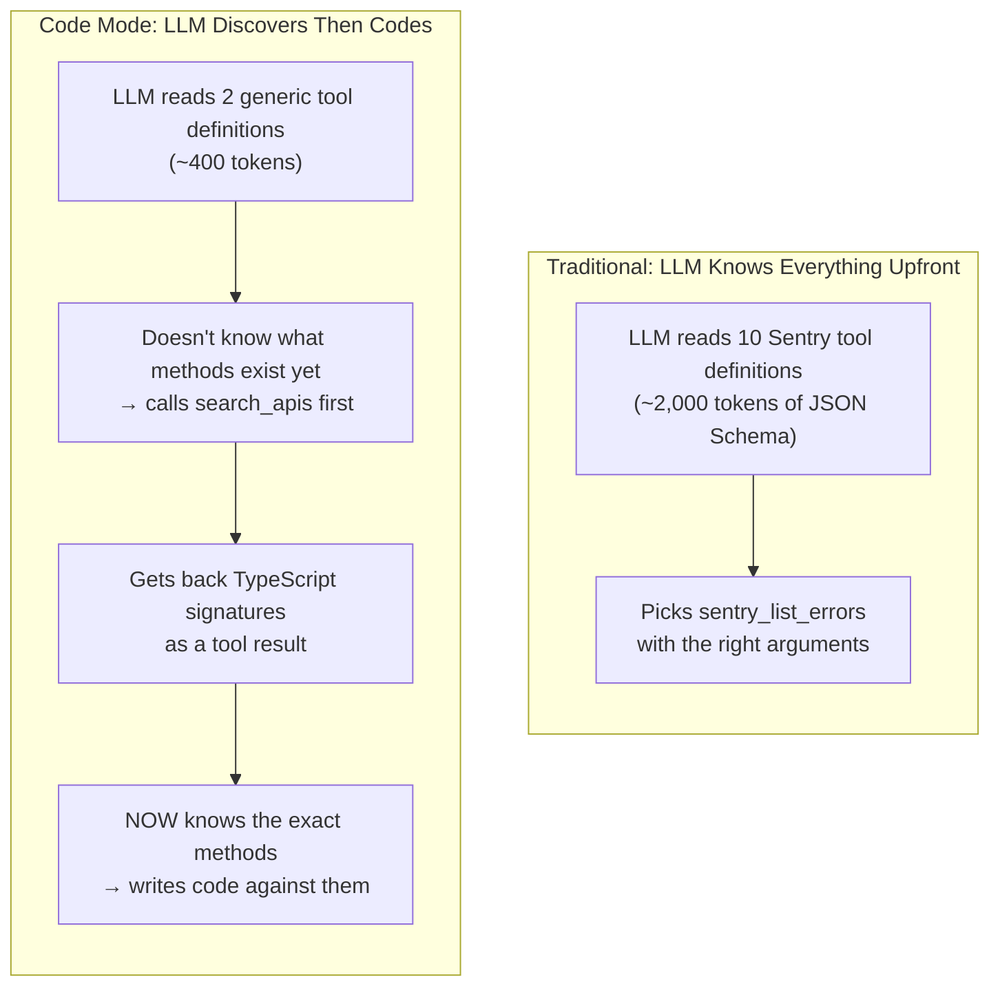

**The search result IS the documentation.** When `search_apis` returns:

```typescript
/** List errors for a project filtered by query */
sentry.listErrors(project: string, query?: string): Error[]

interface Error {
  id: string;
  level: "fatal" | "error" | "warning";
  message: string;
  timestamp: string;
}
```

...the LLM reads this exactly like a developer reads API docs. It sees:
- The function name: `sentry.listErrors`
- The parameters: `project` (required string), `query` (optional string)
- The return type: an array of `Error` objects
- The shape of `Error`: what fields it has and their types

This is enough to write correct code. The LLM has seen millions of TypeScript function signatures during training. Writing `await sentry.listErrors("web-app")` is as natural to it as writing `await fetch("/api/users")`.

**Why TypeScript signatures work better than JSON Schema for code generation:**

```
JSON Schema (what traditional tools use):
{
  "name": "list_errors",
  "input_schema": {
    "properties": {
      "project": { "type": "string" },
      "query": { "type": "string" }
    }
  }
}
→ The LLM must mentally translate this into a tool_use block

TypeScript (what search_apis returns):
sentry.listErrors(project: string, query?: string): Error[]
→ The LLM can directly copy this into code
```

The TypeScript signature is literally the call syntax. There's no translation step. The LLM reads `sentry.listErrors(project: string)` and writes `sentry.listErrors("web-app")`. It's the same language.

### Turn-by-Turn: The Raw Payloads

Let's trace the exact JSON flowing back and forth. This mirrors the [multi-turn example from Layer 1](./tool-execution.md#a-complete-multi-turn-example-with-real-payloads), but for code mode.

**User asks:** "Check for recent login crashes in our web app"

#### Turn 1 → LLM Calls search_apis

**Request** (your loop sends this):

```json
{
  "model": "claude-sonnet-4-20250514",
  "system": "You are a helpful coding assistant...",
  "tools": [
    { "name": "read", "..." : "..." },
    { "name": "edit", "..." : "..." },
    { "name": "search_apis", "..." : "..." },
    { "name": "execute_code", "..." : "..." }
  ],
  "messages": [
    { "role": "user", "content": "Check for recent login crashes in our web app" }
  ]
}
```

**Response** (the LLM returns this):

```json
{
  "role": "assistant",
  "content": [
    {
      "type": "text",
      "text": "I'll search for error tracking methods to find login crashes."
    },
    {
      "type": "tool_use",
      "id": "toolu_01_search",
      "name": "search_apis",
      "input": {
        "query": "list errors crashes by project"
      }
    }
  ],
  "stop_reason": "tool_use"
}
```

Notice: the LLM **did not try to write code first**. It doesn't know what methods exist yet. It searched. This is the critical insight — the LLM uses `search_apis` the way a developer uses "Go to Definition" or searches API docs.

**Your loop now:**
1. Sees `stop_reason: "tool_use"` → continues looping.
2. Extracts the `search_apis` call.
3. Searches the internal TypeScript index (built when plugins connected).
4. Finds matching methods from the Sentry plugin.
5. Returns the matching TypeScript signatures as the tool result.

#### Turn 1 Result → The LLM Sees TypeScript Signatures

**Request** (messages now has 3 entries):

```json
{
  "messages": [
    {
      "role": "user",
      "content": "Check for recent login crashes in our web app"
    },
    {
      "role": "assistant",
      "content": [
        { "type": "text", "text": "I'll search for error tracking methods to find login crashes." },
        { "type": "tool_use", "id": "toolu_01_search", "name": "search_apis", "input": { "query": "list errors crashes by project" } }
      ]
    },
    {
      "role": "user",
      "content": [
        {
          "type": "tool_result",
          "tool_use_id": "toolu_01_search",
          "content": "Found 2 matching methods:\n\n/** List errors for a project filtered by query */\nsentry.listErrors(project: string, query?: string): Error[]\n\n/** Get detailed error info including stack trace */\nsentry.getErrorDetail(errorId: string): ErrorDetail\n\ninterface Error {\n  id: string;\n  level: \"fatal\" | \"error\" | \"warning\";\n  message: string;\n  timestamp: string;\n}\n\ninterface ErrorDetail {\n  id: string;\n  message: string;\n  stacktrace: { file: string; line: number; function: string }[];\n  firstSeen: string;\n  lastSeen: string;\n  count: number;\n}"
        }
      ]
    }
  ]
}
```

**This is the moment the LLM learns the API.** The tool result contains TypeScript signatures with full type information. The LLM now knows:
- `sentry.listErrors` exists and takes a project name + optional query
- `sentry.getErrorDetail` exists and takes an error ID
- What the return types look like (fields, types, shapes)

It has everything it needs to write correct code.

#### Turn 2 → LLM Writes and Executes Code

**Response** (the LLM returns this):

```json
{
  "role": "assistant",
  "content": [
    {
      "type": "text",
      "text": "I found the Sentry error tracking API. Let me fetch recent login crashes and get the details."
    },
    {
      "type": "tool_use",
      "id": "toolu_02_exec",
      "name": "execute_code",
      "input": {
        "code": "const errors = await sentry.listErrors(\"web-app\", \"login crash\");\nconst recent = errors.slice(0, 3);\nconst details = await Promise.all(\n  recent.map(e => sentry.getErrorDetail(e.id))\n);\nconsole.log(JSON.stringify(details.map(d => ({\n  message: d.message,\n  file: d.stacktrace[0]?.file,\n  line: d.stacktrace[0]?.line,\n  count: d.count,\n  lastSeen: d.lastSeen\n})), null, 2));"
      }
    }
  ],
  "stop_reason": "tool_use"
}
```

**Look at what the LLM wrote.** This is real, idiomatic JavaScript:

```javascript
const errors = await sentry.listErrors("web-app", "login crash");
const recent = errors.slice(0, 3);
const details = await Promise.all(
  recent.map(e => sentry.getErrorDetail(e.id))
);
console.log(JSON.stringify(details.map(d => ({
  message: d.message,
  file: d.stacktrace[0]?.file,
  line: d.stacktrace[0]?.line,
  count: d.count,
  lastSeen: d.lastSeen
})), null, 2));
```

The LLM knew to:
- Call `sentry.listErrors` with the right arguments (from the signature)
- Access `.id` on each error (from the `Error` interface)
- Call `sentry.getErrorDetail` with the error ID (from the signature)
- Access `.stacktrace[0].file` (from the `ErrorDetail` interface)
- Use `console.log` (from the `execute_code` tool description saying "Use console.log() for output")
- Use `await` and `Promise.all` (from its JavaScript training)

**It made 4 API calls (1 list + 3 detail fetches) in 1 round trip.** With traditional tool calling, that's 4 separate turns through the loop.

#### Turn 2 Result → Code Runs in Sandbox

Your loop:
1. Builds proxy objects for active plugins (`sentry` → routes to Sentry MCP).
2. Creates a sandbox with `sentry` and `console` injected as globals.
3. Runs the code. Each `sentry.*` call goes through the proxy to the real MCP server.
4. Collects the `console.log` output.
5. Returns it as the tool result.

**Request** (messages now has 5 entries):

```json
{
  "messages": [
    { "role": "user", "content": "Check for recent login crashes in our web app" },
    { "role": "assistant", "content": ["(search_apis call)"] },
    { "role": "user", "content": ["(search_apis result — TypeScript signatures)"] },
    { "role": "assistant", "content": ["(execute_code call)"] },
    {
      "role": "user",
      "content": [
        {
          "type": "tool_result",
          "tool_use_id": "toolu_02_exec",
          "content": "[\n  {\n    \"message\": \"Cannot read property 'token' of null\",\n    \"file\": \"src/auth/login.ts\",\n    \"line\": 42,\n    \"count\": 847,\n    \"lastSeen\": \"2025-01-15T10:23:00Z\"\n  },\n  {\n    \"message\": \"Session expired during login flow\",\n    \"file\": \"src/auth/session.ts\",\n    \"line\": 18,\n    \"count\": 234,\n    \"lastSeen\": \"2025-01-15T09:45:00Z\"\n  }\n]"
        }
      ]
    }
  ]
}
```

#### Turn 3 → LLM Reports Results

**Response:**

```json
{
  "role": "assistant",
  "content": [
    {
      "type": "text",
      "text": "Found 2 recent login crashes:\n\n1. **`Cannot read property 'token' of null`** in `src/auth/login.ts:42` — 847 occurrences, last seen 30 minutes ago. This is a null reference error where the auth token is not being checked before access.\n\n2. **`Session expired during login flow`** in `src/auth/session.ts:18` — 234 occurrences. The session is expiring mid-login.\n\nThe first crash is the most frequent. Want me to read that file and fix it?"
    }
  ],
  "stop_reason": "end_turn"
}
```

`stop_reason: "end_turn"` — the loop exits and returns the text to the user.

**The full flow took 2 round trips** (search + execute) for the plugin work, then the LLM reported results. With traditional tool calling, fetching errors + 2 detail lookups = 3 round trips minimum, plus the plugin activation step.

### Comparing the Conversation Shape

Here is the message array for the same task, side by side:

```
Code Mode (5 messages for the plugin work):
messages[0]  user       → "Check for recent login crashes"
messages[1]  assistant  → text + tool_use(search_apis)
messages[2]  user       → tool_result (TypeScript signatures, ~200 tokens)
messages[3]  assistant  → text + tool_use(execute_code)
messages[4]  user       → tool_result (JSON output from code)
messages[5]  assistant  → Final answer

Traditional Tool Calling (9+ messages):
messages[0]  user       → "Check for recent login crashes"
messages[1]  assistant  → tool_use(activate_plugin "sentry")
messages[2]  user       → tool_result ("activated, 10 tools loaded")
                          ← TOOL LIST CHANGES: cache breakpoint 2 invalidated
messages[3]  assistant  → tool_use(sentry_list_errors)
messages[4]  user       → tool_result (error list)
messages[5]  assistant  → tool_use(sentry_get_error_detail "E-123")
messages[6]  user       → tool_result (error detail)
messages[7]  assistant  → tool_use(sentry_get_error_detail "E-456")
messages[8]  user       → tool_result (error detail)
messages[9]  assistant  → Final answer
```

Code mode: **3 LLM calls**, 0 cache misses, ~260 tokens of plugin data in conversation.
Traditional: **5 LLM calls**, 1 cache miss, ~2,500 tokens of plugin data in conversation.

---

## How It Works

### Step 1: Generate a Searchable API Index

When a plugin connects, the agent converts its MCP tool definitions into a **TypeScript type index** stored internally. This index is NOT sent to the LLM -- it's held by the agent loop for search.

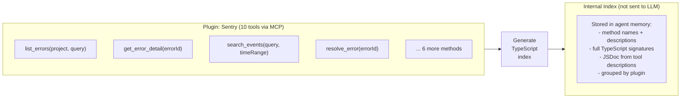

The key difference from the previous approach: **nothing is added to the conversation**. The plugin's API is indexed silently. Zero tokens consumed.

### Step 2: Give the LLM Two Generic Tools

Instead of registering 10 Sentry tools + 15 Figma tools + 22 built-in tools (47 total), register just the built-in tools + two generic tools:

```mermaid
flowchart TD
    subgraph BEFORE ["Traditional Registry"]
        direction TB
        B1["read_file"]
        B2["write_file"]
        B3["edit_file"]
        B4["...18 more built-in tools"]
        B5["sentry_list_errors"]
        B6["sentry_get_detail"]
        B7["sentry_search_events"]
        B8["sentry_resolve_error"]
        B9["figma_get_design"]
        B10["figma_list_components"]
        B11["... 19 more plugin tools"]
        BTOTAL["= 47 tools sent every call\n(changes when plugins activate)"]
    end

    subgraph AFTER ["Code Mode Registry"]
        direction TB
        A1["read_file"]
        A2["write_file"]
        A3["edit_file"]
        A4["...18 more built-in tools"]
        A5["search_apis"]
        A6["execute_code"]
        ATOTAL["= 24 tools sent every call\n(NEVER changes)"]
    end
```

The tool count is fixed at **24** (22 built-in + `search_apis` + `execute_code`), no matter how many plugins are active.

### Step 3: Search → Discover → Code

The LLM uses the two tools in sequence. First it searches, then it codes:

```mermaid
sequenceDiagram
    participant LLM
    participant Loop as Agent Loop
    participant Index as API Index

    Note over LLM: "I need to find error\ntracking methods"

    LLM ->> Loop: TOOL: search_apis({<br/>  query: "list errors by project"<br/>})

    Loop ->> Index: Search across all plugin APIs
    Index ->> Loop: Matching methods from Sentry:

    Loop ->> LLM: RESULT:<br/>/** List errors for a project */<br/>sentry.listErrors(project: string, query?: string): Error[]<br/><br/>/** Get full error stack trace */<br/>sentry.getErrorDetail(errorId: string): ErrorDetail

    Note over LLM: Now I know the exact signatures.<br/>I can write code.
```

The search returned **just 2 method signatures** (~60 tokens) instead of the full Sentry API (10 methods, ~300 tokens). For large APIs like Cloudflare's 2,500 endpoints, this difference is enormous: ~60 tokens vs ~80,000 tokens.

### Step 4: Execute Code in the Sandbox

Now the LLM writes code using the discovered signatures. This section describes both the execution model and the sandbox constraints in detail, since understanding how the code actually runs is essential to understanding what the LLM can and cannot do.

```mermaid
sequenceDiagram
    participant LLM
    participant Loop as Agent Loop
    participant Sandbox as Code Sandbox
    participant Sentry as Sentry MCP

    LLM ->> Loop: TOOL: execute_code({<br/>  code: `<br/>    const errors = await sentry.listErrors("web-app");<br/>    const critical = errors.filter(e => e.level === "fatal");<br/>    const details = await Promise.all(<br/>      critical.map(e => sentry.getErrorDetail(e.id))<br/>    );<br/>    console.log(JSON.stringify(details));<br/>  `<br/>})

    Loop ->> Sandbox: Execute in isolated JS runtime
    Sandbox ->> Sentry: listErrors("web-app")
    Sentry ->> Sandbox: [errors...]
    Sandbox ->> Sentry: getErrorDetail("E-123")
    Sentry ->> Sandbox: {details...}
    Sandbox ->> Sentry: getErrorDetail("E-456")
    Sentry ->> Sandbox: {details...}
    Sandbox ->> Loop: console output (results)
    Loop ->> LLM: RESULT: [detailed error objects]
```

The LLM made **3 API calls** (list + 2 detail fetches) in **1 round trip**. With traditional tool calling, this would need 3 separate turns through the loop.

#### What is the Sandbox?

The sandbox is a **conceptual design pattern** described in this document, not a specific library shipped with this codebase. When you implement code mode, you choose a sandboxing approach based on your runtime and security requirements. Common options:

**Node.js `vm` module** (built-in, low isolation):
```javascript
const vm = require('vm');

// Build the sandbox context: inject plugin bindings as globals
const context = vm.createContext({
  sentry: buildSentryProxy(activeSentryMcpClient),
  figma:  buildFigmaProxy(activeFigmaMcpClient),
  console: { log: captureOutput, error: captureOutput },
  // fetch and require are NOT included — they remain undefined
});

const result = await vm.runInContext(userCode, context, { timeout: 10_000 });
```

The `vm` module creates an isolated V8 execution context. **V8** is the JavaScript engine that powers Node.js and Chrome. A **V8 isolate** is V8's internal concept for a completely separate heap and execution context — think of it as a walled-off JS universe with its own global object and no access to the parent process's variables. The Node.js `vm` module exposes this mechanism. For reference, see the [Node.js vm docs](https://nodejs.org/api/vm.html).

**`isolated-vm` npm package** (higher isolation, recommended for production):

The built-in `vm` module shares the same V8 heap as the host process, which means a determined attacker can escape the sandbox using prototype chain tricks. For stronger isolation, use the [`isolated-vm`](https://github.com/laverdet/isolated-vm) package, which creates a truly separate V8 isolate in a separate heap:

```javascript
const ivm = require('isolated-vm');

const isolate = new ivm.Isolate({ memoryLimit: 128 /* MB */ });
const ivmContext = await isolate.createContext();

// Inject plugin bindings into the isolate's global scope
await ivmContext.global.set('sentry', new ivm.Reference(sentryProxy));
await ivmContext.global.set('console', new ivm.Reference(consoleProxy));

const script = await isolate.compileScript(userCode);
await script.run(ivmContext, { timeout: 10_000 });
```

**`vm2` (deprecated):** `vm2` was a popular sandboxing library but has been abandoned due to unfixed escapes. Do not use it.

The choice of sandbox library is an implementation decision. What matters architecturally is the pattern: the LLM's code runs in an isolated context, with only the plugin proxies and a controlled `console` injected as globals.

#### How Plugin Bindings Get Into Scope

This is the most important implementation detail. The LLM writes `sentry.listErrors("web-app")` — where does `sentry` come from?

Before executing the LLM's code, the agent loop builds a **proxy object** for each active plugin and injects it into the sandbox's global scope:

```javascript
function buildPluginProxy(pluginName, mcpClient) {
  // Return a Proxy where every property access becomes an MCP call
  return new Proxy({}, {
    get(target, methodName) {
      return async (...args) => {
        // sentry.listErrors("web-app") becomes:
        // mcpClient.callTool("sentry", "list_errors", { project: "web-app" })
        return await mcpClient.callTool(pluginName, methodName, args);
      };
    }
  });
}

// Before executing the LLM's code:
const sandboxGlobals = {
  sentry: buildPluginProxy('sentry', sentryMcpClient),
  figma:  buildPluginProxy('figma', figmaMcpClient),
  console: { log: captureOutput, error: captureOutput },
};
vm.createContext(sandboxGlobals);
```

When the LLM's code calls `sentry.listErrors("web-app")`, the Proxy intercepts it and routes it to the real Sentry MCP server over the network. The sandbox itself does not make network calls — the proxy, which lives outside the sandbox, does.

This is also how network access is restricted: `fetch`, `XMLHttpRequest`, and Node.js's `http`/`https` modules are simply not injected into the sandbox context, so they are `undefined` inside the LLM's code. Calling `fetch()` throws a `ReferenceError: fetch is not defined`. No special blocking is needed — the sandbox only has what you put into it.

#### Output: console.log Is the Primary Channel

The tool result returned to the LLM is the **captured `console.log` output** from the sandboxed code. The console proxy collects all log calls during execution:

```javascript
const logLines = [];
const consoleProxy = {
  log: (...args)   => logLines.push(args.map(String).join(' ')),
  error: (...args) => logLines.push('[error] ' + args.map(String).join(' ')),
  warn: (...args)  => logLines.push('[warn] ' + args.map(String).join(' ')),
};
```

After execution, the agent joins all log lines and returns them as the tool result.

**Practical implications:**

- **`return` statements are not captured.** If the LLM writes `return result` instead of `console.log(result)`, the value is discarded. The LLM prompt for `execute_code` should instruct the model to always use `console.log` for any data it wants the agent to see.
- **Multiple `console.log` calls all appear in the result**, concatenated in order.
- **`console.error` is captured** alongside `console.log`. Both appear in the tool result with an `[error]` prefix for error and warn calls.
- **Size limits:** Implementations should cap total output (e.g., 100KB) and truncate with a notice if the code logs very large objects. Without a cap, a bug in the LLM's code could log millions of rows and flood the context window.
- **Unhandled exceptions:** If the LLM's code throws an uncaught exception, the sandbox catches it and returns an error string as the tool result (e.g., `"RuntimeError: Cannot read property 'id' of undefined at line 3"`). The agent loop sees an error result and passes it back to the LLM as a tool result, giving the LLM the opportunity to retry with corrected code. Exceptions do not crash the session.
- **Timeouts:** If execution exceeds the configured timeout (e.g., 10 seconds for the `vm` module's `timeout` option), the runtime throws a `Script execution timed out` error, which is also returned as a tool result. The timeout value should be documented in your implementation and made configurable per deployment.

#### Sandbox Constraints Summary

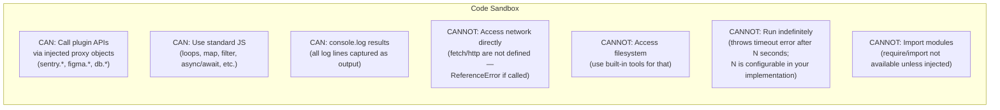

---

## The Search Tool in Detail

The `search_apis` tool is the key innovation that makes this work with two tools instead of one. Without it, you'd need to dump the full API surface into the conversation. With it, the LLM discovers capabilities incrementally.

### What search_apis Does

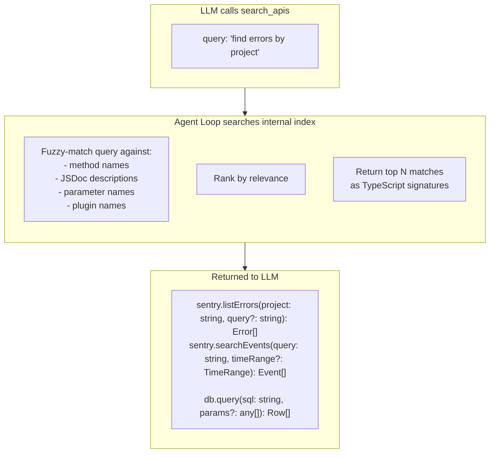

### Where TypeScript API Definitions Live

A common implementation question: when the `search_apis` tool returns a TypeScript signature like `sentry.listErrors(project: string, query?: string): Error[]`, where does this text come from, and does it go into the system prompt?

**The TypeScript API definitions live in the internal index only (not in the system prompt).** They are returned as **tool results** — specifically, as the output of `search_apis` calls. This is deliberately the cache-friendly choice:

```
Option A — API in system prompt:
  System prompt contains TypeScript signatures for all active plugins.
  When a new plugin activates, the system prompt changes.
  → Cache breakpoint 1 invalidated → cold turn.

Option B — API in tool results (this approach):
  System prompt never mentions plugin APIs.
  TypeScript signatures appear only as search_apis results.
  → System prompt never changes → BP1 always cached.
  → Tool definitions never change → BP2 always cached.
```

Option B is the design described in this document. The system prompt instructs the LLM on how to use `search_apis` and `execute_code`, but does not contain any plugin-specific TypeScript signatures. Those arrive on-demand as tool results.

**What about nested types?** When a search result includes `sentry.listErrors(...): Error[]`, the `Error` type definition also appears in the search result, so the LLM sees the complete shape:

```typescript
/** List errors for a project filtered by query */
sentry.listErrors(project: string, query?: string): Error[]

interface Error {
  id: string;
  level: "fatal" | "error" | "warning";
  message: string;
  timestamp: string;
}
```

The agent is responsible for including enough type context in the search result so the LLM can write correct code. How deep to expand nested types is an implementation decision — common practice is one level of expansion for return types.

### What Makes This Better Than Dumping the Full API

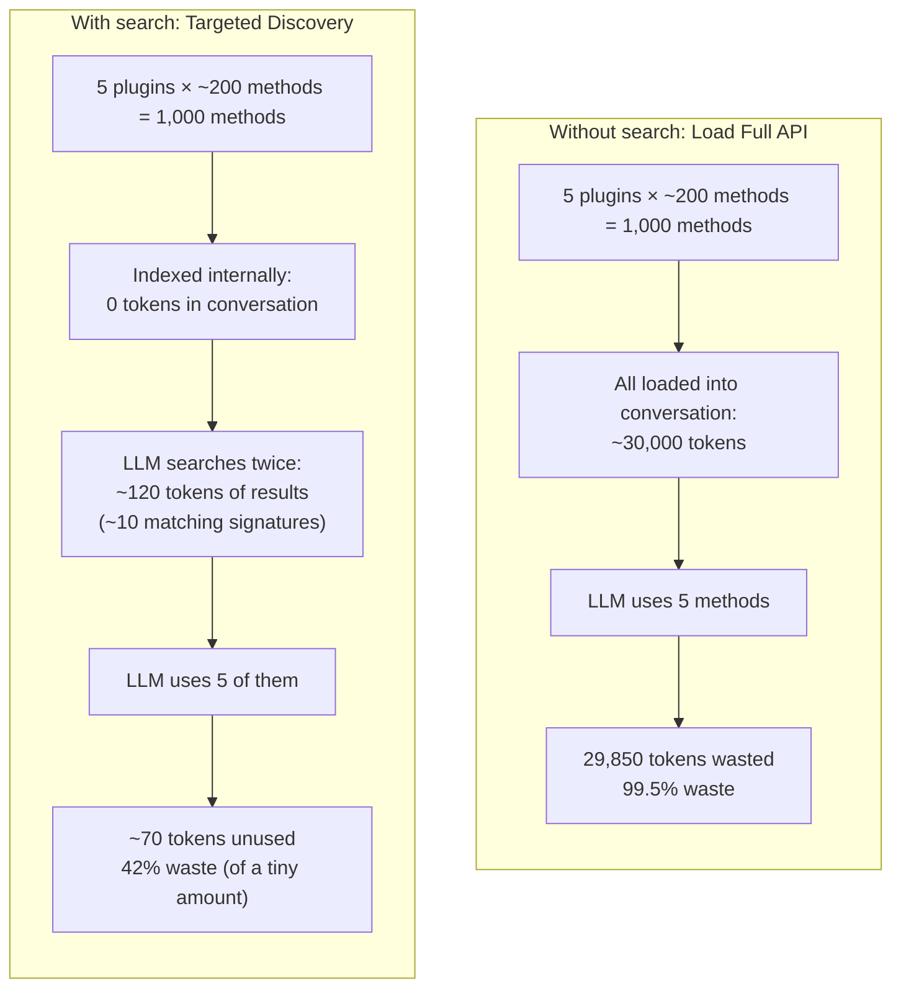

The difference scales dramatically:

```
1,000 methods across 5 plugins:
  Full dump:  ~30,000 tokens in conversation
  Search:     ~120 tokens in conversation (250x less)

2,500 methods (Cloudflare-scale):
  Full dump:  ~80,000 tokens in conversation
  Search:     ~200 tokens in conversation (400x less)
```

### Search Also Replaces Plugin Activation

With the search tool, you don't even need the `activate_plugin` step from Progressive Discovery. The LLM doesn't need to know which plugins exist -- it just describes what it needs, and `search_apis` finds it across all connected plugins:

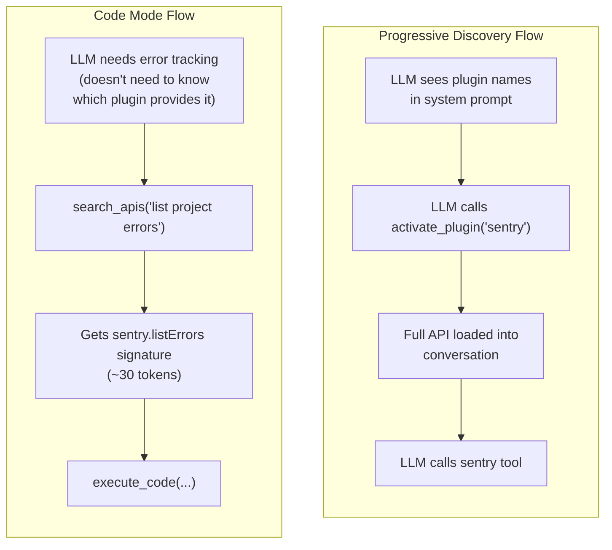

The LLM doesn't even need to know the word "Sentry." It describes the capability it needs ("list project errors"), and the search finds the right methods. This is more natural -- a developer doesn't think "I need the Sentry plugin," they think "I need to find error information."

**Code mode and Progressive Discovery interaction:** In code mode, idle timeout tracking (if you implement it from Progressive Discovery) should be based on whether `execute_code` calls reference a plugin's methods, not on individual plugin tool calls. An `execute_code` call that calls `sentry.*` methods counts as Sentry plugin activity for idle timeout purposes. Plugins can still connect and disconnect at runtime -- the agent simply updates the internal index without touching the tool list.

---

## Why This Solves All Four Problems

### Problem 1 Solved: Massive Token Savings

Tool definitions are replaced by just 2 generic tool definitions, and the TypeScript API is only surfaced through search results:

```
JSON Schema (1 tool, ~150 tokens):
{
  "name": "list_errors",
  "description": "List errors for a project filtered by query",
  "input_schema": {
    "type": "object",
    "properties": {
      "project": { "type": "string", "description": "Project slug" },
      "query": { "type": "string", "description": "Search filter" }
    },
    "required": ["project"]
  }
}

TypeScript via search result (same info, ~30 tokens):
/** List errors for a project filtered by query */
sentry.listErrors(project: string, query?: string): Error[]
```

That's a **5x compression** per method. But the real win is that you only see the **relevant** methods, not the entire API. For 1,000 methods where you need 5, the savings are:

```
Traditional:  1,000 tools × 150 tokens = 150,000 tokens in tool definitions
Code mode:    2 tools × 200 tokens + 5 search results × 30 tokens = 550 tokens
Savings: 99.6%
```

### Problem 2 Solved: Cache Stability

The tool definition list **never changes**. It's always the same 24 tools (22 built-in + `search_apis` + `execute_code`), regardless of how many plugins are connected:

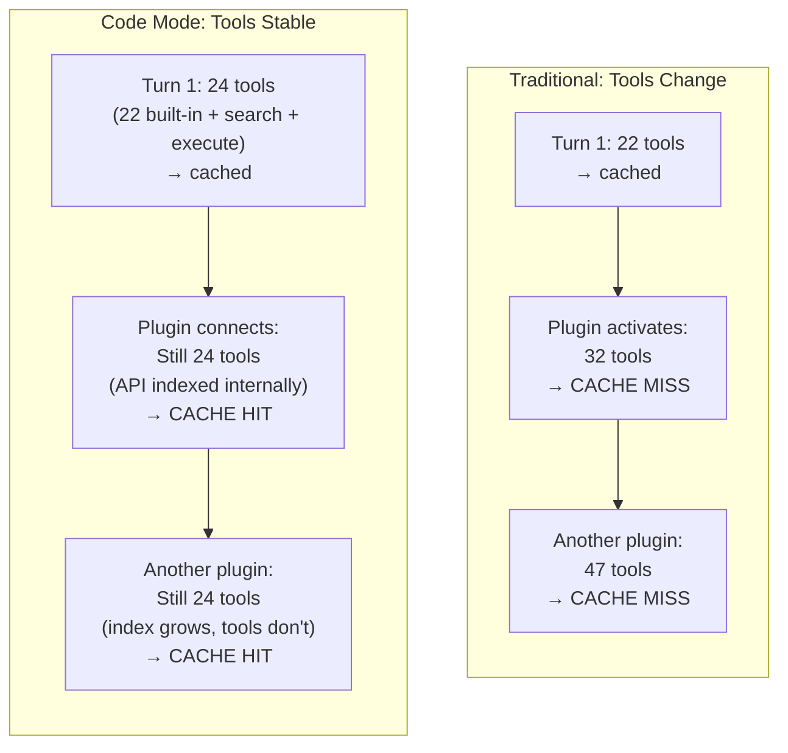

No cold turns. Ever. The [cold turn problem](./context-management.md#the-plugin-activation-problem-cold-turns) is completely eliminated because the tool list is static.

### Problem 3 Solved: Fewer Round Trips

With traditional tool calling, each action is a separate round trip through the LLM:

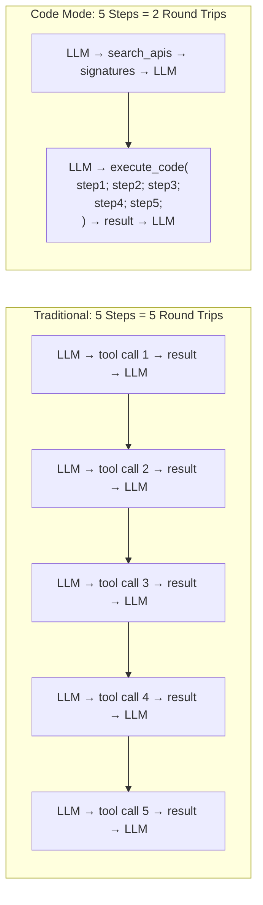

Each round trip costs:
- **Latency**: 1-5 seconds per LLM call
- **Input tokens**: the entire conversation is re-sent each time
- **Output tokens**: the LLM generates a response each time

Code mode needs **2 round trips** (search + execute) regardless of how many API calls are chained. Traditional mode needs 1 round trip per call.

### Problem 4 Solved: No Full API Dump

The search tool means the LLM never needs the full API surface. It gets just the methods it needs, when it needs them:

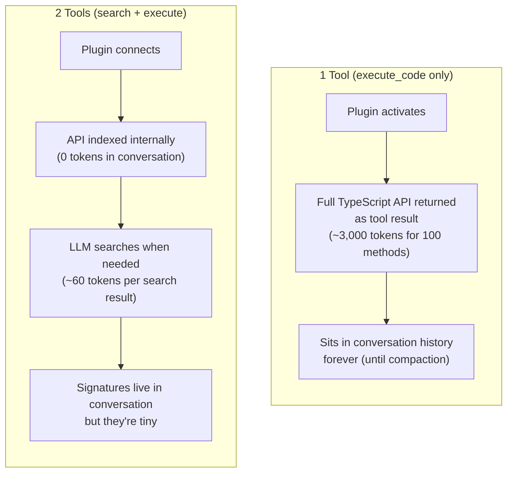

This is especially important for [Context Management](./context-management.md): less data in the conversation means more room for actual work before compaction triggers.

---

## Full Example: Code Mode in Action

```mermaid
sequenceDiagram
    participant You
    participant LLM
    participant Loop as Agent Loop
    participant Index as API Index
    participant Sandbox as Code Sandbox
    participant Sentry as Sentry MCP
    participant Disk as File System

    You ->> LLM: "Check for the login crash,\nthen fix the code"

    Note over LLM: Doesn't need to know\nwhich plugin has error tracking.\nJust searches.

    LLM ->> Loop: TOOL: search_apis({<br/>  query: "list errors login crash"<br/>})
    Loop ->> Index: Search all plugin APIs
    Index ->> Loop: 2 matches from Sentry
    Loop ->> LLM: RESULT:<br/>sentry.listErrors(project: string,<br/>  query?: string): Error[]<br/>sentry.getErrorDetail(<br/>  errorId: string): ErrorDetail

    Note over LLM: Tool list UNCHANGED.\nCache warm.\nOnly ~60 tokens of API info\nadded to conversation.

    LLM ->> Loop: TOOL: execute_code({<br/>  code: `<br/>    const errors = await sentry.listErrors(<br/>      "web-app", "login crash"<br/>    );<br/>    const detail = await sentry.getErrorDetail(<br/>      errors[0].id<br/>    );<br/>    console.log(JSON.stringify({<br/>      file: detail.stacktrace[0].file,<br/>      line: detail.stacktrace[0].line,<br/>      message: detail.message<br/>    }));<br/>  `<br/>})

    Loop ->> Sandbox: Execute in isolated JS runtime
    Sandbox ->> Sentry: listErrors("web-app", "login crash")
    Sentry ->> Sandbox: [{id: "E-123", ...}]
    Sandbox ->> Sentry: getErrorDetail("E-123")
    Sentry ->> Sandbox: {stacktrace: [...], message: "..."}
    Sandbox ->> Loop: {file: "src/auth/login.ts", line: 42, ...}
    Loop ->> LLM: RESULT: {file: "src/auth/login.ts", line: 42, ...}

    Note over LLM: Got everything in 2 calls\n(search + execute).\nNow uses built-in tools to fix.

    LLM ->> Loop: TOOL: read_file("src/auth/login.ts")
    Loop ->> Disk: Read file
    Disk ->> Loop: File contents
    Loop ->> LLM: RESULT: file contents

    LLM ->> Loop: TOOL: edit_file("src/auth/login.ts", ...)
    Loop ->> LLM: "File edited successfully"

    LLM ->> You: "Fixed! Added a null check at line 42."
```

Compare this to the [Progressive Discovery example](./progressive-discovery.md#full-example-progressive-discovery-in-action): same task, but code mode needed **2 round trips** for the Sentry work (search + execute) instead of **3** (activate + list + detail). More importantly: zero cache misses, zero full API dumps, and the LLM never needed to know the word "Sentry."

---

## Second Example: Cross-Plugin Query With an Error Recovery

The first example showed the happy path. This example shows two things traditional tool-call examples often skip: **searching across multiple plugins** and **what happens when the LLM writes buggy code**.

**User asks:** "How many users signed up this week, and what's the current design for the signup page?"

This task spans two plugins (database and Figma) that the LLM doesn't need to know about by name.

### Turn 1 → LLM Searches for Both Capabilities at Once

```json
{
  "role": "assistant",
  "content": [
    {
      "type": "text",
      "text": "I'll search for methods to query user data and fetch design information."
    },
    {
      "type": "tool_use",
      "id": "toolu_01_search",
      "name": "search_apis",
      "input": {
        "query": "query users signup count and get page design"
      }
    }
  ],
  "stop_reason": "tool_use"
}
```

**Tool result** (the search matches across two different plugins):

```
Found 3 matching methods:

/** Execute a SQL query against the database */
db.query(sql: string, params?: any[]): Row[]

/** Get the design spec for a page by name */
figma.getDesign(pageName: string): DesignSpec

interface Row {
  [column: string]: any;
}

interface DesignSpec {
  pageName: string;
  components: { name: string; type: string; props: Record<string, any> }[];
  lastUpdated: string;
  figmaUrl: string;
}
```

The LLM didn't ask for "the database plugin" or "the Figma plugin." It described what it needed, and the search found methods from both. Now it knows `db.query` and `figma.getDesign` exist.

### Turn 2 → LLM Writes Code That Has a Bug

```json
{
  "role": "assistant",
  "content": [
    {
      "type": "tool_use",
      "id": "toolu_02_exec",
      "name": "execute_code",
      "input": {
        "code": "const users = await db.query(\n  \"SELECT COUNT(*) as count FROM users WHERE created_at > NOW() - INTERVAL '7 days'\"\n);\nconst design = await figma.getDesign(\"signup\");\nconsole.log(JSON.stringify({\n  signupsThisWeek: users[0].count,\n  design: design.components.map(c => c.name),\n  lastDesignUpdate: design.lastUpdated,\n  figmaLink: design.figmaUrl\n}));"
      }
    }
  ],
  "stop_reason": "tool_use"
}
```

The code calls both plugins in one script. But the Figma page isn't called "signup" — it's called "Sign Up Page". The sandbox runs the code, and `figma.getDesign("signup")` returns `null`.

**Tool result** (error from the sandbox):

```
TypeError: Cannot read properties of null (reading 'components')
    at line 6
```

### Turn 3 → LLM Reads the Error and Retries

This is the same pattern as [error handling in Layer 1](./tool-execution.md#error-handling-errors-are-just-data). The error becomes a tool result that the LLM reasons about:

```json
{
  "role": "assistant",
  "content": [
    {
      "type": "text",
      "text": "The page name 'signup' wasn't found. Let me search for the correct page name."
    },
    {
      "type": "tool_use",
      "id": "toolu_03_search",
      "name": "search_apis",
      "input": {
        "query": "list available design pages"
      }
    }
  ],
  "stop_reason": "tool_use"
}
```

**Tool result:**

```
Found 1 matching method:

/** List all page names in the Figma project */
figma.listPages(): string[]
```

### Turn 4 → LLM Writes Corrected Code

```json
{
  "role": "assistant",
  "content": [
    {
      "type": "tool_use",
      "id": "toolu_04_exec",
      "name": "execute_code",
      "input": {
        "code": "const users = await db.query(\n  \"SELECT COUNT(*) as count FROM users WHERE created_at > NOW() - INTERVAL '7 days'\"\n);\nconst pages = await figma.listPages();\nconst signupPage = pages.find(p => p.toLowerCase().includes('sign'));\nconst design = signupPage ? await figma.getDesign(signupPage) : null;\nconsole.log(JSON.stringify({\n  signupsThisWeek: users[0].count,\n  matchedPage: signupPage,\n  design: design?.components.map(c => c.name) ?? 'Page not found',\n  lastDesignUpdate: design?.lastUpdated,\n  figmaLink: design?.figmaUrl\n}, null, 2));"
      }
    }
  ],
  "stop_reason": "tool_use"
}
```

**Tool result:**

```json
{
  "signupsThisWeek": 1847,
  "matchedPage": "Sign Up Page",
  "design": ["Header", "EmailInput", "PasswordInput", "SubmitButton", "SocialLogin"],
  "lastDesignUpdate": "2025-01-14T16:30:00Z",
  "figmaLink": "https://figma.com/file/abc123/Sign-Up-Page"
}
```

### Turn 5 → LLM Reports Results

```json
{
  "role": "assistant",
  "content": [
    {
      "type": "text",
      "text": "Here's what I found:\n\n**Signups this week:** 1,847 new users\n\n**Current signup page design** (last updated yesterday):\n- Header\n- Email input\n- Password input\n- Submit button\n- Social login (OAuth)\n\n[View in Figma](https://figma.com/file/abc123/Sign-Up-Page)"
    }
  ],
  "stop_reason": "end_turn"
}
```

### What This Example Demonstrates

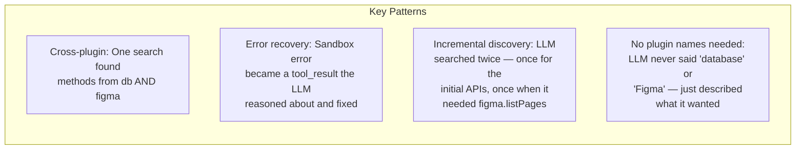

**Total: 3 round trips** (search → execute(error) → search → execute(success)), with 2 searches and 2 executions. With traditional tool calling, this would be: activate database plugin (cold turn) → query → activate Figma plugin (another cold turn) → getDesign(fail) → listPages → getDesign(success) = **6 round trips and 2 cache misses**.

---

## How This Changes Lower Layers

### Changes to Layer 0 (The Loop)

The loop gains two new tool execution paths:

**When `search_apis` is called:**
1. Parse the natural language query
2. Search the internal TypeScript index across all connected plugins
3. Return the top matching method signatures as a tool result

**When `execute_code` is called:**
1. Build proxy objects for all active plugins (each proxy routes method calls to the plugin's MCP server)
2. Create an isolated JS execution context (using `vm.createContext` or `isolated-vm`) with plugin proxies and a capture console injected as globals
3. Execute the LLM's code inside that context with a timeout
4. Collect all `console.log` / `console.error` output captured during execution
5. Return the captured output as the tool result
6. Tear down the sandbox

### Changes to Layer 1 (Tools)

The tool registry stays simpler and **completely static**. Plugin tools are never registered individually -- only `search_apis` and `execute_code` are registered. The registry never grows, shrinks, or changes order.

### Changes to Layer 1+ (Progressive Discovery)

The discovery model shifts. Instead of "tell the LLM what plugins exist, let it activate them," the model becomes "let the LLM describe what it needs, search finds it":

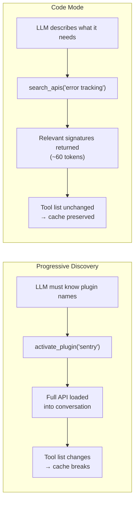

Plugins can still connect/disconnect at runtime, but the agent just updates its internal index. The LLM-facing tool definitions never change.

### Changes to Layer 2 (Context Management)

This is the biggest win. The [cold turn problem](./context-management.md#the-plugin-activation-problem-cold-turns) is **completely eliminated**:

- **Cache breakpoint 2 (tools)** is permanently stable -- `search_apis` and `execute_code` never change
- **Cache breakpoint 1 (system prompt)** is also stable -- TypeScript API definitions never go into the system prompt; they appear only as tool results
- **Zero cold turns** -- plugins connecting/disconnecting only changes the internal index, not the tool list
- **Minimal context consumption** -- search results are tiny (~60 tokens) compared to full API dumps (~3,000+ tokens)
- **Compaction-friendly** -- less API text in the conversation means more room for real work

The trade-off vs traditional progressive discovery:

| | Progressive Discovery | Code Mode (2 tools) |
|---|---|---|
| Cold turns per plugin | 1 | 0 |
| API tokens in conversation | Full API (~3,000/plugin) | Search results only (~60/query) |
| Round trips for multi-step task | 1 per step | search + 1 execute |
| LLM needs to know plugin names | Yes | No |
| Tool count changes | Yes (cache breaks) | No (always 24) |

---

## Cost Comparison

> **Note:** The figures below are illustrative estimates derived from the token cost assumptions stated earlier in this document (50-200 tokens per tool definition, ~60 tokens per search result, ~150 tokens per JSON Schema definition). They are not measured benchmarks. Actual numbers will vary based on your tool descriptions, conversation length, and how many multi-step tasks the LLM performs. Use these as order-of-magnitude comparisons, not as precise predictions.

| | Progressive Discovery | Code Mode |
|---|---|---|
| **Scenario** | 5 plugins, 60 tools, 30-turn conversation | same |
| Tool definition tokens/call | 60 tools × ~150 = ~9,000 | 24 tools × ~150 = ~3,600 |
| Cold turns (cache misses) | ~5 activations × full context reprocess | 0 |
| API tokens in conversation | Full APIs on activation (~3,000/plugin) | Search results only (~60/query) |
| Estimated round trips | ~45 LLM calls | ~25 LLM calls |
| Estimated total input tokens | ~2.5M (rough estimate) | ~1.0M (rough estimate) |
| **Estimated savings** | — | ~60% fewer input tokens |

At Cloudflare scale (2,500 endpoints):

| | Traditional | Code Mode |
|---|---|---|
| Tool definition tokens/call | ~375,000 (exceeds most context windows) | ~3,600 |
| Works at all? | No — tool list alone exceeds context | Yes |

---

## Key Takeaways

1. **Code mode uses 2 generic tools**: `search_apis` to discover methods and `execute_code` to run code
2. **The tool list is permanently fixed** at 24 (22 built-in + 2 generic), eliminating all cold turns
3. **Search replaces API dumps**: the LLM gets only the method signatures it needs (~60 tokens), not the full API (~3,000+ tokens per plugin)
4. **The LLM doesn't need to know plugin names**: it describes what it needs, search finds it
5. **Fewer round trips**: search + execute = 2 calls, no matter how many API calls are chained
6. **LLMs may write more accurate multi-step code** than they make sequential tool calls, particularly for large APIs — but the primary measurable benefit is round-trip reduction
7. **Security via sandboxing**: code runs in an isolated JS context (e.g., Node.js `vm` module or `isolated-vm`) with no direct network access -- only plugin proxies injected as globals
8. **TypeScript API definitions go in tool results** (as `search_apis` results), never in the system prompt -- this preserves both cache breakpoints
9. **`console.log` is the output channel**: code must log results; `return` values are not captured; exceptions and timeouts are returned as error strings
10. **Scales to any size**: 60 tools or 2,500 endpoints, the cost to the LLM is the same (24 tool definitions + targeted search results)

---

> **Related:** [Context Management](./context-management.md) -- How code mode eliminates the cold turn problem from plugin activation.
>
> **Related:** [Progressive Discovery](./progressive-discovery.md) -- The on-demand loading mechanism that code mode replaces for plugins.
