# Layer 2: Context Management

> **Prerequisite:** Read [Layer 1+: Progressive Discovery](./progressive-discovery.md) first.
>
> **What you know so far:** The loop (Layer 0) keeps calling the LLM. The LLM uses tools (Layer 1) to act on the world. Skills and plugins load on demand (Layer 1+). Tool definitions are sent on every call. The conversation grows with each turn.
>
> **What this layer solves:** After many turns, the conversation gets too long for the LLM to handle. How do you keep the agent working when the conversation overflows?

---

## The Problem

LLMs have a **context window** -- a maximum number of tokens they can process at once. Think of it as the LLM's short-term memory. It has a hard limit:

| Model | Context Window |
|-------|---------------|
| GPT-4o | ~128,000 tokens |
| Claude Sonnet/Opus | ~200,000 tokens |

That sounds like a lot, but it fills up fast in an agent:

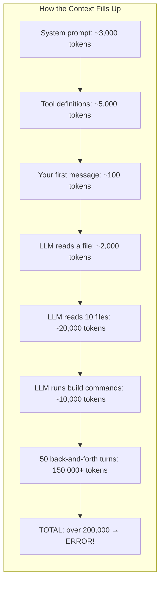

**What happens when you hit the limit?** The LLM API returns an error and everything stops. The loop crashes.

We need three strategies to handle this:

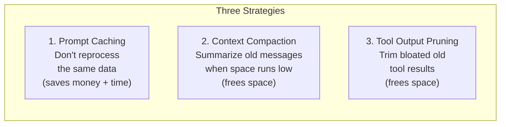

---

## Strategy 1: Prompt Caching

### The Problem

Every time the loop calls the LLM (every turn), it sends the **entire input** from scratch. But parts of that input never change:

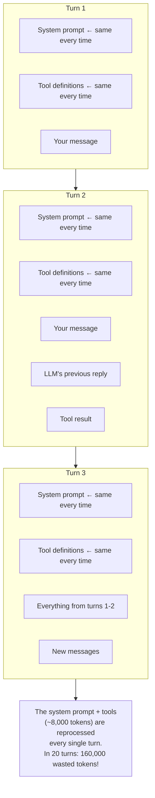

### The Solution

LLM providers (like Anthropic) support **prompt caching**. You mark certain parts of the input as "cacheable." On the first call, those parts are processed and stored. On later calls, they're served from cache -- nearly free.

```mermaid
sequenceDiagram
    participant Loop as Agent Loop
    participant Cache as LLM Cache
    participant LLM

    Note over Loop: Turn 1
    Loop ->> Cache: System prompt + Tools (marked as cacheable)
    Cache ->> Cache: Process and STORE in cache
    Loop ->> LLM: + Your message
    LLM ->> Loop: Response

    Note over Loop: Turn 2
    Loop ->> Cache: System prompt + Tools
    Cache ->> Cache: CACHE HIT! Nearly free.
    Loop ->> LLM: + All messages so far
    LLM ->> Loop: Response

    Note over Loop: Turn 20
    Loop ->> Cache: System prompt + Tools
    Cache ->> Cache: CACHE HIT! Still free.
    Loop ->> LLM: + All messages so far
    LLM ->> Loop: Response
```

### Where to Place Cache Markers

A good strategy uses three cache breakpoints:

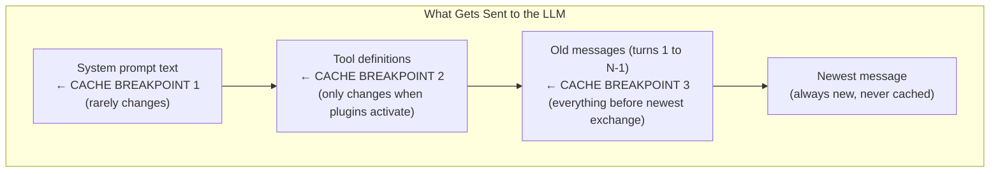

### Design Choices That Protect the Cache

Remember from Layer 1+: skill instructions go in **tool results**, not the system prompt. Now you see why -- if you changed the system prompt to add instructions, the cache would break:

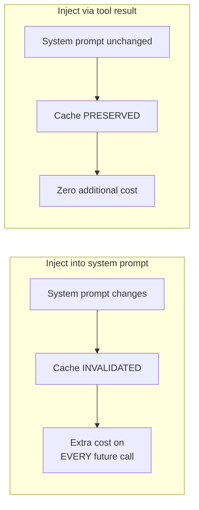

Also: **sort tools alphabetically** before sending them. If the order changes, the cache misses:

```
Turn 1 tools: [bash, edit, read, write]  → cached
Turn 2 tools: [edit, bash, write, read]  → MISS! Different order!

Turn 1 tools: [bash, edit, read, write]  → cached
Turn 2 tools: [bash, edit, read, write]  → HIT! Same order.
```

### The Plugin Activation Problem (Cold Turns)

There's a tension between Layer 1+ (Progressive Discovery) and caching. When a plugin activates, it **adds new tools** to the registry. This changes the tool definitions at cache breakpoint 2. Because caching is **prefix-based**, everything after the changed prefix also loses its cache:

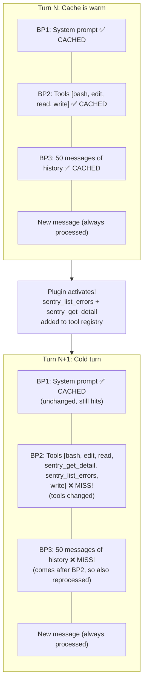

This **cold turn** means the entire conversation history gets reprocessed at full cost. If you have 150K tokens of history, that's 150K tokens billed at full input price instead of the cached price.

**But it's only one turn.** On the next call, the new tool set becomes the cached prefix. The cache re-warms:

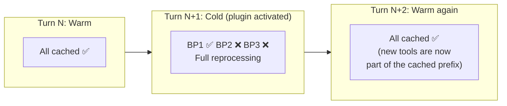

### Mitigating Cold Turn Costs

Several strategies reduce the impact of tool-change cache misses:

**1. Batch plugin activations.** If the LLM needs Sentry and Figma, activate both in the same turn. You pay one cold turn instead of two:

```
BAD:  activate_plugin("sentry")  → cold turn
      activate_plugin("figma")   → another cold turn (tools changed again!)

GOOD: activate_plugin("sentry") + activate_plugin("figma")  → one cold turn
      (both sets of tools added before the next LLM call)
```

**2. Avoid activation/deactivation cycles.** If a plugin idles out and gets deactivated, then the LLM needs it again later, that's two cold turns (one to remove, one to re-add). Consider longer idle timeouts for frequently-used plugins.

**3. Activate early, when context is small.** A cold turn with 10K tokens of history costs far less than one with 150K tokens. If you know certain plugins will be needed, activate them early in the conversation when the miss penalty is small:

```
Cold turn at 10K history:  10K tokens reprocessed  (~$0.03)
Cold turn at 150K history: 150K tokens reprocessed (~$0.45)
Same plugin — 15x the cost just from timing.
```

**4. Accept the cost.** One cold turn per plugin activation is usually acceptable. The real danger is **oscillation** -- repeatedly adding and removing tools, causing cold turns every few calls. As long as tool definitions stabilize quickly, the cost is a one-time blip.

**5. Use Code Mode.** The most radical mitigation: don't register plugin tools at all. Instead, expose plugin capabilities through 2 generic tools (`search_apis` + `execute_code`). The LLM searches for methods it needs, then writes code to call them. The tool list is permanently fixed, so cold turns never happen. See [Code Mode](./code-mode.md) for the full approach.

### Cost Impact

Prompt caching can reduce input costs by 90%+ for long conversations:

```
Without caching:  20 calls x 8K tokens = 160K tokens reprocessed
With caching:     1 cache creation + 19 cache hits ≈ 8K + nearly free
Savings: ~95%

With 1 plugin activation mid-session (at 100K context):
  19 cache hits + 1 cold turn (100K reprocessed) ≈ 108K total
  Savings: still ~67% vs no caching at all
```

---

## Strategy 2: Context Compaction

### The Problem

Even with caching, the conversation keeps growing. Every message, every tool result adds tokens. Eventually it **will** exceed the context window, and no amount of caching helps -- the entire history must fit.

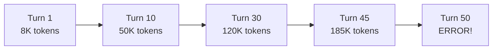

### The Solution

When the conversation approaches the limit, ask the LLM to **summarize** everything into a compact summary. Then replace the old messages with this summary.

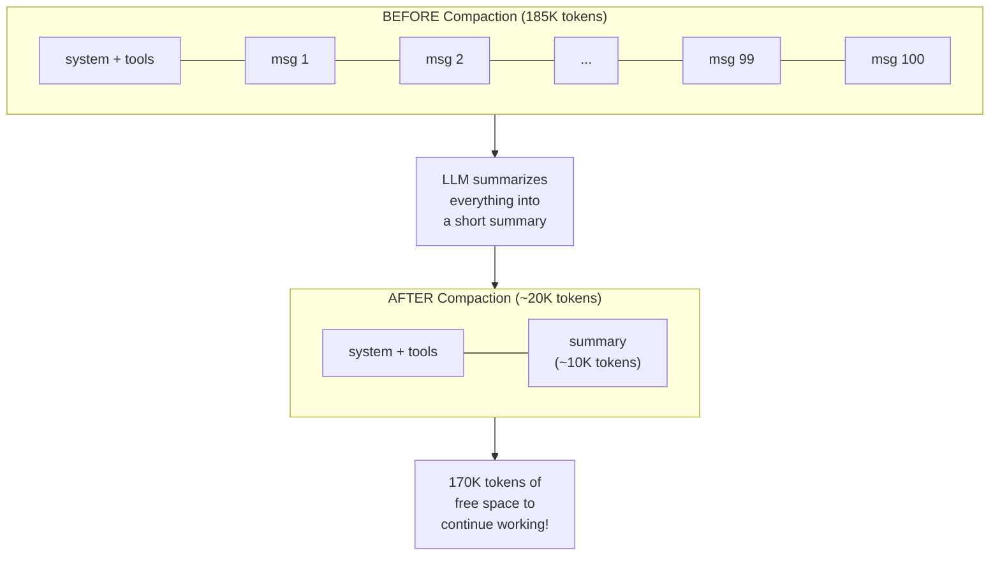

### How Compaction Works Step by Step

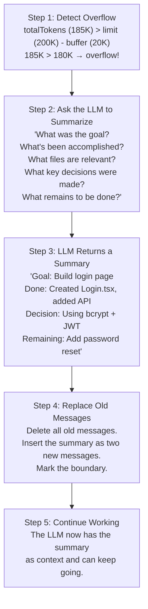

### Multiple Compactions

In very long sessions, compaction happens multiple times. Each one builds on the previous summary:

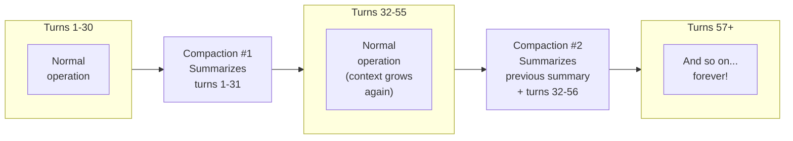

The agent can work **indefinitely** -- compaction keeps resetting the context.

---

## Strategy 3: Tool Output Pruning

### The Problem

Tool results are often the biggest items in the conversation. Reading a file might produce 10,000 tokens. Running `npm install` might produce 5,000 tokens. After many tool calls, old results dominate the context:

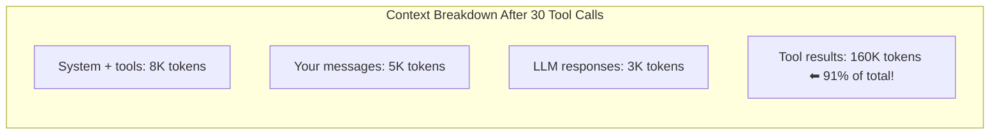

Most of those tool results are from early turns and no longer relevant.

### The Solution

**Prune old tool results** by replacing their content with a short placeholder. Keep only the most recent results:


The pruner walks **backward** from the newest message, protecting the most recent N tokens of tool output (e.g., 40,000) and clearing everything older.

---

## How All Three Strategies Work Together

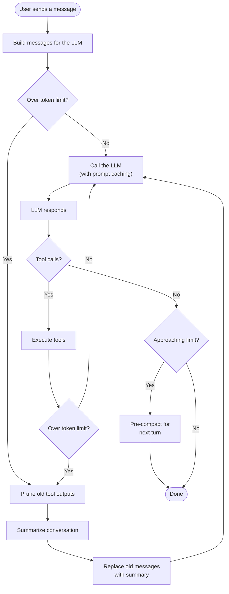

### A Long Session Timeline

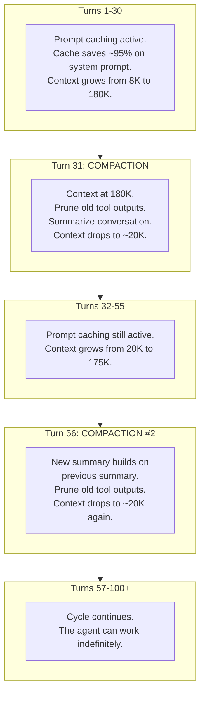

---

## How This Changes Lower Layers

### Changes to Layer 0 (The Loop)

The loop now has a new step after executing tools:

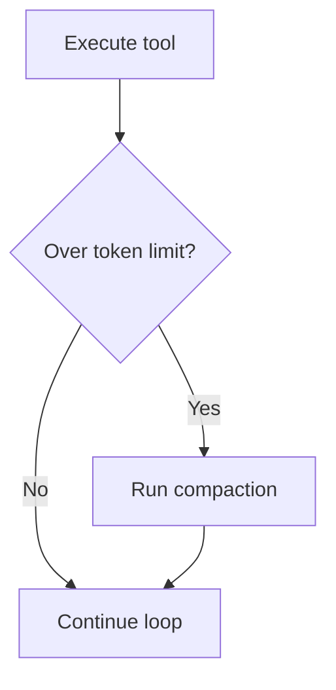

It also has a **post-turn check**: after the loop ends, if the context is approaching the limit, pre-compact for the next turn.

### Changes to Layer 1 (Tools)

Tool definitions must be **sorted alphabetically** to keep the cache stable. The tool list sent to the LLM must be in the same order every time.

### Changes to Layer 1+ (Discovery)

Two design choices protect prompt caching:

1. **Skill instructions go in tool results** (not the system prompt) to avoid invalidating cache breakpoint 1.
2. **Plugin activations cause a cold turn** -- one cache miss when the tool list changes. The loop should batch multiple plugin activations into a single turn when possible, and avoid deactivating plugins that may be needed again soon. See [The Plugin Activation Problem](#the-plugin-activation-problem-cold-turns) above for details.

---

## Typical Constants

| Constant | Typical Value | Purpose |
|----------|---------------|---------|
| Context Limit | 200,000 | Maximum tokens the model handles |
| Compaction Buffer | 20,000 | Trigger compaction when this much space remains |
| Max Output Tokens | 8,000-16,000 | Reserved for the LLM's response |
| Prune Protection | 30,000-50,000 | Recent tool output tokens to keep |
| Min Prune Savings | 15,000-25,000 | Don't prune unless we save this much |

---

## What We Have So Far

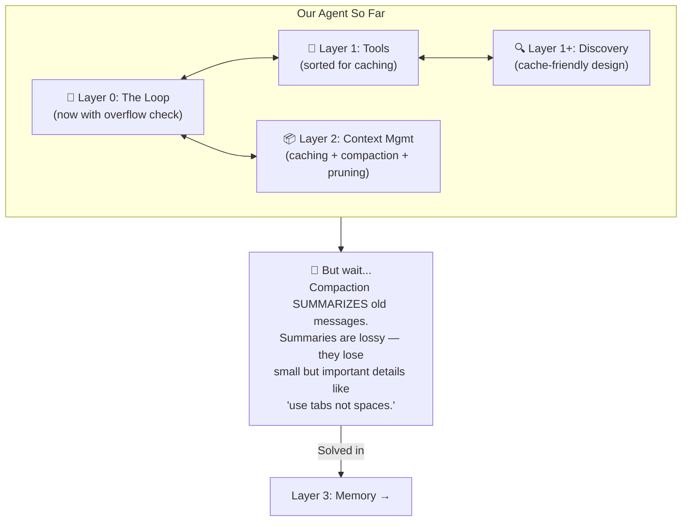

---

## Key Takeaways

1. **Prompt caching** avoids reprocessing identical parts (system prompt, tools), saving 90%+ on those tokens
2. **Context compaction** summarizes old messages when the window fills up, letting conversations run forever
3. **Tool output pruning** trims the biggest space hog (old tool results) while keeping recent ones
4. **All three work together**: caching reduces cost, pruning extends capacity, compaction resets when full
5. **Design choices matter**: sorted tools, stable system prompts, and tool-result-based skill injection all protect cache hits
6. **Plugin activations cause cold turns**: dynamic tool registration (from Layer 1+) changes the tool prefix, causing one full cache miss. Batch activations and activate early to minimize the cost
7. **This upgrades Layer 0**: the loop now checks for overflow after each turn and runs compaction when needed

---

> **Next:** [Layer 3: Observational Memory](./observational-memory.md) -- How do you remember important details that compaction throws away?
