# Layer 2: Context Management

> **Prerequisite:** Read [Layer 1+: Progressive Discovery](./progressive-discovery.md) first.
>
> **What you know so far:** The loop (Layer 0) keeps calling the LLM. The LLM uses tools (Layer 1) to act on the world. Skills and plugins load on demand (Layer 1+). Tool definitions are sent on every call. The conversation grows with each turn.
>
> **What this layer solves:** After many turns, the conversation gets too long for the LLM to handle. How do you keep the agent working when the conversation overflows?
>
> **API knowledge assumed:** This doc assumes you know what a messages array looks like in an LLM API call, what roles (`user`, `assistant`, `tool`) mean, and roughly what a token is. If those concepts are unfamiliar, read the [Anthropic Messages API overview](https://docs.anthropic.com/en/api/messages) first.

---

## A Note on Tokens

A **token** is roughly 0.75 words. "Hello world" is about 2-3 tokens. You cannot count tokens exactly without the model's tokenizer, but you can estimate: 1,000 words is approximately 1,300 tokens.

To get an accurate count before sending a request, use a tokenizer library (for Claude: `@anthropic-ai/tokenizer`; for OpenAI: `tiktoken`) or call the provider's token-counting endpoint. For the overflow checks described in this doc, an estimate within 5-10% is accurate enough -- the safety buffer accounts for the imprecision.

---

## The Problem

LLMs have a **context window** -- a maximum number of tokens they can process at once. Think of it as the LLM's short-term memory. It has a hard limit:

| Model | Context Window |
|-------|---------------|
| GPT-4o | ~128,000 tokens |
| Claude Sonnet/Opus | ~200,000 tokens |

That sounds like a lot, but it fills up fast in an agent:

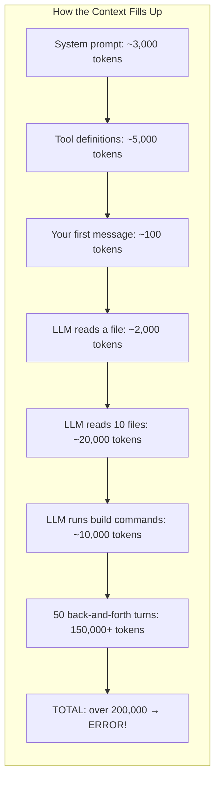

**What happens when you hit the limit?** The LLM API returns an error and everything stops. The loop crashes.

We need three strategies to handle this:

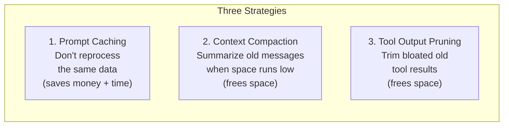

---

## Typical Constants

These values appear in examples throughout this doc. They are starting points -- adjust for your use case.

| Constant | Typical Value | Purpose |
|----------|---------------|---------|
| Context Limit | 200,000 | Maximum tokens the model handles |
| Compaction Trigger | 180,000 | Start compaction when total input tokens exceed this |
| Compaction Buffer | 20,000 | The gap between trigger and limit (absorbs output tokens + estimation error) |
| Max Output Tokens | 8,000-16,000 | Reserved for the LLM's response |
| Prune Protection | 30,000-50,000 | Recent tool output tokens to keep |
| Min Prune Savings | 15,000-25,000 | Don't prune unless we save at least this much |

The compaction buffer (20,000) is intentionally larger than max output tokens (8,000-16,000). It needs to absorb both the response headroom and any token-counting imprecision. Do not shrink it below max output tokens.

---

## Strategy 1: Prompt Caching

### The Problem

Every time the loop calls the LLM (every turn), it sends the **entire input** from scratch. But parts of that input never change:

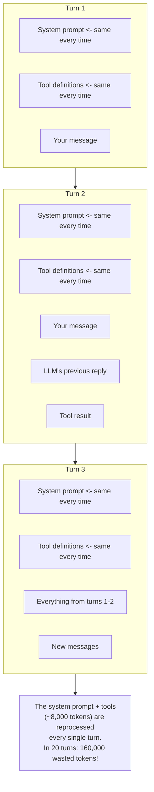

### The Solution: Prompt Caching (Anthropic-Specific)

**Prompt caching is a feature specific to Anthropic's API.** OpenAI uses a different mechanism (automatic and hash-based, with no developer-controlled breakpoints). Everything in this section describes the Anthropic approach only.

Anthropic's caching is **prefix-based** and **breakpoint-controlled**. You tell the API which parts of the input to cache by adding `"cache_control": {"type": "ephemeral"}` to specific message blocks. The API processes those blocks on the first call, stores them server-side, and serves them from cache on subsequent calls -- at roughly 10% of the normal input token price. Cache entries have a 5-minute TTL that resets on each hit.

The cache lives on Anthropic's servers, not on your machine. You pay a small one-time fee to write to the cache (cache creation tokens), then a much lower fee on cache hits (cache read tokens). "Nearly free" means cache-read tokens are priced at approximately 10% of normal input tokens.

```mermaid
sequenceDiagram
    participant Loop as Agent Loop
    participant Cache as Anthropic Cache (server-side, 5-min TTL)
    participant LLM

    Note over Loop: Turn 1
    Loop ->> Cache: System prompt + Tools (with cache_control markers)
    Cache ->> Cache: Process and STORE (TTL starts, resets on each hit)
    Loop ->> LLM: + Your message
    LLM ->> Loop: Response

    Note over Loop: Turn 2
    Loop ->> Cache: System prompt + Tools
    Cache ->> Cache: CACHE HIT! ~10% of normal cost.
    Loop ->> LLM: + All messages so far
    LLM ->> Loop: Response

    Note over Loop: Turn 20
    Loop ->> Cache: System prompt + Tools
    Cache ->> Cache: CACHE HIT! Still cheap.
    Loop ->> LLM: + All messages so far
    LLM ->> Loop: Response
```

### Where to Place Cache Markers

A good strategy uses three cache breakpoints. Each breakpoint marks the end of a stable prefix -- Anthropic processes and caches everything up to and including each marked block. Everything after the last breakpoint is processed fresh every turn.

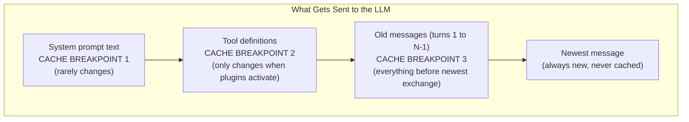

**How to implement this with the Anthropic SDK:**

The `cache_control` field is added to the last content block of each section you want cached.

```typescript
// Breakpoint 1: System prompt
// Add cache_control to the last block of the system prompt array.
const systemPrompt = [
  {
    type: "text",
    text: "You are a coding assistant...",
    cache_control: { type: "ephemeral" }  // Mark end of BP1
  }
];

// Breakpoint 2: Tool definitions
// Sort tools alphabetically by name, then mark the last one.
const tools = sortedTools.map((tool, i) => ({
  ...tool,
  ...(i === sortedTools.length - 1
    ? { cache_control: { type: "ephemeral" } }  // Mark end of BP2
    : {})
}));

// Breakpoint 3: Old messages
// The "old messages" are everything except the newest user turn.
// Mark the last old message to cache the entire prior history.
const oldMessages = allMessages.slice(0, -1);
const newestMessage = allMessages[allMessages.length - 1];

const messagesWithCache = [
  ...oldMessages.map((msg, i) => ({
    ...msg,
    ...(i === oldMessages.length - 1
      ? { cache_control: { type: "ephemeral" } }  // Mark end of BP3
      : {})
  })),
  newestMessage  // No cache_control -- always fresh
];

await anthropic.messages.create({
  model: "claude-sonnet-4-5",
  system: systemPrompt,
  tools,
  messages: messagesWithCache,
  max_tokens: 8096,
});
```

For full API reference and billing details, see the [Anthropic prompt caching guide](https://docs.anthropic.com/en/docs/build-with-claude/prompt-caching).

### Design Choices That Protect the Cache

Remember from Layer 1+: skill instructions go in **tool results**, not the system prompt. Now you see why -- if you changed the system prompt to add instructions, cache breakpoint 1 would break on every call:

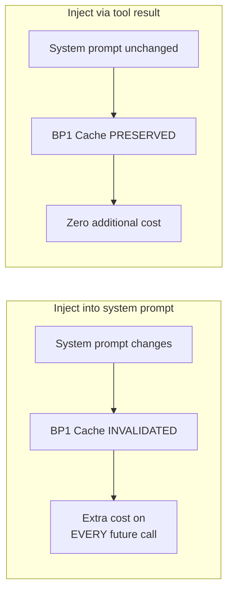

Also: **sort tools alphabetically by their `name` field** before sending them. Anthropic's cache is prefix-based -- if the order of tool definitions changes between calls, the prefix no longer matches and the cache misses, reprocessing the full context at full price.

Sorting applies to all registered tools at the time of the call: base tools plus any plugin tools that have been activated. Re-sort the full list from scratch before each call. This is safe because the request is built fresh each turn. When a plugin adds new tools mid-session (for example, `sentry_get_detail` and `sentry_list_errors`), re-sort the entire list:

```
Before plugin: [bash, edit, read, write]
After plugin:  [bash, edit, read, sentry_get_detail, sentry_list_errors, write]
```

This changes BP2, which causes a cold turn on the next call (see below). After that cold turn, the new sorted list becomes the stable cached prefix.

```
Turn 1 tools: [bash, edit, read, write]        -> cached
Turn 2 tools: [edit, bash, write, read]        -> MISS! Different order.

Turn 1 tools: [bash, edit, read, write]        -> cached
Turn 2 tools: [bash, edit, read, write]        -> HIT! Same order.
```

### The Plugin Activation Problem (Cold Turns)

There's a tension between Layer 1+ (Progressive Discovery) and caching. When a plugin activates, it **adds new tools** to the registry. This changes the tool definitions at cache breakpoint 2. Because caching is **prefix-based**, everything after the changed prefix also loses its cache:

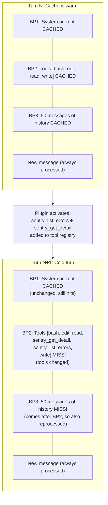

This **cold turn** means the entire conversation history gets reprocessed at full cost. If you have 150K tokens of history, that's 150K tokens billed at full input price instead of the cached price.

**But it's only one turn.** On the next call, the new tool set becomes the cached prefix. The cache re-warms:

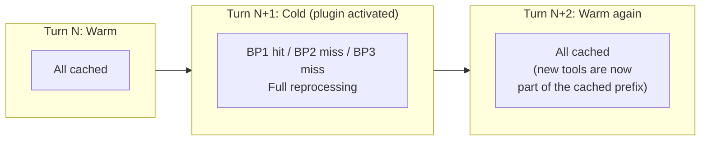

### Mitigating Cold Turn Costs

Several strategies reduce the impact of tool-change cache misses:

**1. Batch plugin activations.** If the LLM needs Sentry and Figma, activate both in the same turn. You pay one cold turn instead of two:

```
BAD:  activate_plugin("sentry")  -> cold turn
      activate_plugin("figma")   -> another cold turn (tools changed again!)

GOOD: activate_plugin("sentry") + activate_plugin("figma")  -> one cold turn
      (both sets of tools added before the next LLM call)
```

**2. Avoid activation/deactivation cycles.** If a plugin idles out and gets deactivated, then the LLM needs it again later, that's two cold turns (one to remove, one to re-add). Consider longer idle timeouts for frequently-used plugins.

**3. Activate early, when context is small.** A cold turn with 10K tokens of history costs far less than one with 150K tokens. If you know certain plugins will be needed, activate them early in the conversation when the miss penalty is small:

```
Cold turn at 10K history:  10K tokens reprocessed  (~$0.03)
Cold turn at 150K history: 150K tokens reprocessed (~$0.45)
Same plugin -- 15x the cost just from timing.
```

These figures are rough estimates based on Claude Sonnet 3.5 input pricing as of early 2025 (approximately $3 per million tokens). They will be different for other models (Opus costs more, Haiku costs less) and will become stale as pricing changes. Use them as order-of-magnitude guidance only, not for budget planning.

**4. Accept the cost.** One cold turn per plugin activation is usually acceptable. The real danger is **oscillation** -- repeatedly adding and removing tools, causing cold turns every few calls. As long as tool definitions stabilize quickly, the cost is a one-time blip.

**5. Use Code Mode.** The most radical mitigation: don't register plugin tools at all. Instead, expose plugin capabilities through 2 generic tools (`search_apis` + `execute_code`). The LLM searches for methods it needs, then writes code to call them. The tool list is permanently fixed, so cold turns never happen. See [Code Mode](./code-mode.md) for the full approach.

### Cost Impact

Prompt caching can reduce input costs by 90%+ for long conversations:

```
Without caching:  20 calls x 8K tokens = 160K tokens reprocessed
With caching:     1 cache creation + 19 cache hits ~= 8K + nearly free
Savings: ~95%

With 1 plugin activation mid-session (at 100K context):
  19 cache hits + 1 cold turn (100K reprocessed) ~= 108K total
  Savings: still ~67% vs no caching at all
```

---

## Strategy 2: Context Compaction

### The Problem

Even with caching, the conversation keeps growing. Every message, every tool result adds tokens. Eventually it **will** exceed the context window, and no amount of caching helps -- the entire history must fit.

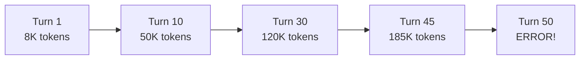

### The Solution

When the conversation approaches the limit, ask the LLM to **summarize** everything into a compact summary. Then replace the old messages with this summary.

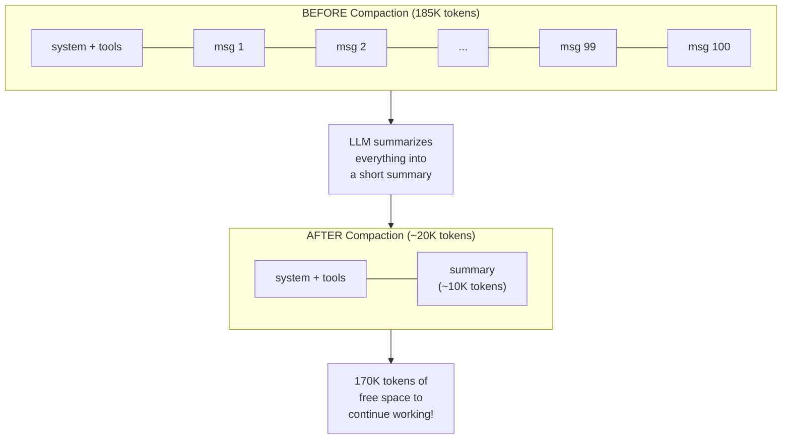

### How Compaction Works Step by Step

**Step 1: Detect Overflow**

Count `totalTokens` -- the number of input tokens you would send in the next LLM call. This is the sum of tokens in the system prompt, the tool definitions, and all messages currently in the conversation history. It does NOT include expected output tokens; those are covered by the compaction buffer.

```
totalTokens = tokens(system_prompt) + tokens(tool_definitions) + tokens(all_messages)

If totalTokens > contextLimit - compactionBuffer:
    trigger compaction

Example:
  totalTokens    = 185,000
  contextLimit   = 200,000
  compactionBuffer = 20,000
  185,000 > 180,000 -> overflow detected
```

The compaction buffer (20,000) is larger than max output tokens (8,000-16,000) to absorb both the response headroom and token-counting imprecision. The check runs before the LLM call, so output tokens are not yet known -- the buffer reserves space for them implicitly. You do not subtract output tokens from `totalTokens`; the buffer is how you account for them.

**Step 2: Ask the LLM to Summarize**

Make a separate LLM call (not the main agent call) with the full conversation and a summarization prompt:

```
What was the user's goal?
What has been accomplished so far?
Which files and code are relevant?
What key decisions were made and why?
What still needs to be done?
```

**Step 3: LLM Returns a Summary**

```
Goal: Build login page
Done: Created Login.tsx, added /api/auth endpoint
Decision: Using bcrypt for password hashing, JWT for sessions
Remaining: Add password reset flow, write tests
```

**Step 4: Replace Old Messages with Two New Messages**

Delete all the old conversation messages from your messages array. Insert the summary as exactly **two messages**: a `user` message and an `assistant` message.

The two-message format is required because LLM APIs expect conversation turns to alternate between `user` and `assistant` roles. An `assistant` message with no preceding `user` message in the same context is either rejected or produces unexpected behavior on some providers.

```typescript
// Replaces all old conversation messages.
// The user turn is a visible marker that compaction occurred here.
// The assistant turn carries the actual summary text.
const summaryMessages = [
  {
    role: "user",
    content: "[Conversation history compacted. Summary of prior context follows.]"
  },
  {
    role: "assistant",
    content: summary  // The text returned by the summarization LLM call
  }
];

// "Mark the boundary" just means this pair of messages is the marker.
// There is no special API field. The placeholder user content is how
// you and future maintainers can identify where a compaction occurred
// when inspecting the message array.

messages = [...summaryMessages, ...newMessagesAfterCompaction];
```

**Step 5: Continue Working**

Append any new messages after the summary pair and continue the loop. The LLM receives the summary as its prior context and proceeds from there.

### A Note on Compaction Quality and Information Loss

Each compaction is **lossy**. The LLM summarizes the conversation, but small details fall out: exact error messages, specific line numbers, the phrasing of a decision that mattered, a subtle constraint the user mentioned early on.

Over multiple compactions, this compounds. Compaction #2 summarizes a context that already contains a summary from compaction #1. The agent is working from a summary of a summary, which loses more detail than a single compaction. The agent can still function -- it retains high-level goals and key decisions -- but fine-grained accuracy degrades progressively.

This is not a problem that context management alone can solve. It is a real limitation:

- Compaction works well for long-running tasks where early context is mostly procedural scaffolding (file reads, build output, iterative edits).
- Compaction works poorly when early messages contained precise constraints, exact values, or nuanced requirements that the summary LLM might paraphrase away.
- After many compactions, if the agent starts making mistakes that feel like "forgetting" earlier decisions, the quality of the summary chain has likely degraded.

If a session has degraded significantly, the cleanest fix is to start a fresh session with a manually written context summary rather than continuing to compound an already-degraded one. Layer 3 (Observational Memory) addresses this systematically by writing important facts to persistent storage before compaction so they survive summarization.

### Multiple Compactions

In very long sessions, compaction happens multiple times. Each one builds on the previous summary:

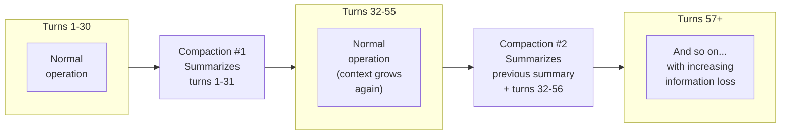

The agent can work indefinitely without crashing. The practical limit is summary quality, not token counts.

---

## Strategy 3: Tool Output Pruning

### The Problem

Tool results are often the biggest items in the conversation. Reading a file might produce 10,000 tokens. Running `npm install` might produce 5,000 tokens. After many tool calls, old results dominate the context:


Most of those tool results are from early turns and no longer relevant.

### The Solution

**Prune old tool results** by replacing their content with a short placeholder. Keep only the most recent results:

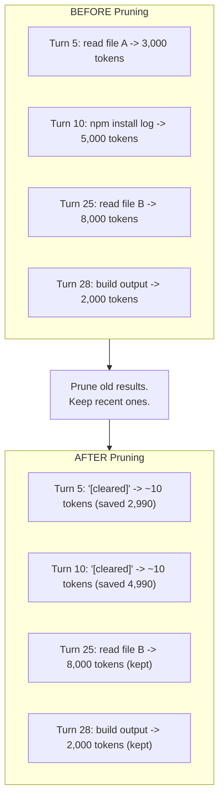

### What "Clearing" Actually Does to the Message Array

Pruning does **not** remove the tool result message from the array. It replaces the content with `[cleared]`. The message remains in place.

This matters because LLM APIs require tool call messages and their corresponding tool result messages to appear as a matched pair. If you delete a tool result message but leave the tool call message, the API sees an unmatched tool call and rejects the request.

```typescript
// WRONG: removes the tool result message entirely -> API error (unmatched tool call)
messages = messages.filter(msg => msg.id !== toolResultId);

// CORRECT: keeps the message in place, replaces only the content
messages = messages.map(msg => {
  if (msg.role === "tool" && shouldPrune(msg)) {
    return { ...msg, content: "[cleared]" };
  }
  return msg;
});
```

The pruner walks **backward** from the newest message, accumulating a running token count of kept tool output. It replaces tool result content (oldest first) with `[cleared]` until the total kept tool output is within the prune protection limit (e.g., 40,000 tokens) or there is nothing left to prune. The corresponding tool call messages are left untouched.

### Pruning Before Summarization: The Tradeoff

The combined flowchart (below) shows pruning happening before summarization during a compaction event. This seems counterintuitive: if the goal of summarizing is to capture the full history, doesn't pruning first mean the LLM summarizes a partially destroyed conversation?

Yes, partially. The tradeoff is:

- **Reason to prune first:** The full 185K context may itself exceed what the summarization LLM can comfortably process. Pruning first reduces the input to the summarization call, making it cheaper and more reliable.
- **Cost of pruning first:** Tool results replaced with `[cleared]` contribute less to the summary. The LLM knows a tool was called but not what it returned. It can often infer the result from surrounding context (for example, if it ran `read Login.tsx` and then started editing that file, the read presumably succeeded), but this is not guaranteed.

The practical implication: if a cleared tool result contained something critical -- an exact error message, a specific value -- the summary may not capture it accurately. This is one of the mechanisms by which compaction quality degrades over time.

---

## How All Three Strategies Work Together

The flowchart below shows the complete flow within a single turn. There are two places where compaction can trigger:

1. **Pre-call check** (`OVER1`): before the LLM is called, if the current messages already exceed the trigger threshold.
2. **Mid-turn check** (`OVER2`): after a tool executes within the turn, if the added tool result pushed the context over the threshold.

**When mid-turn compaction triggers (`OVER2 = Yes`), the loop compacts the messages array in place and then calls the LLM again within the same turn.** The `REPLACE --> CALL` path is not a new user-visible turn -- it is the loop resuming after internal housekeeping. From the user's perspective, one turn is still in progress; the extra LLM call is transparent.


### What Is "Pre-Compact for Next Turn"?

The `POSTCHECK --> PRECOMPACT` path is a **proactive compaction** that runs at the end of a turn, after the LLM finishes responding (no more tool calls). It triggers when the context is approaching the limit but has not crossed it yet -- for example, when `totalTokens > contextLimit * 0.85`.

The motivation: if the agent does nothing, the next turn will likely push the context over the limit and require compaction in the middle of that turn -- while tool execution is in progress. Pre-compacting now:

- Gives the next turn a clean, headroom-rich context from the start.
- Runs the summarization when nothing urgent is happening, rather than mid-loop.

Pre-compaction runs the same full summarization process as regular compaction. It is a full LLM call -- it costs tokens and takes time. It does NOT happen at the end of every turn; only when `POSTCHECK` meets the threshold (most turns will take the `No` branch directly to `DONE`). The threshold (`contextLimit * 0.85`) is a heuristic; tune it based on your typical turn sizes.

### A Long Session Timeline

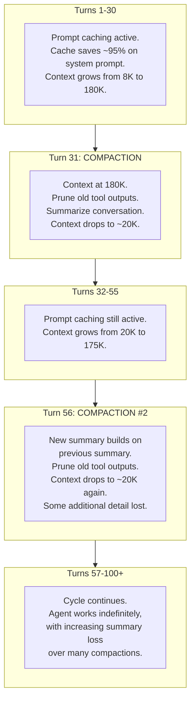

---

## How This Changes Lower Layers

### Changes to Layer 0 (The Loop)

The loop now has a new step after executing tools:

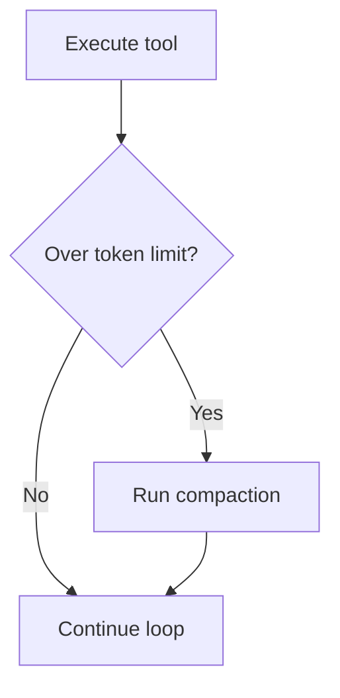

It also has a **post-turn check**: after the loop ends (no more tool calls), if `totalTokens > contextLimit * 0.85`, run pre-compaction so the next turn starts with headroom. This check runs after every turn but compaction only triggers when the threshold is met.

### Changes to Layer 1 (Tools)

Tool definitions must be **sorted alphabetically by the `name` field** to keep the cache stable. This applies to all registered tools -- base tools plus any currently activated plugin tools. Re-sort the full list from scratch before each LLM call.

### Changes to Layer 1+ (Discovery)

Two design choices protect prompt caching:

1. **Skill instructions go in tool results** (not the system prompt) to avoid invalidating cache breakpoint 1.
2. **Plugin activations cause a cold turn** -- one cache miss when the tool list changes. The loop should batch multiple plugin activations into a single turn when possible, and avoid deactivating plugins that may be needed again soon. See [The Plugin Activation Problem](#the-plugin-activation-problem-cold-turns) above for details.

---

## What We Have So Far

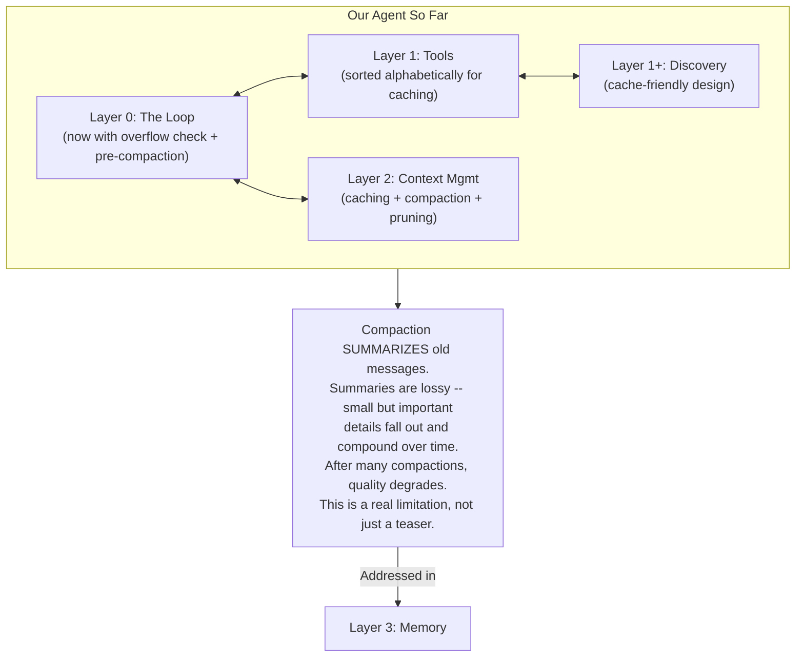

---

## Key Takeaways

1. **Prompt caching is Anthropic-specific.** Mark cacheable sections with `cache_control: { type: "ephemeral" }` on the last block of each section. Three breakpoints: end of system prompt, last tool in the sorted tool list, last old message before the newest exchange. Cache is server-side with a 5-minute TTL that resets on each hit.
2. **Sort tools alphabetically by their `name` field** before every call. This applies to all registered tools (base + plugins). Re-sort from scratch each turn. When a plugin adds tools, the re-sort produces the new stable prefix for the following turn.
3. **Plugin activations cause one cold turn.** Batch activations, activate early, and avoid oscillation. Cold turn cost scales with context size. The cost figures in this doc are based on Claude Sonnet 3.5 pricing from early 2025 and are for order-of-magnitude guidance only.
4. **Compaction detects overflow by counting input tokens** (system + tools + messages). Output tokens are not counted -- the compaction buffer reserves space for them implicitly. Do not shrink the buffer below max output tokens.
5. **The summary replaces old messages as two messages** (user + assistant). The user message is a plain-text placeholder that marks the compaction boundary. The assistant message contains the summary text. Two messages are required to maintain the expected user/assistant alternation.
6. **Pruning keeps tool result messages in the array** but replaces their content with `[cleared]`. Removing tool result messages breaks the API's tool call/result pairing requirement. Only the content is cleared; the message structure stays intact.
7. **Mid-turn compaction calls the LLM again within the same turn.** The `REPLACE --> CALL` path in the flowchart is not a new user-visible turn -- it is the current turn resuming after in-place compaction.
8. **Pre-compaction is a proactive end-of-turn summarization** triggered when context is near (but not yet over) the limit. It runs the full summarization process. It is not free -- it is a full LLM call. It does not happen after every turn, only when the post-check threshold is met.
9. **Compaction is lossy and compounds.** Each compaction loses detail. Multiple compactions degrade summary quality progressively. Pruning before summarization amplifies this effect. This is a real operational limitation of agents that run for many turns without a memory layer.

---

> **Next:** [Layer 3: Observational Memory](./observational-memory.md) -- How do you remember important details that compaction throws away?
