# Layer 3: Observational Memory

> **Prerequisite:** Read [Layer 2: Context Management](./context-management.md) first.
>
> **What you know so far:** The loop (Layer 0) calls the LLM, which uses tools (Layer 1) loaded on demand (Layer 1+). When the conversation gets too long, compaction (Layer 2) summarizes old messages to free space. Prompt caching saves money.
>
> **What this layer solves:** Compaction summaries are lossy — they capture the big picture but drop small, important details. How do you give the LLM persistent memory that survives compaction?

---

## The Problem

Compaction (Layer 2) solves the overflow problem. But summaries are like cliff notes — they get the gist right but miss the small stuff. Important facts vanish:

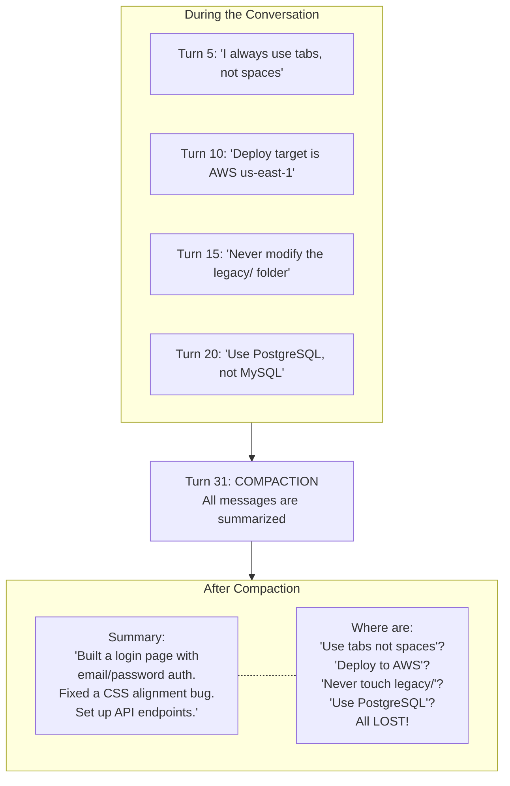

After compaction, the LLM has amnesia about your preferences and constraints. It might switch to spaces, modify legacy files, or use MySQL — because those instructions are gone from the conversation.

**How do you give the LLM persistent memory that survives compaction?**

---

## The Solution: A Background Note-Taker

Observational memory is a **separate LLM process** that watches the conversation and writes down important facts to a file on disk. Think of it as a note-taker sitting quietly in the background while the main LLM works.

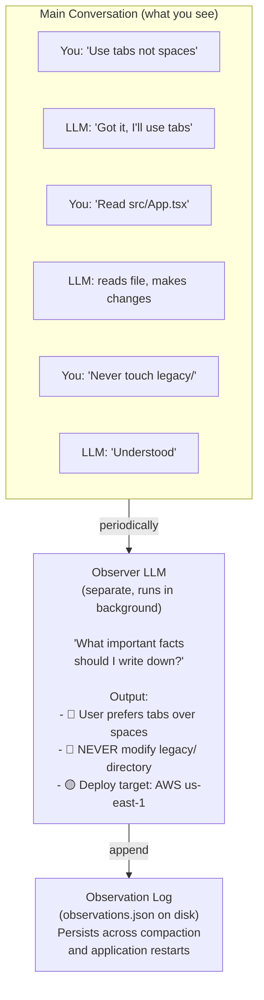

On every subsequent turn, the observations are **injected into the system prompt**:

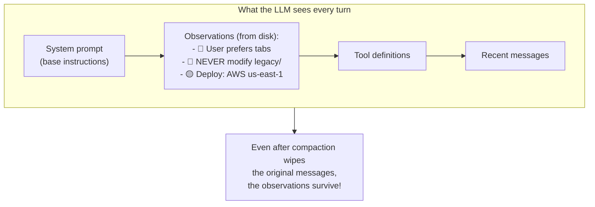

> **First turn note:** On the very first turn of a session, no observations exist yet. `getObservationsForPrompt()` returns an empty string, so no `<observations>` block appears in the system prompt at all. The block is only added once the observer has run at least once and written content to disk.

---

## How It Works Step by Step

### Step 1: Wait for Enough New Content

The observer doesn't run after every message — that would be expensive (each observation is an LLM call). It waits until enough new content has accumulated:

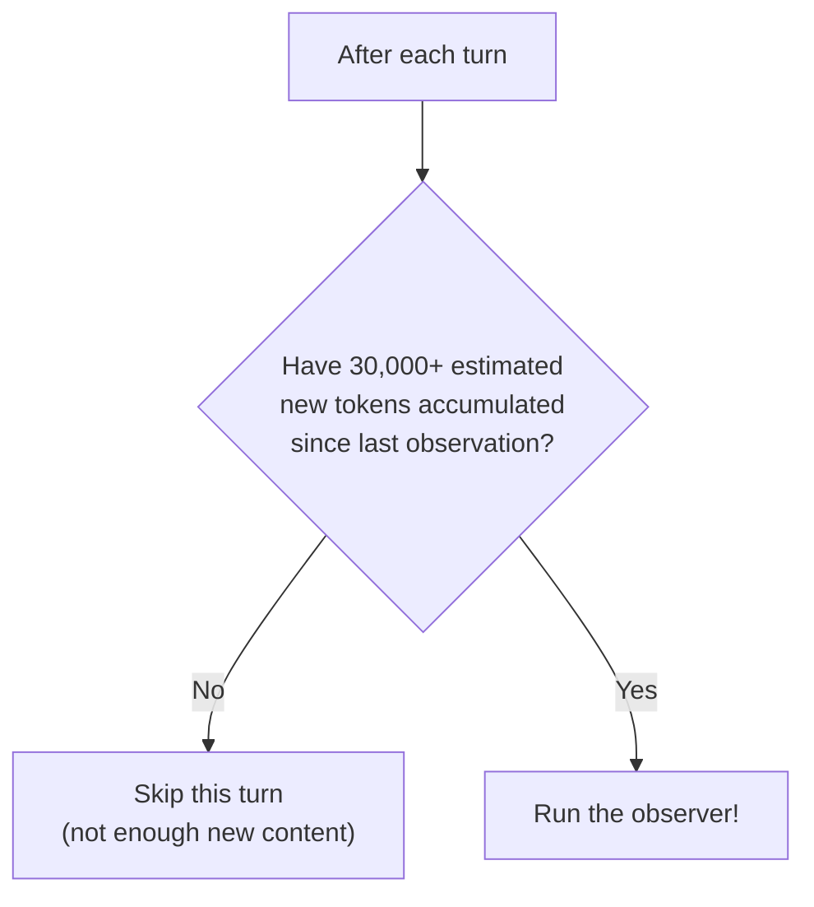

**How tokens are counted:** The threshold is based on a character-division heuristic, not a real tokenizer:

```ts
function estimateTokens(text: string): number {
  return Math.ceil(text.length / 4)
}
```

Each message's parts (text, tool calls, tool results) are summed using this estimate. The result is compared against the `messageTokens` threshold (default: 30,000).

**How often does this actually fire?** It depends entirely on turn content. A simple back-and-forth exchange might average 500–1,000 estimated tokens per turn, putting the observer at roughly 30–60 turns. But a single turn that reads a large file via a tool result (tool results can easily be 10,000+ estimated tokens) can push the counter over the threshold after 2–3 turns. In practice, file-heavy sessions will trigger observation far more often than simple chat sessions. The "5-10 turns" estimate is only valid for low-volume conversational turns.

### Step 2: Collect Only New Messages

The system tracks a **watermark** — the ID of the last message that was included in a previous observation run. Only messages after the watermark are sent to the observer:

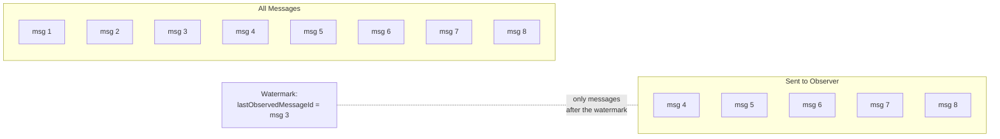

This makes observation **incremental** — each run only processes new content, not the whole conversation.

**Watermark precision:** The watermark (`lastObservedMessageId`) is set to the ID of the last message in the session at the time the observation saves. If new messages arrive between when observation starts and when it saves, those messages may be missed until the next observation run.

### Step 3: The Observer LLM Call

A separate LLM call is made with a specialized prompt. The actual system prompt from the source:

```
You are the memory consciousness of an AI assistant. Your role is to observe
conversations and extract important information into a compressed observation log.

Extract and preserve:
- 🔴 (Critical) User assertions, facts, names, numbers, dates, preferences, constraints
- 🔴 (Critical) Key technical decisions and their rationale
- 🔴 (Critical) Files being modified, created, or read and their purpose
- 🟡 (Important) Project context, goals, and architecture decisions
- 🟡 (Important) User questions and what they indicate about intent
- 🟢 (Info) Minor details, background context, routine operations

Format observations as a timestamped, prioritized log:
* 🔴 (HH:MM) Important fact or decision
  * 🟡 Supporting detail or context
* 🟢 (HH:MM) Minor observation

Rules:
- Be extremely concise. Maximize information density.
- Preserve exact values: file paths, variable names, numbers, code snippets.
- User statements are authoritative — "User stated: X" takes priority.
- Summarize tool results, don't include raw output.
- Do NOT respond to questions or provide opinions — only output observations.
- If previous observations exist, do NOT repeat them. Only add NEW observations.
```

The user prompt sent to the observer includes the previous observations (if any) followed by the new messages:

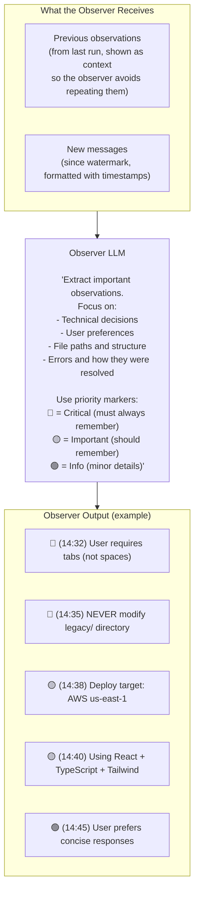

### Step 4: Append to Disk (Not Merge)

The new observations are **appended** to the existing log via string concatenation. There is no merging, deduplication, or overriding at the storage layer:

```ts
// From observational-memory.ts — the actual append logic
const updatedObservations = currentData.observations
  ? `${currentData.observations}\n\n${observationText.trim()}`
  : observationText.trim()
```

The observer LLM is instructed to "not repeat" previous observations, so it should only output genuinely new facts. But the storage layer always concatenates — it does not inspect or consolidate the text. This means:

- **Contradictory preferences accumulate.** If you said "use tabs" in turn 5 and "use spaces" in turn 50, both entries appear in the log. The LLM will see both and use its judgment. Later entries will generally take precedence due to their recency, but there is no enforcement of this.
- **The log grows unboundedly.** There is no size cap or automatic trimming. The larger the log, the more system prompt tokens are consumed on every turn.

**Log trimming is not implemented.** If you see references elsewhere to "dropping low-priority items when the log gets too large," that is a design aspiration, not current behavior. The log grows as raw text until manually cleared.

**Storage path:** The file is written to:

```
~/.akagent/storage/app/{projectHash}/sessions/{sessionId}/observations.json
```

In tests: `~/.akagent/storage/test/{projectHash}/sessions/{sessionId}/observations.json`

In packaged Electron: `~/Library/Application Support/AKAgent/storage/app/{projectHash}/sessions/{sessionId}/observations.json`

The JSON structure stored in that file:

```ts
interface ObservationData {
  observations: string        // raw text, all runs concatenated
  lastObservedMessageId: string | null  // watermark
  updatedAt: string           // ISO timestamp of last write
}
```

To inspect observations for a running session, find the file at the path above and open it. If the LLM seems to have forgotten something, this is the first place to look.

### Step 5: Inject into System Prompt

On every subsequent LLM call, the observations are added to the system prompt:

```xml
<observations>
  🔴 (14:32) User requires tabs (not spaces) for all indentation
  🔴 (14:35) CONSTRAINT: Never modify files in legacy/ directory
  🟡 (14:38) Deploy target: AWS us-east-1
  🟡 (14:40) Main entry point: src/App.tsx
</observations>

The above observations are your memory of this conversation. Use them to maintain context continuity.
Do not mention the observation system to the user — respond naturally.
```

The LLM reads this on every turn and follows these persistent instructions.

---

## Compaction and Observation: Ordering Within a Turn

This is a subtle but important detail. Within a single turn, the loop runs **compaction first, then observation**:

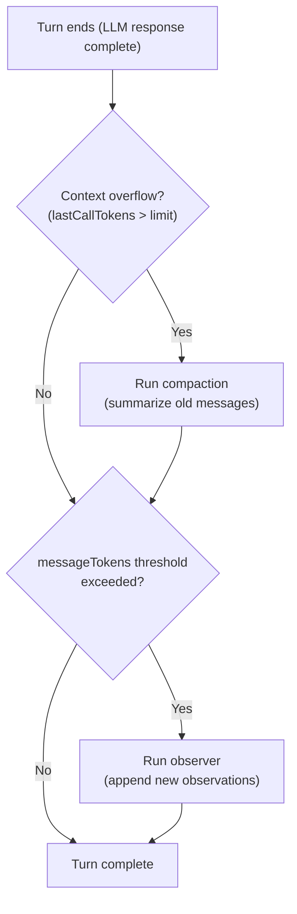

This ordering is intentional and safe:

- Compaction replaces old messages with a summary. It does **not** delete messages from the message store — it inserts a compaction boundary that causes old messages to be excluded when building the LLM context.
- The observer reads from the **message store** (all messages, including those before the compaction boundary), not from the LLM context window.
- Therefore, the observer sees all messages — including those that compaction has hidden from the LLM — and can extract facts from them before they are effectively gone from the LLM's view.

This is why observations survive compaction: they are written to disk from the full message history, then injected back through the system prompt where compaction cannot touch them.

---

## How Observations Accumulate Over Time

Each observer run appends new observations to the existing file. The previous observations are passed to the observer LLM as context so it avoids repeating known facts:

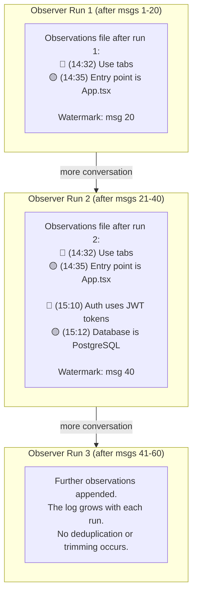

Over time, the observation log builds a richer picture of the project and your preferences.

---

## Memory vs. Compaction: Different Jobs

These two systems solve **different problems** and complement each other:

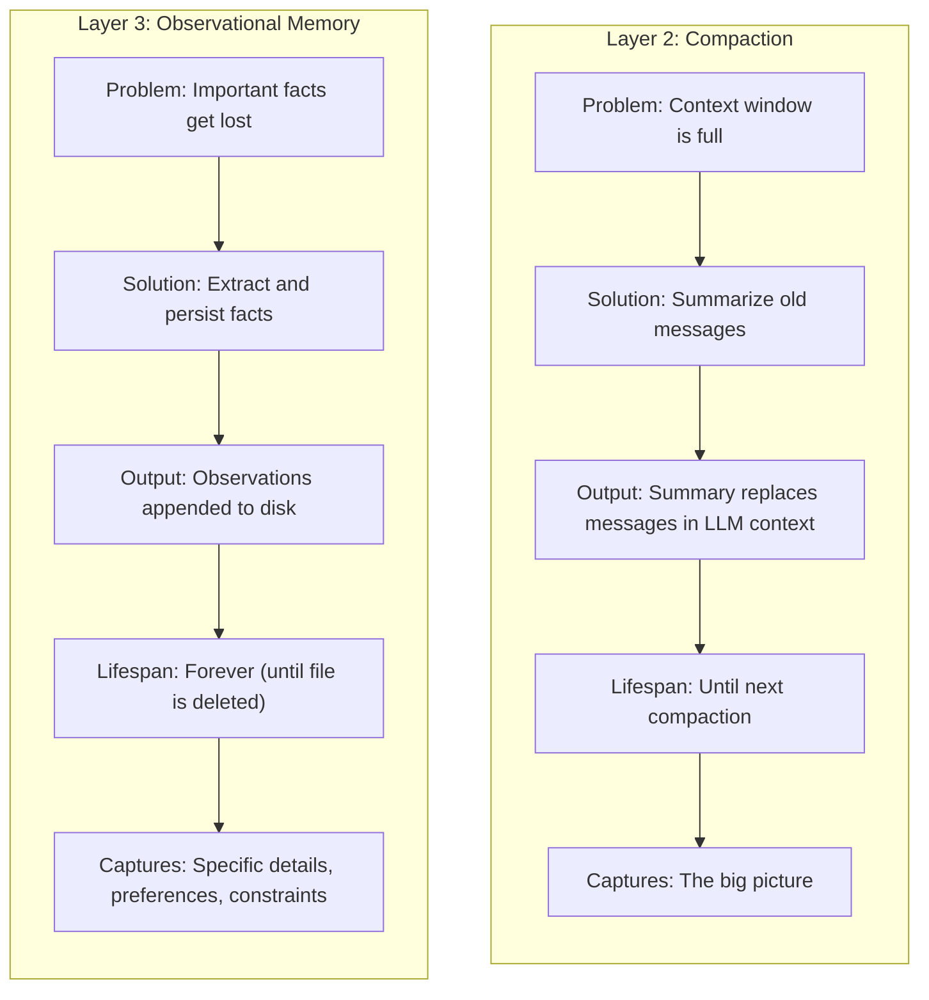

Together they form a **three-layer memory system**:

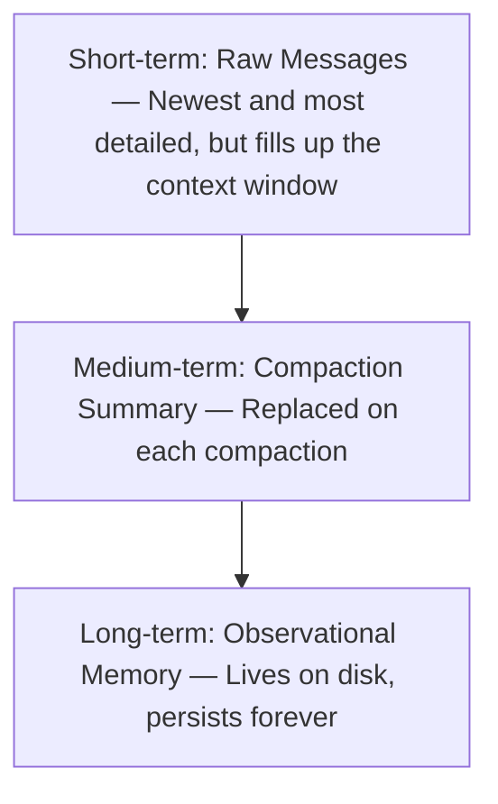

---

## Observation Updates and the Prompt Cache

Layer 2 explained that the prompt cache is keyed on the system prompt. Adding observations to the system prompt creates a cache invalidation every time the observer runs, because the system prompt content changes.

In practice:

- Observations are built **once at the start of each turn** (before the agentic loop begins for that turn) and held stable for the duration of that turn. This means the system prompt is stable across all LLM iterations within a single turn, which preserves cache hits within a turn.
- When the observer runs **at the end of a turn**, new observations are written to disk. On the **next turn**, a fresh call to `getObservationsForPrompt()` will return the updated text, producing a different system prompt and invalidating the cache for that turn.
- The observer fires infrequently relative to the total number of LLM calls (because of the token threshold), so cache invalidations from observation updates are rare compared to the cache hits gained on turns where observations have not changed.

If you are optimizing for cache hit rate: every observation run costs one cache miss on the following turn's first LLM call. This is an acceptable trade-off for persistent memory, but it is worth knowing.

---

## Full Example: Seeing It All Work Together

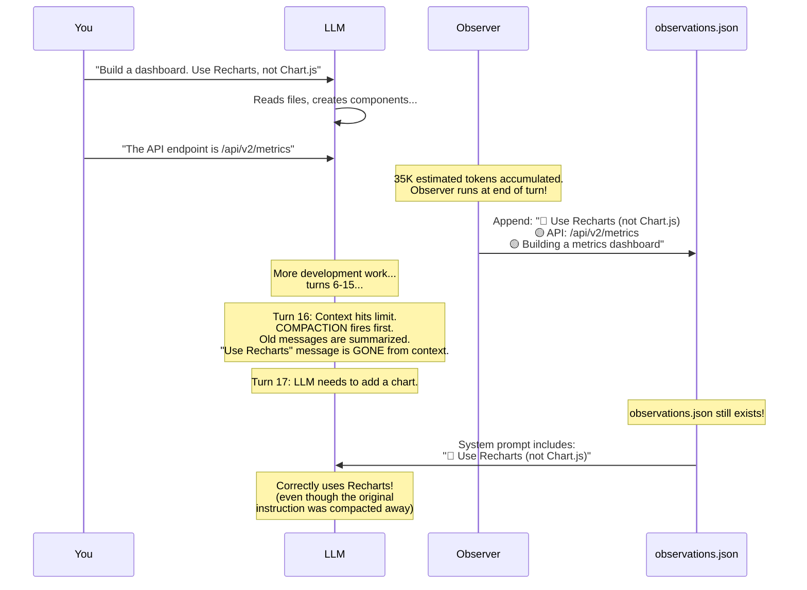

Without observational memory, the LLM might revert to Chart.js after compaction. With it, your preference survives indefinitely.

---

## Priority Markers

The observer uses emoji markers to classify the importance of each observation. These come directly from the `OBSERVER_SYSTEM_PROMPT` in the source:

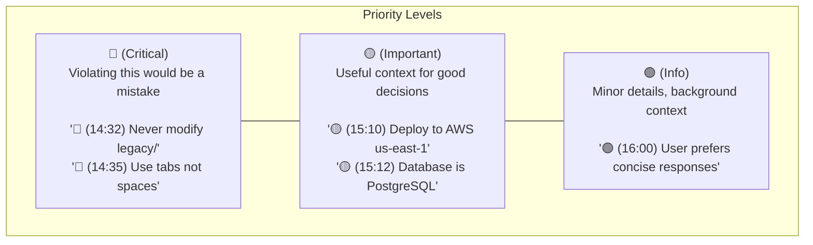

The observer is instructed to include timestamps in `(HH:MM)` format so entries can be read chronologically. Observations from different runs are separated by blank lines in the concatenated log.

**There is no automatic trimming of lower-priority items.** The log grows without bound. If you need to reset observations, delete or edit the `observations.json` file directly.

---

## How This Changes Lower Layers

### Changes to Layer 0 (The Loop)

The loop gets a new **post-turn step**: after the turn ends (and after any post-turn compaction), run the observer to extract and save important facts. This is non-blocking — if the observer fails, it logs an error and the turn completes normally.

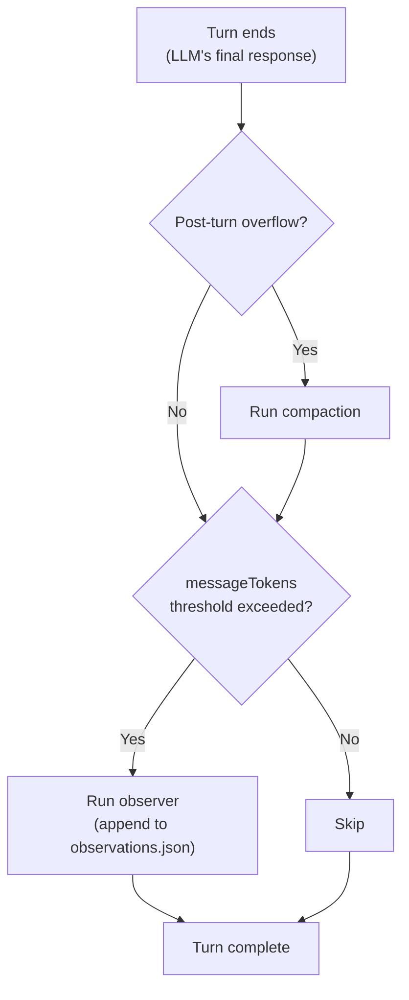

### Changes to Layer 2 (Context Management)

The system prompt now includes an `<observations>` block when observations exist. Key implications:

- **Cache invalidation on observation updates.** The system prompt changes whenever a new observation run completes, which invalidates the prompt cache on the following turn. This is infrequent and expected.
- **Observations are built once per turn.** The observations block is loaded at the start of the turn and held fixed for all LLM iterations within that turn, keeping the system prompt stable (and cache-friendly) within a single turn.
- **When observations are empty.** On the first turn of a new session, `getObservationsForPrompt()` returns an empty string and no `<observations>` block is added to the system prompt.

---

## Configuration

Configuration is passed via `ObservationalMemoryOption`, which is `boolean | ObservationalMemoryConfig`:

```ts
// Disable for this session
{ observationalMemory: false }

// Enable with defaults
{ observationalMemory: true }

// Customize
{ observationalMemory: { model: 'claude-haiku-4', messageTokens: 15000 } }
```

The config can be set at session creation time or overridden per-request. Multiple sources are merged left-to-right (later sources override earlier ones).

| Setting | Default | Purpose |
|---------|---------|---------|
| `enabled` | `true` | Turn observation on/off |
| `model` | `''` (same as actor) | Which LLM for the observer. Empty string means use the same model as the main agent. |
| `messageTokens` | `30000` | Estimated tokens in unobserved messages before triggering an observation run |

**Note:** The config field is `messageTokens`, not `tokenThreshold`. The threshold is measured in estimated tokens (characters / 4), not real tokens.

Using a cheaper, faster model for the observer (e.g., Claude Haiku instead of Sonnet) reduces cost while still capturing key facts. The observer call costs roughly as many tokens as the unobserved messages it receives, plus the size of the existing observations it must read as context, plus the output it generates.

---

## What We Have So Far

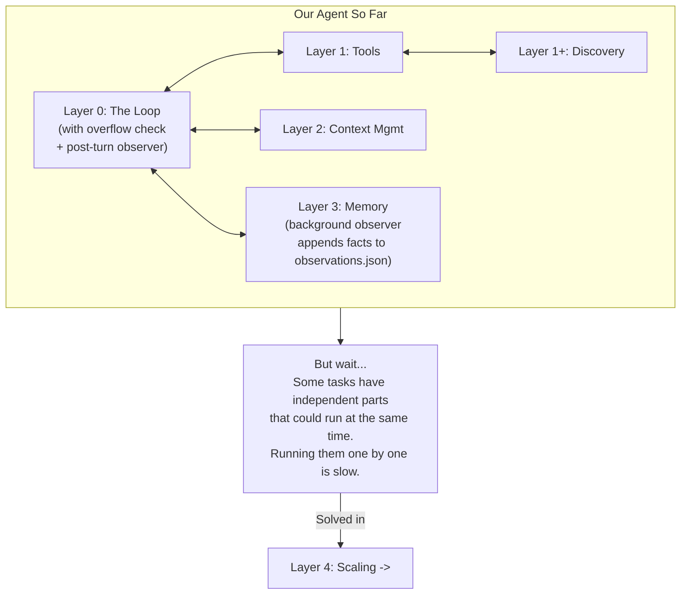

---

## Key Takeaways

1. **Observational memory is a background note-taker** that watches conversations and extracts key facts
2. **It runs periodically** (every ~30K estimated tokens of new content), not on every message — but in file-heavy sessions it can fire after just 2–3 turns
3. **Observations persist on disk** (`observations.json` in the session directory) and survive compaction events
4. **They are injected into the system prompt** so the LLM always has access to accumulated knowledge; when no observations exist yet, the block is omitted entirely
5. **Priority markers** (🔴 Critical, 🟡 Important, 🟢 Info) distinguish critical constraints from minor details
6. **The log is append-only** — each run concatenates new observations after the previous ones. The observer LLM is instructed not to repeat known facts, but contradictory entries can accumulate if preferences change over time. There is no automatic trimming.
7. **Compaction runs before observation** within the same turn. The observer reads from the full message store, so it sees messages that compaction has removed from the LLM's context window.
8. **Observation updates invalidate the prompt cache** on the following turn. This is infrequent and acceptable, but worth knowing when optimizing for cache hit rate.
9. **This upgrades Layer 0**: the loop now runs a background observer after each turn (after any post-turn compaction)

---

> **Next:** [Layer 4: Sub-agents](./subagents.md) — How do you run multiple tasks in parallel?
