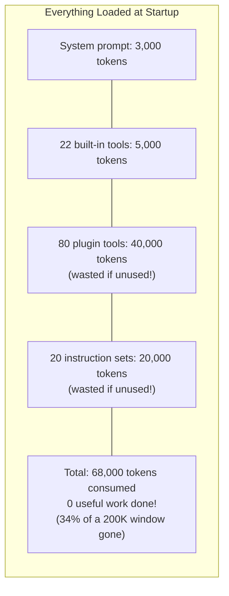
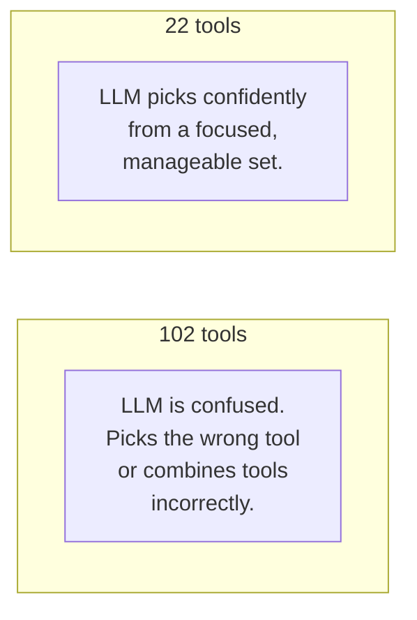
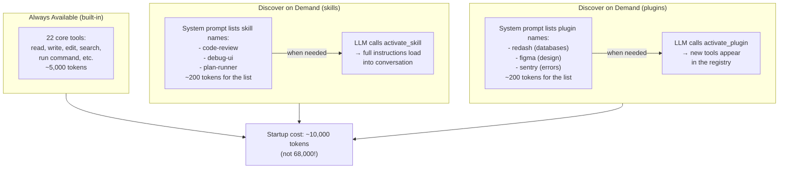
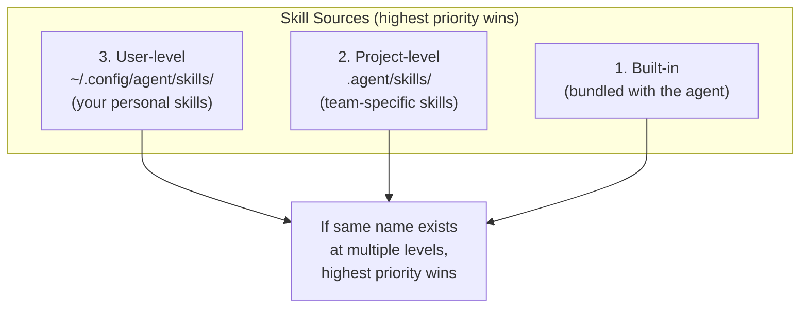
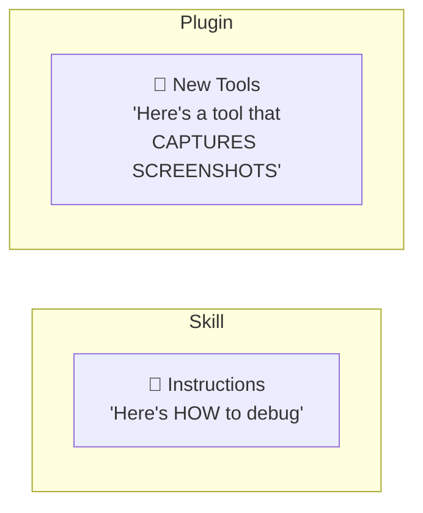
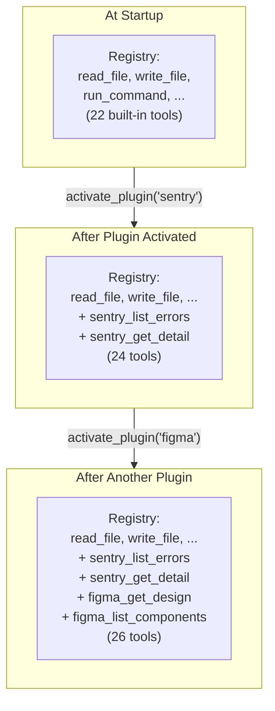
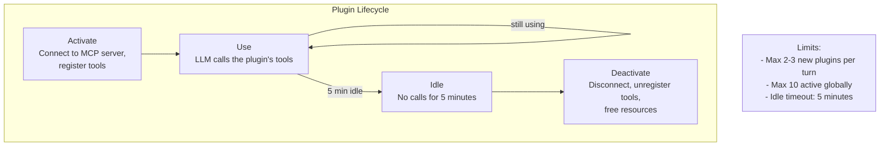
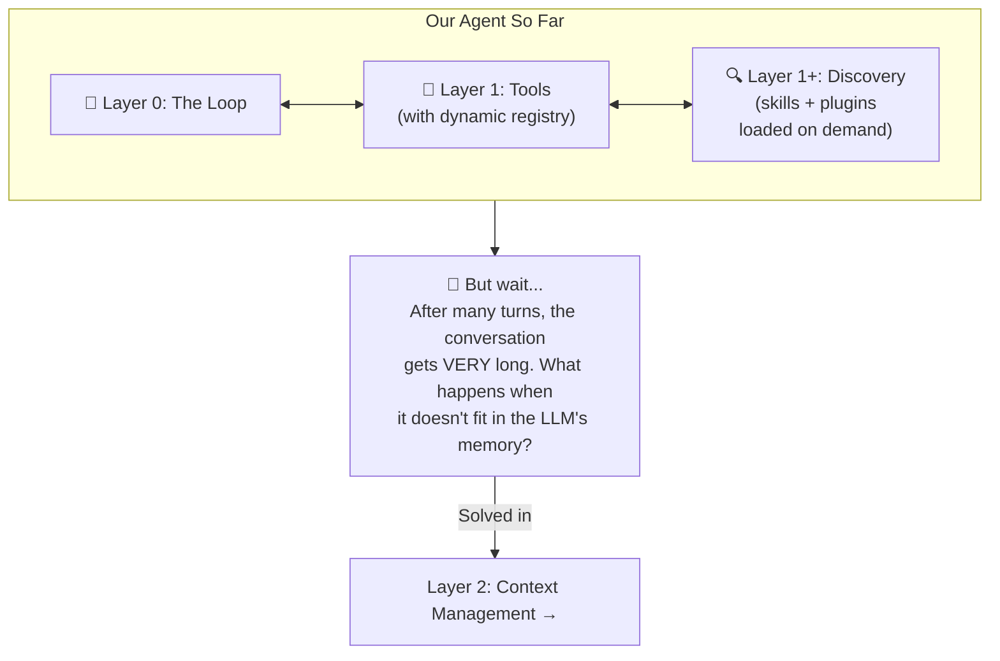

# Layer 1+: Progressive Discovery

> **Prerequisite:** Read [Layer 1: Tools](./tool-execution.md) first.
>
> **What you know so far:** The loop (Layer 0) keeps calling the LLM. The LLM uses tools (Layer 1) to act on the real world. Tools are stored in a registry and their definitions are sent on every LLM call.
>
> **What this layer solves:** When you have 100+ tools, sending them all overwhelms the LLM and wastes space. How do you give the LLM access to many capabilities without overwhelming it?

---

## The Problem

A powerful agent can connect to many external services (databases, design tools, monitoring platforms) and follow many specialized instruction sets (coding patterns, review checklists). If you loaded **everything** at startup, two bad things happen.

### Problem 1: Too Much Space Wasted

Remember from Layer 1: tool definitions are sent on **every LLM call**. Each definition costs tokens (roughly 1 token = 1 word). Loading 100 tools and 20 instruction sets burns through your budget before the user even says "hello":



### Problem 2: Too Many Choices

LLMs perform worse when given too many options. With 100+ tools, the model struggles to pick the right one:



Research shows that LLM accuracy drops as the number of tools increases. 20-30 tools is a practical sweet spot.

**How do you give the LLM access to 100+ capabilities without overwhelming it?**

---

## The Solution: Load on Demand

Instead of loading everything upfront, tell the LLM **what exists** (just names and short descriptions) and give it a tool to **activate** what it needs. Think of it like an app store: you can see what's available, but you only install what you need.



---

## Part 1: Skills (Loadable Instructions)

### What Is a Skill?

A **skill** is an instruction set that teaches the LLM how to approach a specific task. Think of it as a recipe card the LLM pulls off a shelf when it needs it.

Examples:
- **Code Review**: "Check for security issues first, then performance, then style..."
- **Debug UI**: "Take a screenshot first, then inspect the DOM, then check console logs..."
- **Plan Runner**: "Break the task into steps, create a checklist, execute each step..."

### How Skill Activation Works

```mermaid
sequenceDiagram
    participant LLM
    participant Loop as Agent Loop
    participant Disk as Skill Files

    Note over LLM: LLM sees skill names<br/>in system prompt:<br/>"code-review, debug-ui,<br/>plan-runner"

    LLM ->> Loop: "I need the code-review skill"<br/>TOOL: activate_skill("code-review")
    Loop ->> Disk: Read code-review.md
    Disk ->> Loop: Full instructions:<br/>"Step 1: Security Scan<br/>Step 2: Logic Review<br/>Step 3: Style Check..."
    Loop ->> LLM: RESULT: "Step 1: Security Scan..."

    Note over LLM: LLM now follows<br/>these instructions for<br/>the rest of the conversation
```

The key design choice: skill instructions are delivered as a **tool result** (in the conversation), not by changing the system prompt. Why? This matters for cost, as we'll explain in [Layer 2](./context-management.md).

> **Quick preview**: LLM providers cache the system prompt so it doesn't get reprocessed every call. If you changed the system prompt to add skill instructions, the cache would break and you'd pay extra on every call. By putting instructions in a tool result instead, the system prompt stays the same and the cache keeps working.

### Where Skills Come From

Skills can come from multiple sources, merged in priority order:



This lets teams customize skills per project, and individual developers customize for their preferences.

---

## Part 2: Plugins (External Tool Servers)

### What Is a Plugin?

A **plugin** is an external service that adds new tools to the agent at runtime. While skills add *instructions* (text), plugins add *capabilities* (executable tools).



Plugins typically connect via **MCP (Model Context Protocol)** -- a standard that lets LLMs communicate with external tool servers.

### How Plugin Activation Works

```mermaid
sequenceDiagram
    participant LLM
    participant Loop as Agent Loop
    participant MCP as Plugin Server<br/>(e.g., Sentry)

    Note over LLM: LLM sees plugin names<br/>in system prompt:<br/>"sentry — View error reports"

    LLM ->> Loop: "I need Sentry for this"<br/>TOOL: activate_plugin("sentry")
    Loop ->> MCP: Connect via MCP
    MCP ->> Loop: Here are my tools:<br/>- list_errors<br/>- get_error_detail<br/>- search_events
    Loop ->> Loop: Register new tools<br/>in the tool registry

    Note over Loop: New tools available<br/>on the NEXT loop turn

    LLM ->> Loop: TOOL: sentry_list_errors<br/>({ project: "web-app" })
    Loop ->> MCP: Execute list_errors
    MCP ->> Loop: [{ id: "E-123", title: "Login crash" }]
    Loop ->> LLM: RESULT: error list
```

### How This Changes Layer 1

The tool registry from Layer 1 becomes **dynamic**:



### Resource Management

Plugins consume real resources (network connections, API rate limits). A well-designed system manages them:



---

## Full Example: Progressive Discovery in Action

```mermaid
sequenceDiagram
    participant You
    participant LLM
    participant Loop as Agent Loop
    participant Sentry as Sentry Plugin

    You ->> LLM: "Check Sentry for the login crash,<br/>then fix the code"

    Note over LLM: Sees "sentry" in available<br/>plugins list. Activates it.
    LLM ->> Loop: TOOL: activate_plugin("sentry")
    Loop ->> Sentry: Connect via MCP
    Sentry ->> Loop: Tools registered

    LLM ->> Loop: TOOL: sentry_list_errors<br/>({ query: "login crash" })
    Loop ->> Sentry: list_errors("login crash")
    Sentry ->> Loop: [{ title: "NullPointer in LoginHandler" }]

    Note over LLM: Now uses built-in tools<br/>to fix the code
    LLM ->> Loop: TOOL: read_file("src/auth/login.ts")
    Loop ->> LLM: File contents...

    LLM ->> Loop: TOOL: edit_file("src/auth/login.ts", ...)
    Loop ->> LLM: "File edited successfully"

    LLM ->> You: "Fixed! Added a null check<br/>for invalid auth tokens."
```

The LLM started with **zero Sentry knowledge** and progressively discovered exactly what it needed:
1. Knew Sentry existed (from the listing in the system prompt)
2. Activated Sentry (connected to the MCP server)
3. Used Sentry's tools to find the error
4. Used built-in tools to fix the code

---

## How This Changes Lower Layers

### Changes to Layer 0 (The Loop)

The loop now needs to handle two special tool calls:
- `activate_skill` -- loads instructions into the conversation
- `activate_plugin` -- connects to an external service and registers new tools

### Changes to Layer 1 (Tools)

The tool registry becomes dynamic:
- Tools can be added mid-session (when a plugin activates)
- Tools can be removed (when a plugin deactivates or idles out)
- The tool list sent to the LLM may change between turns

---

## What We Have So Far



---

## Key Takeaways

1. **Progressive discovery** means loading capabilities on demand, not all at once
2. **Skills** are loadable instruction sets (markdown files) that teach the LLM how to approach tasks
3. **Plugins** are external services (via MCP) that add new executable tools at runtime
4. **The LLM starts lean** (~22 tools) and grows capabilities as the task demands
5. **Fewer tools = better decisions** -- LLMs pick the right tool more often with fewer options
6. **Skills go in tool results** (not the system prompt) to keep costs down
7. **This upgrades Layer 1**: the tool registry becomes dynamic (tools can be added and removed)

---

> **Next:** [Layer 1+: Code Mode](./code-mode.md) -- An alternative approach: replace plugin tools with 2 generic tools (`search_apis` + `execute_code`) to eliminate cache-breaking and reduce round trips.
>
> **Or skip to:** [Layer 2: Context Management](./context-management.md) -- What happens when the conversation gets too long?
