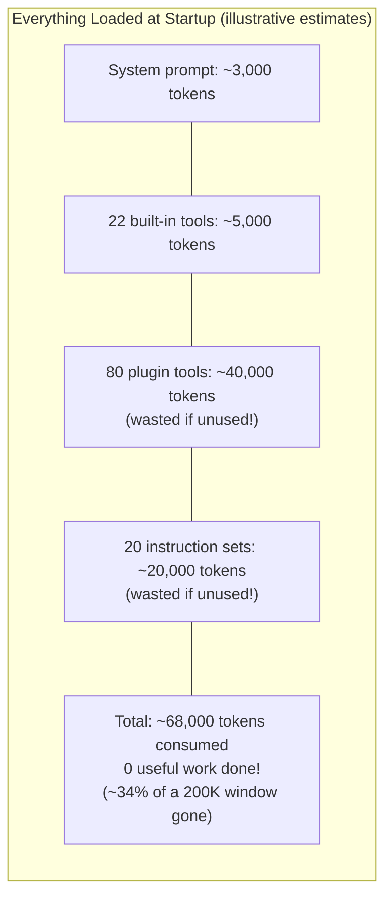
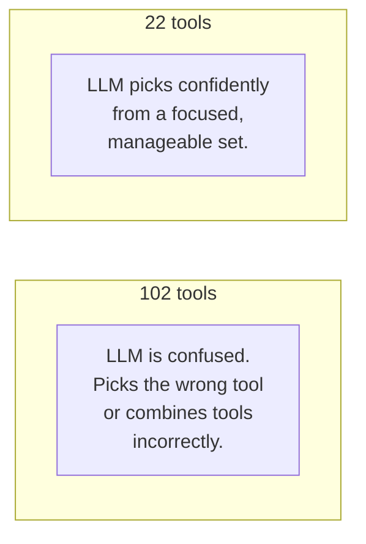
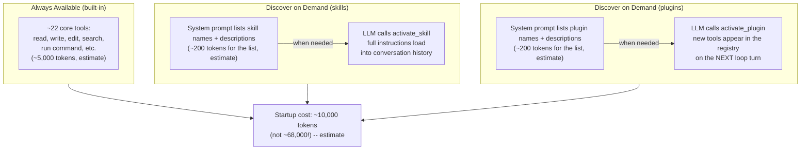
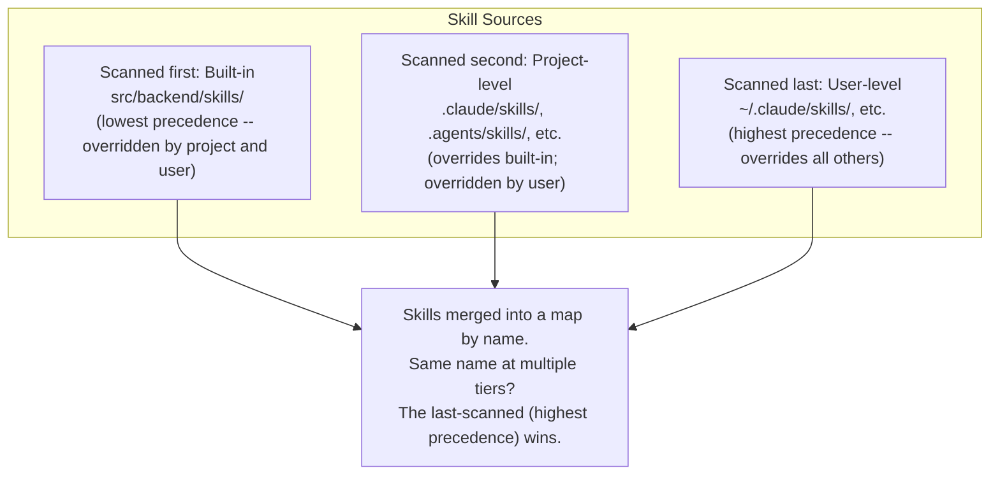
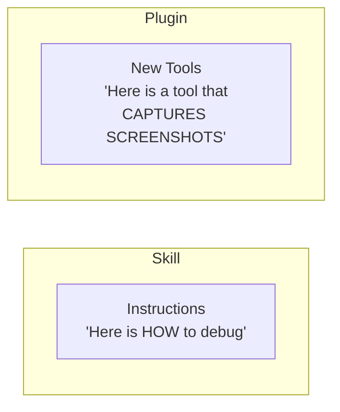
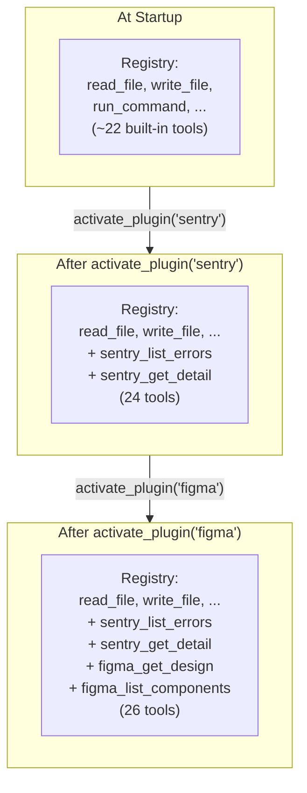
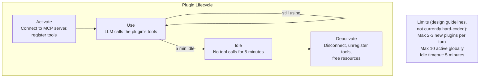
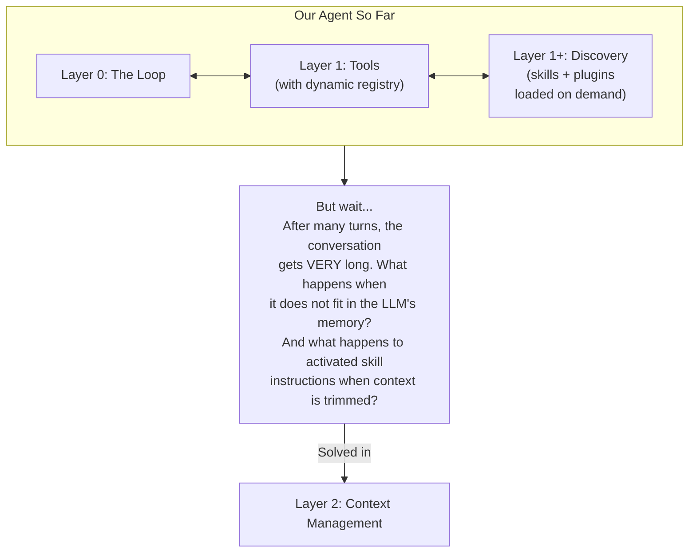

# Layer 1+: Progressive Discovery

> **Prerequisite:** Read [Layer 1: Tools](./tool-execution.md) first.
>
> **What you know so far:** The loop (Layer 0) keeps calling the LLM. The LLM uses tools (Layer 1) to act on the real world. Tools are stored in a registry and their definitions are sent on every LLM call.
>
> **What this layer solves:** When you have 100+ tools, sending them all overwhelms the LLM and wastes space. How do you give the LLM access to many capabilities without overwhelming it?

---

## The Problem

A powerful agent can connect to many external services (databases, design tools, monitoring platforms) and follow many specialized instruction sets (coding patterns, review checklists). If you loaded **everything** at startup, two bad things happen.

### Problem 1: Too Much Space Wasted

Remember from Layer 1: tool definitions are sent on **every LLM call**. Each definition costs tokens (roughly 1 token = 1 word). Loading 100 tools and 20 instruction sets burns through your budget before the user even says "hello."

> **A note on token numbers.** The figures below are illustrative estimates based on typical tool definition lengths. Actual token costs vary across models (GPT-4o, Claude 3.5 Sonnet, Gemini 1.5 Pro all tokenize differently) and across tool definitions (a simple tool with a one-line description costs far fewer tokens than one with a detailed schema and many parameters). Treat the numbers as order-of-magnitude guidance, not precise measurements.



### Problem 2: Too Many Choices

LLMs perform worse when given too many options. With 100+ tools, the model struggles to pick the right one:



In practice, LLM tool selection accuracy degrades as tool count grows. Keeping the active set to roughly 20-30 tools has been found to produce more reliable choices; beyond ~50, errors increase noticeably. These thresholds are based on practitioner observation rather than a published benchmark, so treat them as a starting heuristic rather than a hard rule.

**How do you give the LLM access to 100+ capabilities without overwhelming it?**

---

## The Solution: Load on Demand

Instead of loading everything upfront, tell the LLM **what exists** (just names and short descriptions) and give it a tool to **activate** what it needs. Think of it like an app store: you can see what is available, but you only install what you need.

The available-list entries in the system prompt do change when new skills or plugins are installed. The cached system prompt breaks at that point and must be rebuilt -- this is an acceptable, infrequent cost compared with the per-turn overhead of including full definitions for every capability.



---

## Part 1: Skills (Loadable Instructions)

### What Is a Skill?

A **skill** is an instruction set that teaches the LLM how to approach a specific task. Think of it as a recipe card the LLM pulls off a shelf when it needs it.

Examples:
- **Code Review**: "Check for security issues first, then performance, then style..."
- **Debug UI**: "Take a screenshot first, then inspect the DOM, then check console logs..."
- **Plan Runner**: "Break the task into steps, create a checklist, execute each step..."

Skills are stored as `SKILL.md` files. Each file has YAML frontmatter containing the name and description (used in the system prompt listing) followed by a markdown body containing the full instructions (loaded only on activation).

### The `activate_skill` Tool

`activate_skill` is a **regular tool registered in the same tool registry** as `read_file`, `run_command`, and every other tool. From Layer 1 you know tools have a name, description, and input schema that are sent to the LLM in every call. Here is the actual schema for `activate_skill`:

```json
{
  "name": "activate_skill",
  "description": "List available skills or activate a skill to gain new capabilities. Use action=\"list\" to see available skills, action=\"activate\" with skill_name to activate one.",
  "inputSchema": {
    "type": "object",
    "properties": {
      "action": {
        "type": "string",
        "enum": ["list", "activate"],
        "description": "\"list\" to list available skills, \"activate\" to activate a skill"
      },
      "skill_name": {
        "type": "string",
        "description": "Name of the skill to activate (required when action=activate)"
      }
    },
    "required": ["action"]
  }
}
```

The LLM learns **when** to call this tool from two sources:
1. The tool description tells it that `activate_skill` is how to gain new instruction capabilities.
2. The `<available_skills>` block in the system prompt (shown below) tells it which skills exist and what each one does, so it can decide which to activate.

### What the System Prompt Actually Says

Before every LLM turn, the loop appends an `<available_skills>` XML block to the system prompt. Here is a real example with two skills:

```
You have access to skills that can be activated using the activate_skill tool.

<available_skills>
  <skill>
    <name>code-review</name>
    <description>Performs a structured code review: security issues first, then performance, then style. Use when the user asks to review or audit code.</description>
    <source>builtin</source>
  </skill>
  <skill>
    <name>web-scraper</name>
    <description>Fetches and parses web content from URLs. Use when the user needs to retrieve or extract information from web pages or APIs.</description>
    <source>project</source>
  </skill>
</available_skills>
```

This tells the LLM: "These skills exist. Call `activate_skill` to load one." The `description` field on each skill is the LLM's primary signal for when to activate it. A well-written description (e.g. "Use when the user asks to review or audit code") is what guides the LLM to pick the right skill and avoid activating the wrong one.

### How Skill Activation Works

```mermaid
sequenceDiagram
    participant LLM
    participant Loop as Agent Loop
    participant Disk as Skill Files

    Note over LLM: Sees <available_skills> block<br/>in system prompt with<br/>name + description for each skill

    LLM ->> Loop: TOOL: activate_skill({ action: "activate", skill_name: "code-review" })
    Loop ->> Disk: Read code-review/SKILL.md (body only, frontmatter stripped)
    Disk ->> Loop: Full instructions:<br/>"Step 1: Security Scan<br/>Step 2: Logic Review<br/>Step 3: Style Check..."
    Loop ->> LLM: RESULT: Skill "code-review" activated.<br/><system-reminder><br/># Activated Skill: code-review<br/>Step 1: Security Scan...<br/></system-reminder>

    Note over LLM: Instructions are now in conversation<br/>history. LLM follows them for<br/>the rest of this session.
```

The key design choice: skill instructions are delivered **as part of the tool result** (which goes into conversation history as a user message), not by modifying the system prompt. This keeps the system prompt stable so LLM provider prompt caching continues to work -- a modified system prompt invalidates the cache and causes the provider to reprocess it on every call, adding cost.

> **On skill instructions and context truncation.** Skill instructions live in conversation history, which means they are subject to the same context management rules as everything else. If the conversation grows long and earlier messages are trimmed (see [Layer 2: Context Management](./context-management.md)), a skill's instructions can fall out of the active window. When this happens, the LLM will no longer have access to those instructions and will behave as if the skill was never activated. Layer 2 describes strategies for handling this, including re-injection of critical instructions during compaction. For now, be aware that "for the rest of the conversation" is accurate only as long as the conversation history has not been truncated past the point where the skill result appears.

> **On duplicate activation.** If the LLM calls `activate_skill` with the same skill name a second time, the instructions are appended to the conversation again as another tool result. This is harmless but wasteful. The system prompt listing and the tool description are the LLM's primary guides for avoiding redundant activations; there is no code-level enforcement of "activate once."

### Where Skills Come From

Skills are discovered from three tiers. Within each tier the agent scans subdirectories for `SKILL.md` files. After all three tiers are scanned, skills are merged into a single map by name. **A skill discovered in a later tier overrides a skill with the same name from an earlier tier** -- this is how project- and user-level skills customize or replace built-ins.

The scan order is:

| Scan order | Source | Example paths | Precedence |
|---|---|---|---|
| 1 (scanned first) | Built-in | `src/backend/skills/` | Lowest |
| 2 | Project-level | `.claude/skills/`, `.agents/skills/`, `.github/skills/`, `.opencode/skills/` | Middle |
| 3 (scanned last) | User-level | `~/.claude/skills/`, `~/.agents/skills/`, `~/.copilot/skills/`, `~/.config/opencode/skills/` | Highest |

Because later sources overwrite earlier ones in the map, a user-level skill named `code-review` replaces the built-in `code-review`. This lets individual developers override built-in defaults, and project-level skills override built-ins for the whole team.



---

## Part 2: Plugins (External Tool Servers)

### What Is a Plugin?

A **plugin** is an external service that adds new tools to the agent at runtime. While skills add *instructions* (text), plugins add *capabilities* (executable tools).



### What Is MCP?

Plugins connect via **MCP (Model Context Protocol)**, an open standard for communication between LLM agents and external tool servers. MCP defines a wire protocol that lets a plugin server advertise its available tools and execute them on request.

In practice, an MCP server is a process (local or remote) that accepts tool-discovery and tool-execution requests over one of two supported transports:

- **stdio**: the plugin runs as a child process; the agent communicates with it over stdin/stdout.
- **SSE (Server-Sent Events)**: the plugin runs as an HTTP server; the agent connects over HTTP.

The official MCP specification and SDK are at [modelcontextprotocol.io](https://modelcontextprotocol.io). This codebase uses `@modelcontextprotocol/sdk` for both transports (see `src/backend/mcp/mcp-manager.ts`). You do not need to understand the full wire format to follow this document; the key point is that MCP gives a standardized way to discover and call any plugin's tools without writing custom integration code for each one.

### The `activate_plugin` Tool

`activate_plugin` is also a regular tool registered in the same registry as all other tools. Its schema:

```json
{
  "name": "activate_plugin",
  "description": "Activate a plugin to gain new tools. The plugin's tools will be available starting from the next loop turn.",
  "inputSchema": {
    "type": "object",
    "properties": {
      "plugin_name": {
        "type": "string",
        "description": "Name of the plugin to activate (e.g. 'sentry', 'figma')"
      }
    },
    "required": ["plugin_name"]
  }
}
```

Like `activate_skill`, the LLM learns which plugins exist from the system prompt listing, and it knows to call `activate_plugin` from the tool description. The description explicitly states "available starting from the next loop turn" so the LLM understands the timing constraint without having to infer it.

### What the System Prompt Says for Plugins

Plugins are listed in the system prompt similarly to skills:

```
You have access to plugins that add new tools. Activate a plugin using the activate_plugin tool.
The plugin's tools will be registered into your tool list on the next loop turn.

<available_plugins>
  <plugin>
    <name>sentry</name>
    <description>View and search Sentry error reports and events. Use when the user needs to investigate application errors.</description>
  </plugin>
  <plugin>
    <name>figma</name>
    <description>Inspect Figma designs and list components. Use when the user needs to reference design specifications.</description>
  </plugin>
</available_plugins>
```

The plugin list is rebuilt when plugins are installed or removed. This breaks the system prompt cache at that moment, but plugin installation is infrequent, so the cost is acceptable.

### How Plugin Activation Works (Turn Boundary)

Plugin activation has an important timing constraint: **a plugin's tools are not available in the same turn that `activate_plugin` is called.** They become available on the next turn. Here is exactly why and how:

When `activate_plugin("sentry")` is called in turn N:
1. The loop executes the tool call.
2. The loop connects to the Sentry MCP server and retrieves its tool definitions.
3. The new tools are registered into the tool registry.
4. The tool result is added to the conversation: `"Plugin 'sentry' activated. New tools available on the next turn: sentry_list_errors, sentry_get_detail, sentry_search_events."`
5. Turn N ends.
6. Turn N+1 begins. The loop calls `registry.getDefinitions()` to build the tool list for this call. The Sentry tools are now in the registry and are included.
7. The LLM now sees `sentry_list_errors` in its tool list and can call it.

The LLM cannot call `sentry_list_errors` in turn N because it only learns about the new tools at the start of turn N+1. The tool result message explicitly names the new tools ("New tools available on the next turn: ...") so the LLM knows what it can call in the next turn without having to guess.

```mermaid
sequenceDiagram
    participant LLM
    participant Loop as Agent Loop
    participant MCP as Plugin Server (Sentry)

    Note over LLM: Sees plugin names in<br/>system prompt

    rect rgb(240, 240, 255)
        Note over LLM,MCP: TURN N
        LLM ->> Loop: TOOL: activate_plugin({ plugin_name: "sentry" })
        Loop ->> MCP: Connect via MCP (stdio or SSE transport)
        MCP ->> Loop: Tool definitions:<br/>sentry_list_errors, sentry_get_detail, sentry_search_events
        Loop ->> Loop: Register new tools in the tool registry
        Loop ->> LLM: RESULT: Plugin 'sentry' activated.<br/>New tools available on the next turn:<br/>sentry_list_errors, sentry_get_detail, sentry_search_events.
    end

    rect rgb(240, 255, 240)
        Note over LLM,MCP: TURN N+1 — tool list now includes Sentry tools
        LLM ->> Loop: TOOL: sentry_list_errors({ project: "web-app" })
        Loop ->> MCP: Execute list_errors
        MCP ->> Loop: [{ id: "E-123", title: "Login crash" }]
        Loop ->> LLM: RESULT: error list
    end
```

### How This Changes Layer 1

The tool registry from Layer 1 becomes **dynamic**:



Key implications for the loop:
- The tool list sent to the LLM may differ between turns.
- Tools can be added mid-session (plugin activation).
- Tools can be removed mid-session (plugin deactivation -- explained next).

### Resource Management and Plugin Deactivation

Plugins consume real resources (network connections, API rate limits). A well-designed system manages them with lifecycle rules.



> **On the limits.** "Max 2-3 new plugins per turn" and "max 10 active globally" are **design guidelines**, not values currently enforced in code. They exist to keep the active tool count within a range where the LLM performs reliably and to prevent runaway resource consumption. When implementing this pattern you decide whether to enforce these as hard limits in the activation handler or leave them as advisory guidelines communicated to the LLM via the system prompt.

**When a plugin deactivates**, the following happens:

1. The loop disconnects from the MCP server and calls `registry.unregister()` for each of the plugin's tools.
2. On the next turn, the tool list sent to the LLM no longer includes those tools.
3. If the LLM attempts to call a tool that was removed, the registry returns: `"Unknown tool: sentry_list_errors"`. The LLM sees this as a tool result error and can recover (e.g., call `activate_plugin` again to reconnect).
4. A better approach is for the loop to proactively inject a notification message at the moment of deactivation: `"Plugin 'sentry' was deactivated due to inactivity. Call activate_plugin to reconnect."` This gives the LLM explicit notice rather than a confusing unknown-tool error mid-task.

**Mid-task deactivation** -- when the LLM is actively working with a plugin and it times out between turns:

- Deactivation happens between turns, not inside one, so the LLM's current turn always completes.
- At the start of the next turn, the tool list is updated (Sentry tools absent) and the notification message is visible.
- The LLM can call `activate_plugin("sentry")` again on that turn, then use the tools on the following turn.
- Nothing in the conversation history is lost; the LLM knows from the history what it was trying to do and can continue.

---

## Full Example: Progressive Discovery in Action

This example marks the turn boundary explicitly so the "next loop turn" constraint is clear.

```mermaid
sequenceDiagram
    participant You
    participant LLM
    participant Loop as Agent Loop
    participant Sentry as Sentry Plugin (MCP)

    You ->> LLM: "Check Sentry for the login crash,<br/>then fix the code"

    rect rgb(240, 240, 255)
        Note over LLM,Sentry: TURN 1
        Note over LLM: Sees "sentry" in <available_plugins>.<br/>Must activate before using its tools.
        LLM ->> Loop: TOOL: activate_plugin({ plugin_name: "sentry" })
        Loop ->> Sentry: Connect via MCP
        Sentry ->> Loop: Tool definitions registered
        Loop ->> LLM: RESULT: Plugin 'sentry' activated.<br/>New tools available on the next turn:<br/>sentry_list_errors, sentry_get_detail
    end

    rect rgb(240, 255, 240)
        Note over LLM,Sentry: TURN 2 — Sentry tools now in tool list
        LLM ->> Loop: TOOL: sentry_list_errors({ query: "login crash" })
        Loop ->> Sentry: list_errors("login crash")
        Sentry ->> Loop: [{ title: "NullPointer in LoginHandler" }]
        Loop ->> LLM: RESULT: [{ title: "NullPointer in LoginHandler" }]
    end

    rect rgb(255, 255, 240)
        Note over LLM,Sentry: TURN 3 — uses built-in tools, no plugin needed
        LLM ->> Loop: TOOL: read_file({ path: "src/auth/login.ts" })
        Loop ->> LLM: File contents...
        LLM ->> Loop: TOOL: edit_file({ path: "src/auth/login.ts", ... })
        Loop ->> LLM: "File edited successfully"
    end

    LLM ->> You: "Fixed! Added a null check for invalid auth tokens."
```

The LLM started with **zero Sentry knowledge** and progressively discovered exactly what it needed:
1. Knew Sentry existed (from the listing in the system prompt)
2. Called `activate_plugin` -- one turn to connect
3. Called `sentry_list_errors` on the next turn with the new tools
4. Used built-in tools to fix the code

---

## How This Changes Lower Layers

### Changes to Layer 0 (The Loop)

The loop now needs to handle two special tool calls. Both are regular tools in the registry; they are "special" only in that their side effects change the loop's own state:

- `activate_skill` -- reads a skill file and returns the instructions as a tool result. No changes to the system prompt or the tool registry.
- `activate_plugin` -- connects to an MCP server, discovers tools, and registers them in the tool registry. The next call to `registry.getDefinitions()` will include the new tools.

The loop also gains a **deactivation path**: a background check (or a per-turn check) removes plugins that have been idle too long and optionally injects a notification message into the conversation.

### Changes to Layer 1 (Tools)

The tool registry becomes dynamic:
- Tools can be added mid-session (when a plugin activates)
- Tools can be removed mid-session (when a plugin deactivates or idles out)
- The tool list sent to the LLM may change between turns

---

## What We Have So Far



---

## Key Takeaways

1. **Progressive discovery** means loading capabilities on demand, not all at once.
2. **Skills** are loadable instruction sets (SKILL.md files) that teach the LLM how to approach tasks. They load into conversation history as tool results, not into the system prompt.
3. **Plugins** are external services (via MCP) that add new executable tools to the registry at runtime.
4. **`activate_skill` and `activate_plugin` are ordinary tools** in the tool registry with JSON schemas, called exactly like `read_file` or `run_command`.
5. **The system prompt lists** skill and plugin names with descriptions so the LLM knows what exists and when to activate each one.
6. **Skill instructions appear in conversation history** and can be lost when context is trimmed. See Layer 2 for how to handle re-injection.
7. **Plugin tools are available on the next loop turn** after `activate_plugin` is called, not in the same turn.
8. **Deactivated plugins** cause "unknown tool" errors if the LLM tries to use them. Proactive notification messages are the recommended way to inform the LLM gracefully.
9. **The LLM starts lean** (~22 tools) and grows capabilities as the task demands.
10. **This upgrades Layer 1**: the tool registry becomes dynamic (tools can be added and removed).

---

> **Next:** [Layer 1+: Code Mode](./code-mode.md) -- An alternative approach: replace plugin tools with a single `execute_code` tool to eliminate cache-breaking and reduce round trips.
>
> **Or skip to:** [Layer 2: Context Management](./context-management.md) -- What happens when the conversation gets too long?
