# Layer 4: Sub-agents (Scaling)

> **Prerequisite:** Read [Layer 3: Observational Memory](./observational-memory.md) first.
>
> **What you know so far:** The loop (Layer 0) calls the LLM, which uses tools (Layer 1) loaded on demand (Layer 1+). Context management (Layer 2) handles overflow with caching, compaction, and pruning. Observational memory (Layer 3) saves important facts that survive compaction.
>
> **What this layer solves:** Some tasks have independent parts that could run at the same time. Running them one by one is slow. How do you run multiple AI tasks in parallel?

**Glossary for this document:**

- **Session**: The persistent record of a conversation. Has an `id`, a `title`, a `projectPath`, and a list of messages on disk at `.storage/sessions/{sessionId}/`. A session is the unit of conversation history.
- **Sub-session**: A session created specifically to run one `spawn_agent` call. It has a `parentSessionId` field pointing to the session that spawned it. It is stored in the same `.storage/sessions/` directory as any other session but is excluded from `listSessions()` results because of that field.
- **Sub-agent**: The agent loop that runs inside a sub-session.
- **`sub_agent` part**: A `MessagePart` of type `sub_agent` stored on the parent's assistant message. It carries the task, status, real-time output, tool call log, and — after the sub-agent completes — the full embedded sub-session messages.
- **`parentSessionId`**: A field on the `Session` object. When set, the session is a sub-session. `listSessions()` skips any session with this field set, which is how sub-sessions are hidden from the UI.

---

## The Problem

If you say "Update the header, fix the footer bug, and add a loading spinner," the agent could do them one by one. But that's slow. Each sub-task is independent — they don't depend on each other:

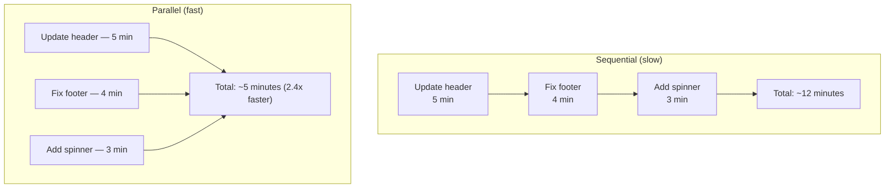

Note: the 2.4x figure assumes the sub-agents dominate total time. If regular tools run before the spawn calls in the same turn (see "Changes to Layer 0" below), the sequential preamble reduces the speedup.

But there's a constraint: each LLM API call is **one request** that produces **one response**. You can't have a single call do three things at once.

**How do you run multiple AI tasks in parallel?**

---

## The Solution: Spawn Independent Agent Loops

The `spawn_agent` tool creates a **new, independent agent loop** — a complete copy of the agent with its own session, its own conversation, its own LLM calls, and its own tool execution. Multiple sub-agents run at the same time.

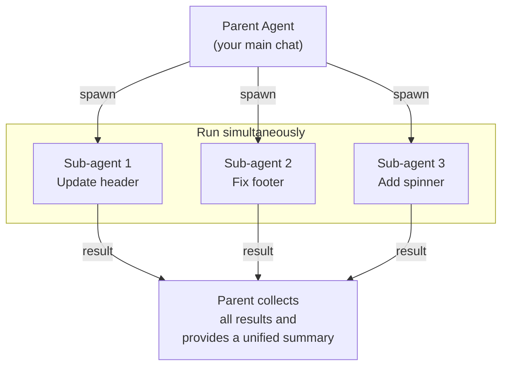

Each sub-agent is a **full agent** with all the same capabilities as the parent — it can read files, write code, run commands, and even spawn its own sub-agents.

---

## The `spawn_agent` Tool: Full Definition

The tool the LLM calls is registered in the tool registry like any other tool, but the agent loop handles it specially instead of routing it through the normal `toolRegistry.execute()` path.

**Parameter schema:**

| Parameter | Type   | Required | Description |
|-----------|--------|----------|-------------|
| `task`    | string | Yes      | The task description that becomes the sub-agent's first user message. |
| `model`   | string | No       | Model identifier to use for the sub-agent (e.g. `"claude-sonnet-4-5"`, `"gpt-4o"`). Must be a value in `ALL_MODEL_IDS`. If omitted or unrecognized, defaults to the parent's model. |

**What an LLM tool call looks like in JSON:**

```json
{
  "type": "tool_use",
  "id": "toolu_01XYZ",
  "name": "spawn_agent",
  "input": {
    "task": "Update the site header: replace the current logo with logo-v2.svg and change the nav font to Inter.",
    "model": "claude-haiku-4-5"
  }
}
```

When the LLM emits multiple `spawn_agent` calls in the same response, all of them run in parallel. The LLM is told in the system prompt that it can (and should) issue multiple `spawn_agent` calls in a single response when the sub-tasks are independent, so it batches them rather than waiting.

**Model fallback behavior:** If the requested model string is not in the known model list (`ALL_MODEL_IDS`), the agent logs a warning and silently falls back to the parent's model. There is no hard error.

---

## Step by Step: How It Works

### Step 1: The LLM Decides to Spawn

The parent LLM sees `spawn_agent` in its tool list (just like any other tool from Layer 1) and decides to use it:

```mermaid
sequenceDiagram
    participant You
    participant Parent as Parent LLM
    participant Loop as Agent Loop

    You ->> Parent: "Update header, fix footer, add spinner"
    Parent ->> Loop: spawn_agent(task="Update header")<br/>spawn_agent(task="Fix footer")<br/>spawn_agent(task="Add spinner")
```

### Step 2: Create Independent Sessions

For each `spawn_agent` call, a new isolated session is created. Here is exactly what happens in code:

```typescript
// agent-loop.ts (simplified)
const subSession = await sessionManager.createSession(
  `Sub: ${task.slice(0, 40)}`,  // title: e.g. "Sub: Update header"
  session.projectPath            // same project directory as parent
)
await sessionManager.updateSession(subSession.id, { parentSessionId: sessionId })
```

The sub-session:
- Has a fresh, empty message history
- Uses the same `projectPath` as the parent (it can read and write the same files)
- Has `parentSessionId` set to the parent session's ID
- Is stored at `.storage/sessions/{subSessionId}/` like any other session
- Does **not** appear in `GET /api/sessions` results, because `listSessions()` skips sessions with `parentSessionId` set

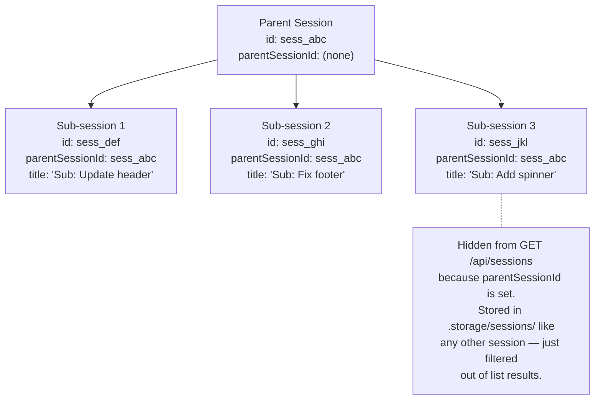

### Step 3: Run in Parallel

Each sub-agent gets its own agent loop (Layer 0), running at the same time:

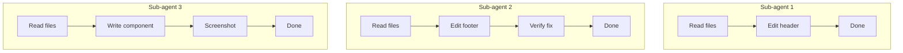

Each sub-agent independently:
- Has its own conversation (the `task` string becomes the first user message)
- Uses the same system prompt as the parent
- Has access to the same tools
- Makes its own LLM API calls

### Step 4: Stream Progress to You via SSE

This is how sub-agent progress reaches the frontend in real time.

The parent's `runAgent()` is an async generator that yields SSE events to the HTTP response. Sub-agents are also `runAgent()` calls. Their events are not sent on a separate channel — they are forwarded through the **same SSE connection** that the frontend opened when it submitted the parent's message.

Sub-agent events carry `toolCallId` (which `spawn_agent` call this event belongs to) and `subSessionId` (which sub-session produced it), so the frontend can route each event to the correct sub-agent card in the UI.

Three event types carry sub-agent progress (full schemas in `docs/backend/ws.md`):

| Event | When emitted | Key fields |
|-------|-------------|-----------|
| `sub-agent-start` | When sub-session is created | `toolCallId`, `subSessionId`, `task` |
| `sub-agent-progress` | For each `text-delta` the sub-agent produces | `toolCallId`, `subSessionId`, `text` (a text delta, not a full string) |
| `sub-agent-done` | When the sub-agent finishes or errors | `toolCallId`, `subSessionId`, `output` (full collected text), `isError` |

Additionally, sub-agent tool calls are forwarded as:
- `sub-agent-tool-start` — sub-agent started a tool
- `sub-agent-tool-input` — sub-agent tool input streamed in
- `sub-agent-tool-result` — sub-agent tool completed

**How attribution works:** Every event from a sub-agent carries both `toolCallId` (the parent's `spawn_agent` tool call ID) and `subSessionId`. The frontend's `useAgent` hook creates a `sub_agent` part on the parent's assistant message keyed by `toolCallId` and routes progress events to that part. Because multiple sub-agents are streaming simultaneously, the frontend may receive events interleaved from different sub-agents; `toolCallId` is how it demultiplexes them.

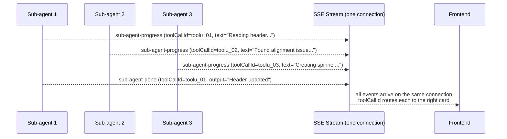

### Step 5: Collect Results

When all sub-agents finish, their collected text output becomes a **tool result** for the parent LLM — the same `tool_result` message shape that any other tool produces (see Layer 1). The parent LLM sees three tool results in its next turn, one per `spawn_agent` call, and uses them to write a unified summary.

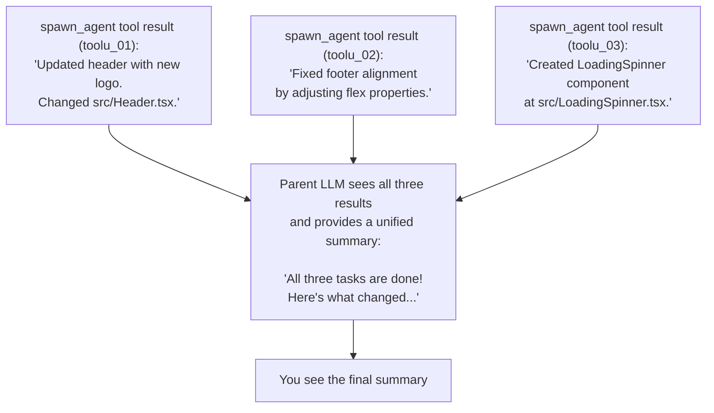

The tool result content is the sub-agent's **collected text output**: the concatenation of all `text-delta` events the sub-agent produced. It is a plain string. The parent LLM does not receive the sub-agent's full conversation history as tool result content — only this summary string.

### Step 6: Embed and Clean Up

After a sub-agent completes, before the sub-session is deleted, its full message history is **embedded** into the parent's assistant message as the `messages` field of the `sub_agent` part:

```typescript
// agent-loop.ts (simplified)
const subMessages = await messageStore.getMessages(subSession.id)

// Strip nested sub-agent messages (see "Nested Sub-agents" below)
const cleanedMessages = subMessages.map(msg => ({
  ...msg,
  parts: msg.parts.map(part =>
    part.type === 'sub_agent' ? { ...part, messages: undefined } : part
  )
}))

subAgentPart.messages = cleanedMessages  // embedded into parent's assistant message
await saveAssistantProgress()            // write parent to disk BEFORE deleting sub-session
await sessionManager.deleteSession(subSession.id)
```

**What "embedded" means concretely:** The parent's assistant message on disk (`.storage/sessions/{parentId}/messages/NNNN-{id}.json`) contains a `parts` array. One entry in that array is the `sub_agent` part. After embedding, `sub_agent.messages` contains the complete `Message[]` array from the sub-session — every user message, assistant message, tool call, and tool result that happened in the sub-session. This is an audit trail; it is not sent back to the parent LLM.

**What the parent LLM sees on its next turn:** The parent LLM sees the tool result string (the collected text output), not the embedded messages. The embedded messages are for human inspection only. On subsequent turns, the parent's conversation history contains the `spawn_agent` tool call and its tool result, just like any other tool.

**Why the parent is saved to disk before deleting the sub-session:** This ordering guarantees that if the application crashes between the embed write and the delete, the data is not lost. The sub-session may become an orphan (see Crash Recovery), but the parent already has the data.

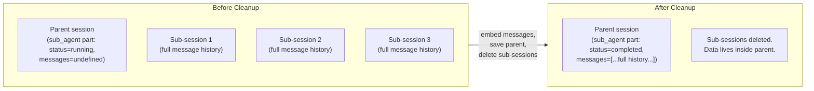

**Nested sub-agent stripping (happens at embed time):** If Sub-agent A spawned its own sub-agents (A1 and A2), A's conversation already contains `sub_agent` parts for A1 and A2. When A's messages are embedded into the parent, each `sub_agent` part's `messages` field is set to `undefined` before writing. This means:

- The parent retains A's own messages (text, tool calls, tool results, sub_agent part metadata including `output`)
- The parent does **not** retain A1's or A2's full conversation histories
- What survives from A1/A2 is the `output` string (the collected text result) stored in A's `sub_agent` part for each of them

This stripping happens at embed time, not before. While A1 and A2 are running, their full histories live in their own sub-sessions. Only when A is embedded into the parent are A1's and A2's histories dropped.

---

## The Complete Flow

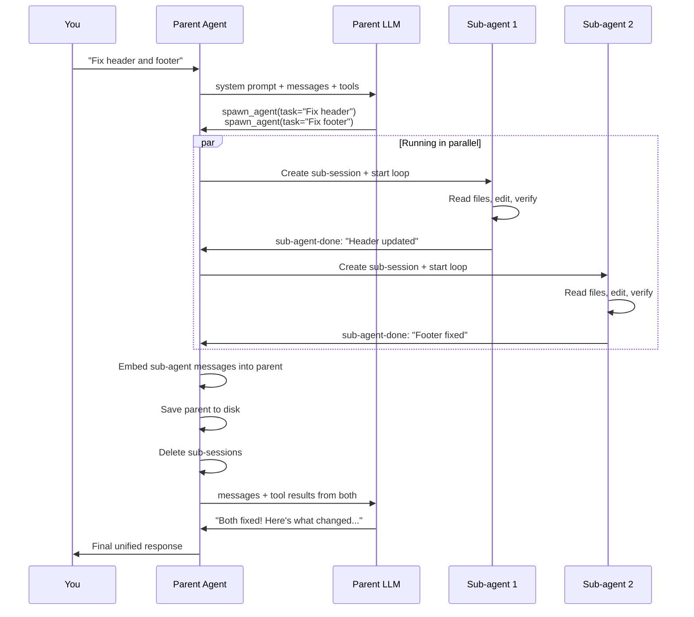

---

## Advanced Features

### Using Different Models

Sub-agents can use **different LLM models** than the parent by passing the `model` parameter to `spawn_agent`. The model string must be a known model ID; invalid values fall back silently to the parent's model.

```json
{
  "name": "spawn_agent",
  "input": {
    "task": "Translate all user-facing strings in src/components/ to French",
    "model": "claude-haiku-4-5"
  }
}
```

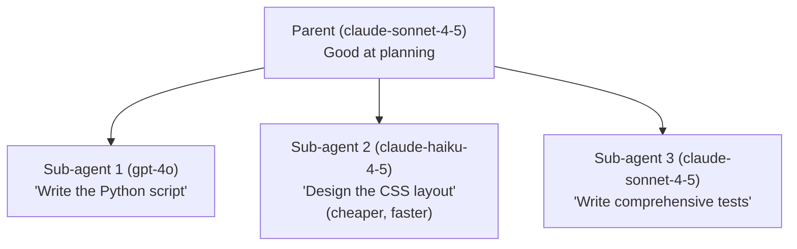

Use cases:
- **Cheaper model** for simple sub-tasks (save money)
- **Faster model** for time-sensitive sub-tasks
- **Specialized model** for certain languages or domains

**System prompt behavior:** Sub-agents receive the same system prompt as the parent, regardless of model. The system prompt is not adapted or regenerated for the target provider. In practice this works because the agent system prompt describes tools and behaviors in natural language, not in provider-specific formats. If you use a model from a different provider (e.g. GPT-4o) that has different tool-use formatting conventions, the LLM adapter in `src/backend/llm/` handles the translation.

**API key management:** Sub-agents use the same credentials as the parent session. There is no per-sub-agent credential override.

### Nested Sub-agents

Sub-agents can spawn their own sub-agents, creating a tree:

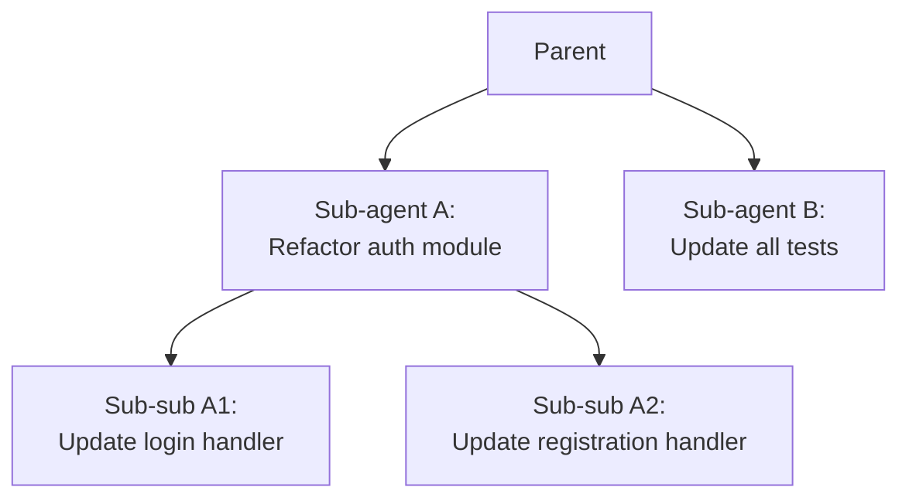

Nested sub-agent messages are **stripped during embedding** (Step 6). When Sub-agent A is embedded into the Parent, only A's own messages remain — A1 and A2's full histories are removed. What survives from A1/A2 is the `output` string stored in A's `sub_agent` part (the collected text result that A saw as A1's tool result). See the Step 6 section for the exact stripping logic.

### Planning Mode Inheritance

**What planning mode is:** Planning mode is a per-message toggle (set by the user in the chat UI) that makes the agent read-only. When planning mode is active, three defense layers apply:

1. File-mutating tools (`write`, `edit`, `multi_edit`) are removed from the tool definitions sent to the LLM — the model never sees them.
2. A `<planning-mode>` block is injected into the system prompt instructing the model not to modify files.
3. If a file-mutating tool call somehow reaches execution (e.g. from a cached conversation), it is blocked at runtime with a `[PLANNING MODE]` message.

**In planning mode, a sub-agent:**
- Can: call `read`, `bash` (for read-only commands), `glob`, `grep`, `search`, and any other non-mutating tool
- Cannot: call `write`, `edit`, or `multi_edit`
- Cannot bypass the restriction by spawning its own sub-agents (see below)

**Why sub-agents inherit it:** `planningMode` is forwarded explicitly when spawning:

```typescript
for await (const subEvent of runAgent(subSession.id, task, subModel, {
  thinkingEnabled: options?.thinkingEnabled,
  planningMode: options?.planningMode  // forwarded from parent
})) {
```

Without this forwarding, a sub-agent would run without planning mode restrictions even when the parent is constrained. Sub-agents also cannot call `spawn_agent` to further escape the restriction because the sub-agent's own `runAgent()` call will also receive `planningMode: true` and apply the same three defense layers.

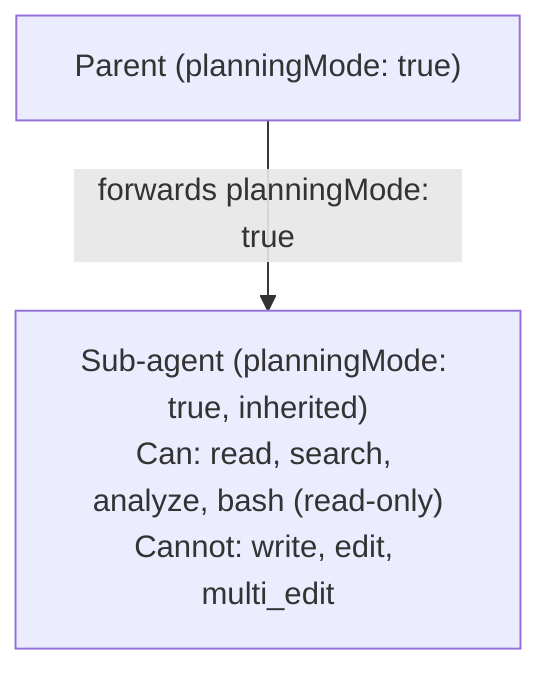

---

## When to Use Sub-agents vs. Sequential

| Scenario | Approach | Why |
|----------|----------|-----|
| Three independent file edits | Sub-agents | No dependencies, parallelism wins |
| Read file, then edit based on contents | Sequential | Step 2 depends on step 1 |
| One simple task | Sequential | Sub-agent overhead not worth it |
| Complex task touching many files | Sub-agents | Break into independent groups |

---

## How This Changes Lower Layers

### Changes to Layer 0 (The Loop)

The loop now handles `spawn_agent` as a **special tool call**. After the LLM response is received and all tool calls are collected, the loop partitions them into two groups:

```typescript
// agent-loop.ts
const spawnAgentCalls = pendingToolCalls.filter(tc => tc.name === 'spawn_agent')
const otherToolCalls  = pendingToolCalls.filter(tc => tc.name !== 'spawn_agent')
```

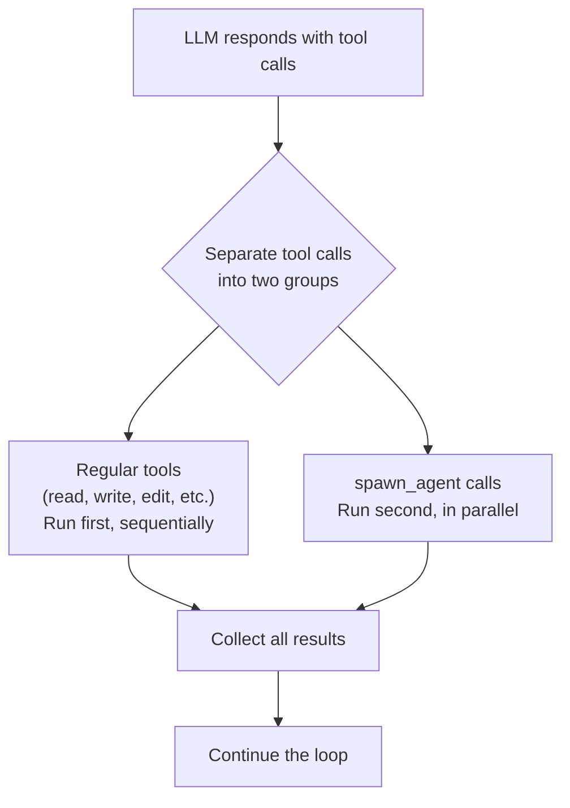

**Why regular tools run first:** The rationale is that a sub-agent might need the result of a regular tool. For example, the LLM might issue `read_file("config.json")` and `spawn_agent(task="...")` in the same response, intending the sub-agent to receive the file contents somehow (via a subsequent turn).

**The trade-off:** If the LLM issues `read_file` and `spawn_agent` in the same response but the sub-agent genuinely does not depend on the file read, the system still waits for the file read to complete before starting the sub-agent. There is no way to annotate a `spawn_agent` call as dependency-free. In practice, well-prompted LLMs issue dependent reads and independent spawns in separate turns, so this rarely adds significant latency.

Source files:
- `src/backend/agent/agent-loop.ts` — special handling for `spawn_agent` (lines 479–892)
- `src/backend/tools/spawn-agent.tool.ts` — tool definition (placeholder execute; real logic in agent loop)

### Changes to Layer 1 (Tools)

`spawn_agent` is registered in the tool registry like any other tool, but its `execute()` function is a placeholder. The agent loop intercepts `spawn_agent` before routing to `toolRegistry.execute()` and handles it directly. This keeps the tool definition (what the LLM sees) separate from the execution logic (what the loop does).

---

## Crash Recovery

**Background — why this is needed:** The normal flow guarantees that sub-sessions are deleted after their messages are embedded into the parent (Step 6). But cleanup runs inside the running process. If the application crashes after sub-sessions are created but before cleanup completes, those sub-sessions become orphans: they exist on disk but the parent's assistant message was never completed, and the sub-sessions were never deleted.

**Terminology:**
- **Orphaned sub-session**: A sub-session whose `parentSessionId` points to a parent that was not cleanly finished. Detectable by scanning `listSessions` and looking for sub-sessions (sessions with `parentSessionId` set) that were not deleted.
- **Sub-agent part stuck in `running` status**: The parent's assistant message may have been partially written to disk with a `sub_agent` part whose `status` is `"running"` — meaning the agent loop was still executing when the process died.
- **"Next load"**: When the Electron app restarts (not just a tab refresh). On startup, the backend can scan for these inconsistencies.

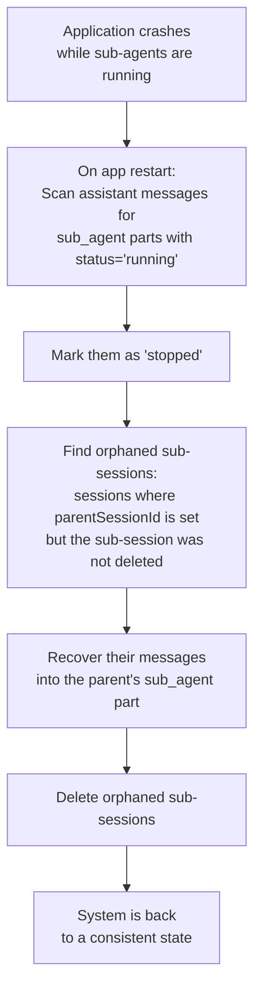

**Why cleanup can fail:** Step 6 saves the parent to disk first, then deletes the sub-session. If the crash happens between the save and the delete, the parent already has the embedded messages and the sub-session is an orphan. If the crash happens before the save, neither the embedding nor the deletion happened. In both cases, crash recovery detects `running` sub-agent parts and re-attempts recovery using whatever sub-session data is still on disk.

---

## The Complete Agent: All Layers Together

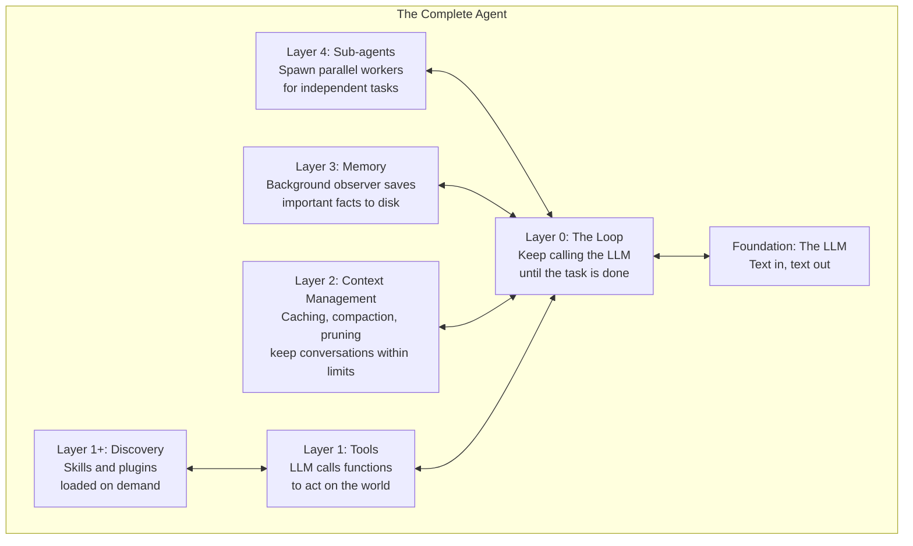

The loop (Layer 0) is the backbone. Everything else plugs into it:
- **Tools** (Layer 1) give the LLM hands
- **Discovery** (Layer 1+) keeps the tool set lean
- **Context Management** (Layer 2) keeps conversations within limits
- **Memory** (Layer 3) preserves important facts across compactions
- **Sub-agents** (Layer 4) enable parallel execution

---

## Key Takeaways

1. **Sub-agents are independent agent loops** — each has its own session, conversation, and LLM stream
2. **They run in parallel** — multiple sub-agents execute simultaneously for faster completion
3. **Events stream in real time via the same SSE connection** — `toolCallId` and `subSessionId` route each event to the correct sub-agent card in the UI
4. **Sub-sessions are hidden by `parentSessionId`** — they are stored like regular sessions but excluded from `listSessions()` results
5. **The parent LLM sees only the tool result string** — the collected sub-agent text output, not the full conversation history
6. **Sub-agent histories are embedded into the parent's `sub_agent` part** — available for audit, not sent back to the LLM
7. **Nested sub-agent histories are stripped at embed time** — only the outermost sub-agent's messages are preserved; deeper histories are removed to prevent unbounded growth
8. **Regular tools run before spawn calls** in the same turn — this is conservative but ensures sequential dependencies can be satisfied
9. **Planning mode is inherited** — sub-agents cannot bypass the read-only restriction
10. **Cleanup is crash-safe** — the parent is saved to disk before sub-sessions are deleted; orphaned sub-sessions can be recovered on restart

---

> **You've completed the guide!** Go back to the [README](./README.md) for the full architecture overview and glossary.
