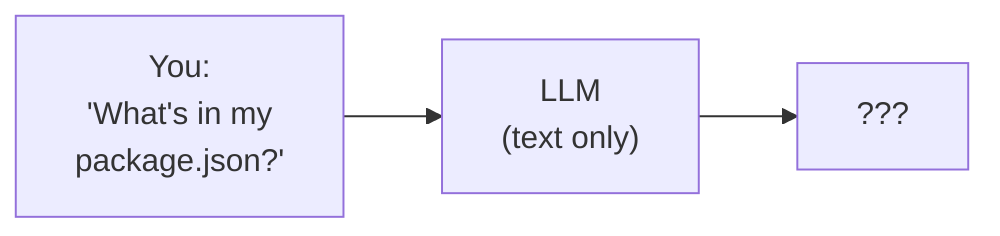
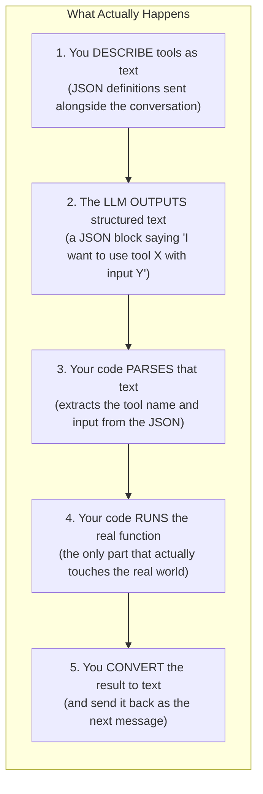
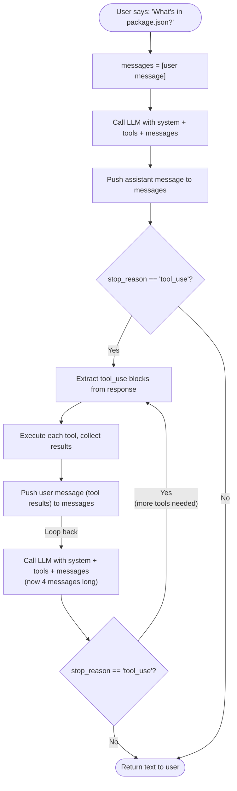
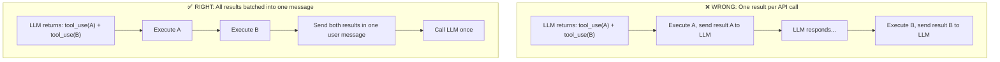
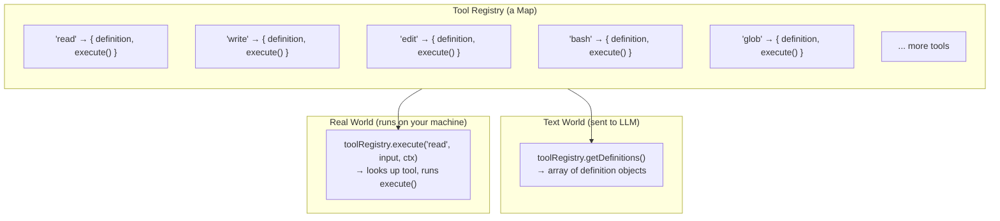
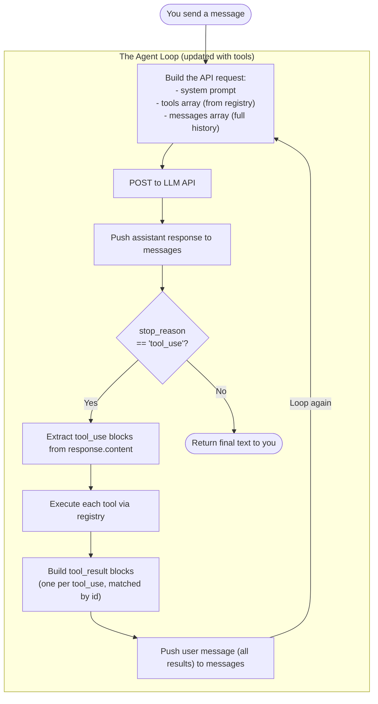

# Layer 1: Tools

> **Prerequisite:** Read [Layer 0: The Loop](./agent-loop.md) first.
>
> **What you know so far:** The agent loop keeps calling the LLM until it stops requesting "actions." The conversation grows each turn. The LLM has no memory — you re-send the entire message list every call.
>
> **What this layer solves:** HOW does the LLM request actions? What do they look like in actual API calls? How does the loop know to execute them? And how do results get back to the LLM?

---

## The Problem

In Layer 0, we said the LLM can "request actions." But we hand-waved over the details. The LLM is a text-in, text-out machine. It can't actually read files or run commands. So how does it tell the loop what to do?



Without a way to act on the real world, the LLM can only say: "I don't have access to your files."

**How do you give a text-only model the ability to act on the real world?**

---

## The Core Principle: It's All Just Text

Before diving into the mechanics, internalize this one idea:

> **Tool calling is not magic. The LLM does not "call" anything. It outputs structured text. Your code reads that text and decides what to do with it.**

Here is what actually happens:



The LLM never leaves its text world. It reads text descriptions of tools, then outputs text that follows a specific JSON format. **Your agent loop is the only thing that actually does anything.** The LLM is just choosing what to do next by writing structured text.

This is the single most important concept in this layer. Everything below is the mechanical detail of how this text flows back and forth.

---

## What the LLM Actually Sees: The Raw API Call

Let's look at what the LLM **literally receives** when you call it with tools. This is the actual HTTP request body sent to the Anthropic API. No abstractions — the real thing.

### Turn 1: You Ask a Question

You send a `POST` request to `https://api.anthropic.com/v1/messages`:

```json
{
  "model": "claude-sonnet-4-20250514",
  "max_tokens": 4096,
  "system": "You are a helpful coding assistant working in the user's project.",

  "tools": [
    {
      "name": "read",
      "description": "Read the contents of a file. The file_path must be relative to the project directory.",
      "input_schema": {
        "type": "object",
        "properties": {
          "file_path": {
            "type": "string",
            "description": "Relative path to the file to read"
          }
        },
        "required": ["file_path"]
      }
    },
    {
      "name": "bash",
      "description": "Execute a shell command and return its output.",
      "input_schema": {
        "type": "object",
        "properties": {
          "command": {
            "type": "string",
            "description": "The shell command to run"
          }
        },
        "required": ["command"]
      }
    }
  ],

  "messages": [
    {
      "role": "user",
      "content": "What's in my package.json?"
    }
  ]
}
```

Three things go in:
1. **`system`** — the system prompt (instructions for the LLM)
2. **`tools`** — the tool definitions (a JSON array describing what tools exist)
3. **`messages`** — the conversation history (just one user message so far)

The `tools` array is **literally text that the LLM reads**. It is not a "plugin system" or a "function registration API." It is structured text that tells the LLM: "Here are things you can ask me to do. If you want to use one, output a JSON block in this specific format."

### Turn 1: The LLM Responds

The API returns:

```json
{
  "id": "msg_01XFDUDYJgAACzvnptvVoYEL",
  "type": "message",
  "role": "assistant",
  "content": [
    {
      "type": "text",
      "text": "I'll read your package.json file."
    },
    {
      "type": "tool_use",
      "id": "toolu_01A09q90qw90lq917835lhds",
      "name": "read",
      "input": {
        "file_path": "package.json"
      }
    }
  ],
  "stop_reason": "tool_use"
}
```

Look at what the LLM did:

1. It produced a `text` block — a plain English sentence.
2. It produced a `tool_use` block — a structured JSON object with a tool name and input.
3. It set `stop_reason` to `"tool_use"` — signaling "I want to use a tool before continuing."

**The `tool_use` block is just text output.** The LLM did not "invoke" the `read` function. It wrote a JSON blob that says: "I'd like you to call `read` with `{ "file_path": "package.json" }` and tell me what you get back." Your loop reads this JSON, runs the actual function, and reports back.

The `id` field (`"toolu_01A09q90qw90lq917835lhds"`) is generated by the LLM. It is a unique identifier for this specific tool call. When you send the result back, you attach this same `id` so the LLM knows which result matches which request. This matters when the LLM makes multiple tool calls in one response (covered below).

### Turn 2: You Send the Tool Result Back

Your loop ran the `read` function, got the file contents, and now sends the result back. Here is the **full request body** for the second API call:

```json
{
  "model": "claude-sonnet-4-20250514",
  "max_tokens": 4096,
  "system": "You are a helpful coding assistant working in the user's project.",

  "tools": [
    { "name": "read", "description": "...", "input_schema": { "..." : "..." } },
    { "name": "bash", "description": "...", "input_schema": { "..." : "..." } }
  ],

  "messages": [
    {
      "role": "user",
      "content": "What's in my package.json?"
    },
    {
      "role": "assistant",
      "content": [
        {
          "type": "text",
          "text": "I'll read your package.json file."
        },
        {
          "type": "tool_use",
          "id": "toolu_01A09q90qw90lq917835lhds",
          "name": "read",
          "input": { "file_path": "package.json" }
        }
      ]
    },
    {
      "role": "user",
      "content": [
        {
          "type": "tool_result",
          "tool_use_id": "toolu_01A09q90qw90lq917835lhds",
          "content": "{\n  \"name\": \"my-app\",\n  \"version\": \"1.0.0\",\n  \"dependencies\": {\n    \"react\": \"^18.2.0\"\n  }\n}"
        }
      ]
    }
  ]
}
```

Notice what happened to `messages`:

1. **Message 1** (`user`): Your original question — unchanged.
2. **Message 2** (`assistant`): The LLM's response from Turn 1 — replayed exactly as it came back. This includes both the text block and the `tool_use` block.
3. **Message 3** (`user`): The tool result. This is new. Your loop created this message. The `tool_use_id` field matches the `id` from the tool call in message 2.

**Why is the tool result in a `user` message?** The Anthropic API enforces strictly alternating roles: `user → assistant → user → assistant → ...`. The LLM's response was an `assistant` message. The next message must be `user`. Tool results are the user's "reply" — your loop is speaking on behalf of the user, saying: "Here's the result of that tool you asked for."

You also resend the **full `tools` array** and the **full `system` prompt** every call. The LLM has no memory. Every API call is a fresh start — the LLM reconstructs its understanding from the entire payload you send.

### Turn 2: The LLM Responds With the Final Answer

```json
{
  "id": "msg_01YBGKjFdqkZ8rT1234abcd",
  "type": "message",
  "role": "assistant",
  "content": [
    {
      "type": "text",
      "text": "Your package.json contains a project called \"my-app\" at version 1.0.0. It has one dependency: React 18.2.0."
    }
  ],
  "stop_reason": "end_turn"
}
```

This time:
- Only a `text` block, no `tool_use`.
- `stop_reason` is `"end_turn"` — the LLM is done.

The loop sees `"end_turn"`, stops looping, and returns the text to the user.

---

## How the LLM Knows How to Call Tools

This is the question everyone asks: "How does the LLM know to output that specific JSON format?"

The answer has two parts.

### Part 1: The API Provider Trains the Model

The LLM was **fine-tuned** (trained on examples) to recognize tool definitions and produce `tool_use` blocks. When Anthropic (or OpenAI, or Google) adds tool-calling support, they train the model on thousands of examples like:

```
Given these tool definitions: [...]
Given this user message: "What's in my package.json?"
The correct output is: a tool_use block with name "read" and input { "file_path": "package.json" }
```

The model learns the pattern: "When I see tool definitions and a user request that could be served by one of those tools, I should output a `tool_use` block with the right name and input."

**You don't teach the model this format.** The API provider already did. Your job is to provide clear tool definitions so the model can make good decisions.

### Part 2: Your Descriptions Guide the Decision

The model decides **which** tool to call by reading the `name` and `description` fields. It decides **what input** to provide by reading the `input_schema` — specifically the `description` fields on each property.

This is why descriptions matter enormously. Compare:

```json
{
  "name": "do_thing",
  "description": "Does a thing",
  "input_schema": {
    "type": "object",
    "properties": {
      "x": { "type": "string", "description": "The input" }
    }
  }
}
```

vs.

```json
{
  "name": "read",
  "description": "Read the contents of a file from disk. Returns the full file content as a string. The file_path must be relative to the project root directory.",
  "input_schema": {
    "type": "object",
    "properties": {
      "file_path": {
        "type": "string",
        "description": "Relative path to the file to read, e.g. 'src/index.ts' or 'package.json'"
      }
    }
  }
}
```

The first one — the LLM has no idea when to use it or what `x` means. The second one — the LLM clearly knows this reads files and that `file_path` should be a relative path.

**Tool definitions are natural-language instructions.** The JSON structure is for the API, but the `description` strings are for the LLM to read and reason about. Write them like you're explaining the tool to a competent colleague.

---

## Implementing the Agent Loop With Tool Calls

Now let's build the loop. We'll start with pseudocode, then show real TypeScript.

### Pseudocode

```
function runAgent(userMessage, tools):
    messages = [{ role: "user", content: userMessage }]

    while true:
        response = callLLM(system, tools, messages)

        // Add the assistant's response to history
        messages.push({ role: "assistant", content: response.content })

        // Check if the LLM wants to use tools
        if response.stop_reason != "tool_use":
            return getTextFromResponse(response)   // Done!

        // Extract all tool_use blocks from the response
        toolCalls = response.content.filter(block => block.type == "tool_use")

        // Execute each tool and collect results
        results = []
        for each call in toolCalls:
            output = executeToolFromRegistry(call.name, call.input)
            results.push({
                type: "tool_result",
                tool_use_id: call.id,
                content: output
            })

        // Send all results back as one user message
        messages.push({ role: "user", content: results })
```

That's the entire loop. Let's trace through it step by step:



### Real TypeScript

Here is a working implementation:

```typescript
interface ToolDefinition {
  name: string
  description: string
  input_schema: Record<string, unknown>
}

interface Tool {
  definition: ToolDefinition
  execute: (input: Record<string, unknown>) => Promise<{ output: string; isError: boolean }>
}

// The tool registry: a map from name → Tool
const toolRegistry = new Map<string, Tool>()

function registerTool(tool: Tool) {
  toolRegistry.set(tool.definition.name, tool)
}

// The agent loop
async function runAgent(userMessage: string): Promise<string> {
  const messages: any[] = [
    { role: "user", content: userMessage }
  ]

  const toolDefinitions = [...toolRegistry.values()].map(t => t.definition)

  while (true) {
    // 1. Call the LLM
    const response = await callAnthropicAPI({
      model: "claude-sonnet-4-20250514",
      max_tokens: 4096,
      system: "You are a helpful coding assistant.",
      tools: toolDefinitions,
      messages: messages,
    })

    // 2. Add the assistant's full response to history
    messages.push({ role: "assistant", content: response.content })

    // 3. If the LLM is done, return the text
    if (response.stop_reason !== "tool_use") {
      const textBlock = response.content.find((b: any) => b.type === "text")
      return textBlock?.text ?? ""
    }

    // 4. Extract all tool_use blocks
    const toolCalls = response.content.filter((b: any) => b.type === "tool_use")

    // 5. Execute each tool and collect results
    const results: any[] = []
    for (const call of toolCalls) {
      const tool = toolRegistry.get(call.name)
      let result: { output: string; isError: boolean }

      if (!tool) {
        result = { output: `Unknown tool: ${call.name}`, isError: true }
      } else {
        try {
          result = await tool.execute(call.input)
        } catch (err) {
          result = { output: `Tool error: ${err}`, isError: true }
        }
      }

      results.push({
        type: "tool_result",
        tool_use_id: call.id,         // Must match the id from the tool_use block
        content: result.output,
        is_error: result.isError,
      })
    }

    // 6. Send all results back as one user message
    messages.push({ role: "user", content: results })

    // Loop continues — next iteration calls the LLM again
  }
}
```

**Key implementation details:**

- **Step 2**: You push the assistant's response as-is to `messages`. This includes both `text` and `tool_use` blocks. You must replay the full response.
- **Step 4**: One response can contain multiple `tool_use` blocks. You extract all of them.
- **Step 5**: Tools execute sequentially in a for-loop. Each result gets the `tool_use_id` that matches the original call's `id`.
- **Step 6**: All results go in **one** `user` message. Not one message per result — one message containing an array of `tool_result` blocks.

---

## A Complete Multi-Turn Example With Real Payloads

Let's trace a realistic scenario: the user says "Fix the build error in my project." This takes 3 turns with 4 tool calls.

### Turn 1 → LLM Requests Two Tools at Once

**Request** (your loop sends this):

```json
{
  "model": "claude-sonnet-4-20250514",
  "system": "You are a helpful coding assistant.",
  "tools": [
    { "name": "read", "description": "Read a file...", "input_schema": { "..." : "..." } },
    { "name": "bash", "description": "Run a shell command...", "input_schema": { "..." : "..." } },
    { "name": "edit", "description": "Edit a file...", "input_schema": { "..." : "..." } }
  ],
  "messages": [
    { "role": "user", "content": "Fix the build error in my project." }
  ]
}
```

**Response** (the LLM returns this):

```json
{
  "role": "assistant",
  "content": [
    {
      "type": "text",
      "text": "Let me check the build output and look at your source code."
    },
    {
      "type": "tool_use",
      "id": "toolu_01_bash",
      "name": "bash",
      "input": { "command": "npm run build 2>&1" }
    },
    {
      "type": "tool_use",
      "id": "toolu_02_read",
      "name": "read",
      "input": { "file_path": "src/App.tsx" }
    }
  ],
  "stop_reason": "tool_use"
}
```

The LLM requested **two tools in one response**. The `content` array has three blocks: one text block and two `tool_use` blocks. Each tool call has its own unique `id`.

**Your loop now:**
1. Pushes this entire response as an `assistant` message to the history.
2. Sees `stop_reason: "tool_use"` → continues looping.
3. Extracts both `tool_use` blocks.
4. Executes `bash("npm run build 2>&1")` → gets the build error output.
5. Executes `read("src/App.tsx")` → gets the file contents.
6. Bundles both results into one `user` message.

### Turn 2 → LLM Sees Results, Makes a Fix

**Request** (your loop sends this — messages now has 3 entries):

```json
{
  "messages": [
    {
      "role": "user",
      "content": "Fix the build error in my project."
    },
    {
      "role": "assistant",
      "content": [
        { "type": "text", "text": "Let me check the build output and look at your source code." },
        { "type": "tool_use", "id": "toolu_01_bash", "name": "bash", "input": { "command": "npm run build 2>&1" } },
        { "type": "tool_use", "id": "toolu_02_read", "name": "read", "input": { "file_path": "src/App.tsx" } }
      ]
    },
    {
      "role": "user",
      "content": [
        {
          "type": "tool_result",
          "tool_use_id": "toolu_01_bash",
          "content": "src/App.tsx(3,10): error TS2307: Cannot find module './Button'."
        },
        {
          "type": "tool_result",
          "tool_use_id": "toolu_02_read",
          "content": "import React from 'react'\nimport { useState } from 'react'\nimport { Button } from './Button'\n\nexport function App() {\n  return <Button label=\"Click me\" />\n}"
        }
      ]
    }
  ]
}
```

Notice the pattern: `user → assistant → user`. The tool results in the third message each carry a `tool_use_id` that ties back to the corresponding `tool_use` block in the second message. This is how the LLM knows which result belongs to which call.

**Response:**

```json
{
  "role": "assistant",
  "content": [
    {
      "type": "text",
      "text": "The build error says it can't find the './Button' module. The file imports from './Button' but that file doesn't exist. Let me create it."
    },
    {
      "type": "tool_use",
      "id": "toolu_03_edit",
      "name": "write",
      "input": {
        "file_path": "src/Button.tsx",
        "content": "import React from 'react'\n\nexport function Button({ label }: { label: string }) {\n  return <button>{label}</button>\n}\n"
      }
    }
  ],
  "stop_reason": "tool_use"
}
```

The LLM reasoned about the error (text block), then requested a write to create the missing file (tool_use block).

### Turn 3 → LLM Verifies the Fix

**Request** (messages now has 5 entries — the conversation keeps growing):

```json
{
  "messages": [
    { "role": "user", "content": "Fix the build error in my project." },
    { "role": "assistant", "content": ["(Turn 1 response — text + 2 tool_use blocks)"] },
    { "role": "user", "content": ["(Turn 1 tool results — 2 tool_result blocks)"] },
    { "role": "assistant", "content": ["(Turn 2 response — text + 1 tool_use block)"] },
    { "role": "user", "content": [
        { "type": "tool_result", "tool_use_id": "toolu_03_edit", "content": "File created: src/Button.tsx" }
      ]
    }
  ]
}
```

**Response:**

```json
{
  "role": "assistant",
  "content": [
    {
      "type": "tool_use",
      "id": "toolu_04_verify",
      "name": "bash",
      "input": { "command": "npm run build 2>&1" }
    }
  ],
  "stop_reason": "tool_use"
}
```

Notice: **no text block this time.** The LLM can respond with only tool calls and no text — or only text and no tool calls — or both. The `content` array is flexible.

Your loop executes the build, it succeeds. Sends the result back.

### Turn 4 → LLM Reports Done

**Response:**

```json
{
  "role": "assistant",
  "content": [
    {
      "type": "text",
      "text": "Fixed! The build error was caused by a missing Button component. I created src/Button.tsx with the Button component that App.tsx was importing."
    }
  ],
  "stop_reason": "end_turn"
}
```

`stop_reason: "end_turn"` — the loop exits. The text is returned to the user.

**Here is the full flow visualized:**

```mermaid
sequenceDiagram
    participant User
    participant Loop as Agent Loop
    participant LLM
    participant Disk as Your Computer

    User ->> Loop: "Fix the build error"

    Note over Loop: Turn 1
    Loop ->> LLM: messages=[user msg] + tools=[read, bash, edit]
    LLM ->> Loop: text + tool_use(bash) + tool_use(read)<br/>stop_reason="tool_use"
    Loop ->> Disk: bash("npm run build")
    Disk ->> Loop: "error TS2307: Cannot find module './Button'"
    Loop ->> Disk: read("src/App.tsx")
    Disk ->> Loop: [file contents]

    Note over Loop: Turn 2
    Loop ->> LLM: messages=[user, assistant, user(2 results)] + tools
    LLM ->> Loop: text + tool_use(write "src/Button.tsx")<br/>stop_reason="tool_use"
    Loop ->> Disk: write("src/Button.tsx", ...)
    Disk ->> Loop: "File created"

    Note over Loop: Turn 3
    Loop ->> LLM: messages=[...5 messages...] + tools
    LLM ->> Loop: tool_use(bash "npm run build")<br/>stop_reason="tool_use"
    Loop ->> Disk: bash("npm run build")
    Disk ->> Loop: "Build successful"

    Note over Loop: Turn 4
    Loop ->> LLM: messages=[...7 messages...] + tools
    LLM ->> Loop: "Fixed! The issue was..."<br/>stop_reason="end_turn"
    Loop ->> User: "Fixed! The issue was..."
```

Each turn, the `messages` array grows by 2 (one assistant message, one user message with tool results). By Turn 4, the LLM is receiving 7 messages plus all tool definitions plus the system prompt — the full conversation history replayed from the start. This is what "the LLM has no memory" means in practice.

---

## The Conversation Shape: Alternating Roles

Here is the exact shape of `messages` after all 4 turns. This pattern is the same for any tool-using conversation:

```
messages[0]  role: "user"       → Your original question
messages[1]  role: "assistant"  → LLM text + tool_use(bash) + tool_use(read)
messages[2]  role: "user"       → tool_result(bash) + tool_result(read)
messages[3]  role: "assistant"  → LLM text + tool_use(write)
messages[4]  role: "user"       → tool_result(write)
messages[5]  role: "assistant"  → tool_use(bash)
messages[6]  role: "user"       → tool_result(bash)
messages[7]  role: "assistant"  → LLM text (final answer)
```

The pattern is always: `user → assistant → user → assistant → ...`

Every `assistant` message is exactly what the LLM returned. Every `user` message after the first one contains `tool_result` blocks that your loop created. The API **requires** this strict alternation — send two `user` messages in a row and you get a 400 error.

---

## Multiple Tool Calls: How and Why

The LLM can return **multiple `tool_use` blocks in one response**. We saw this in Turn 1 of the example above, where it requested `bash` and `read` simultaneously.

### Why does the LLM do this?

The LLM is trying to be efficient. If it needs two pieces of information that are independent (the build output and the source code), it requests both at once instead of waiting for one result before asking for the next. This saves a round-trip.

### How the loop handles it

When the loop extracts `tool_use` blocks from the response, it may find more than one. The implementation is straightforward — execute them one by one in a for-loop and collect all results:

```typescript
// Extract ALL tool_use blocks (there may be 1, 2, or more)
const toolCalls = response.content.filter(b => b.type === "tool_use")

// Execute each one sequentially
const results = []
for (const call of toolCalls) {
  const output = await executeTool(call.name, call.input)
  results.push({
    type: "tool_result",
    tool_use_id: call.id,      // Ties this result to the specific tool_use block
    content: output.text,
    is_error: output.isError,
  })
}

// All results go in ONE user message
messages.push({ role: "user", content: results })
```

### The batching rule

**All tool results from one LLM response go into one user message.** You do not make a separate API call after each tool execution. You wait until all tools have been executed, then send all results at once.



Why? Because the API requires it. Each `tool_use` block in the assistant message must have a corresponding `tool_result` block in the next user message. If you only send one result, the API will reject the request because the other `tool_use` block has no matching result.

---

## The Tool Registry

An agent has many tools (this codebase has 20+). The tool registry is a `Map<string, Tool>` that stores every available tool.

Each entry in the map holds **two distinct things**:

1. **`definition`** (`ToolDefinition`) — the JSON object sent to the LLM. Contains `name`, `description`, and `input_schema`. This is text the LLM reads.

2. **`execute`** — a TypeScript async function that runs when the LLM calls the tool. This is code that runs on your machine.

```typescript
export interface Tool {
  definition: ToolDefinition
  execute: (input: Record<string, unknown>, context: ToolContext) => Promise<ToolResult>
}
```

Here is a complete tool:

```typescript
export const readTool: Tool = {
  definition: {
    name: 'read',
    description: 'Read the contents of a file. The file_path must be relative to the project directory.',
    input_schema: {
      type: 'object',
      properties: {
        file_path: { type: 'string', description: 'Relative path to the file to read' },
        offset: { type: 'number', description: 'Line number to start reading from (1-based). Optional.' },
        limit: { type: 'number', description: 'Number of lines to read. Optional.' }
      },
      required: ['file_path']
    }
  },
  execute: async (input, context) => {
    const filePath = input.file_path as string
    // ... resolves path, reads file, returns contents
    return { output: content, isError: false }
  }
}
```

The separation is the whole point. The `definition` is what the LLM reads (pure text/data). The `execute` is what your computer runs (real code with side effects). They are connected by name, but they live in completely different worlds.



The loop uses the registry in two ways:
- **`getDefinitions()`** — returns all `definition` objects, sent to the LLM on every call
- **`execute(name, input, context)`** — looks up the tool by name and runs its `execute` function

---

## Error Handling: Errors Are Just Data

When a tool fails, the error is returned as the tool result — not thrown as an exception. The loop catches all errors in the registry's `execute` wrapper:

```typescript
async execute(name: string, input: Record<string, unknown>): Promise<ToolResult> {
  const tool = this.tools.get(name)
  if (!tool) {
    return { output: `Unknown tool: ${name}`, isError: true }
  }
  try {
    return await tool.execute(input, context)
  } catch (err) {
    return { output: `Tool error: ${String(err)}`, isError: true }
  }
}
```

The `isError: true` flag becomes `is_error: true` in the `tool_result` block sent to the API. The LLM sees it and adapts:

```mermaid
sequenceDiagram
    participant LLM
    participant Loop as Agent Loop

    LLM ->> Loop: tool_use: bash("npm install nonexistent-pkg")
    Loop ->> Loop: Runs command → fails
    Loop ->> LLM: tool_result (is_error=true):<br/>"npm ERR! 404 Not Found: nonexistent-pkg"

    Note over LLM: Reads the error, reasons about it,<br/>decides to check package.json first

    LLM ->> Loop: tool_use: read("package.json")
    Loop ->> LLM: tool_result: { "dependencies": { "real-pkg": "^1.0" } }
    LLM ->> Loop: tool_use: bash("npm install real-pkg")
    Loop ->> LLM: tool_result: "added 1 package"
    LLM ->> Loop: "Fixed! The package name was wrong."<br/>stop_reason="end_turn"
```

This is one of the most important design principles: **errors become information** that the LLM reasons about, rather than exceptions that crash the program. A crashing tool cannot crash the agent loop.

---

## Input Validation: Trust, But Verify (Or Don't)

The `input_schema` in a tool definition serves two audiences:

1. **For the LLM** — it tells the LLM what fields to provide and what types they should be
2. **For the loop** — it *could* validate what the LLM actually sends before calling `execute`

In practice, most implementations (including this codebase) **trust the LLM** to fill in the input correctly. There is no automatic schema validation before `execute` is called. The tool's `execute` function handles unexpected inputs itself:

```typescript
// The LLM is trusted to send a string. If it doesn't, this will fail gracefully.
const filePath = input.file_path as string
```

Modern LLMs almost always follow the schema correctly. The edge case is hallucinated tool names — when the LLM invents a tool that doesn't exist. The registry handles this by returning an error instead of throwing (shown in the error handling section above).

---

## Security: What Is Actually Implemented

Tools give the LLM real power over your computer. Here is what this codebase implements:

**1. Path traversal prevention** — File tools (`read`, `write`, `edit`) resolve the path and verify it stays within the project root:

```typescript
if (fullPath !== projectRoot && !fullPath.startsWith(projectPrefix)) {
  return { output: 'Error: Path traversal detected', isError: true }
}
```

**2. Planning mode** — Blocks all file-mutating tools. The loop intercepts blocked calls before execution.

**3. Abort signal** — An `AbortController` signal is passed to every tool. Long-running tools (like `bash`) check it to stop early when you click Stop.

**4. Output truncation** — Large tool outputs are truncated before being sent to the LLM to prevent consuming the entire context window.

**5. Error isolation** — All tool execution is wrapped in try/catch. A crashing tool returns an error result, not an exception.

---

## How This Changes Layer 0

The simple loop from Layer 0 now has concrete mechanics:



---

## Key Takeaways

1. **Tool calling is just text.** The LLM outputs structured JSON (`tool_use` blocks). Your code parses that JSON and runs real functions. The LLM never touches the real world directly.

2. **The LLM was trained to produce this format.** The API provider (Anthropic, OpenAI) fine-tuned the model to recognize tool definitions and output `tool_use` blocks. Your descriptions guide *which* tool and *what input* — the format is already learned.

3. **Every API call replays the full conversation.** System prompt, tool definitions, and the entire message history are sent every time. The LLM has no memory between calls.

4. **Tool results go in user messages.** The API requires strictly alternating `user → assistant → user → ...` roles. Tool results are the "user's reply" to the assistant's tool request.

5. **Multiple tool calls → one batched response.** All `tool_use` blocks in one response are executed before the next API call. All results go in one user message, matched by `tool_use_id`.

6. **`stop_reason` drives the loop.** `"tool_use"` means keep going. `"end_turn"` means stop. That's the only decision the loop makes.

7. **Errors are just data.** Tool failures return `{ is_error: true }` with the error text. The LLM reads the error and decides what to do — no exceptions, no crashes.

8. **Two things per tool: definition + execute.** The definition is text for the LLM. The execute function is code for your machine. They're connected by name but live in different worlds.

---

> **Next:** [Layer 1+: Progressive Discovery](./progressive-discovery.md) — What happens when you have too many tools? Sending 100+ definitions every turn wastes tokens and confuses the LLM. How does the registry grow at runtime?
