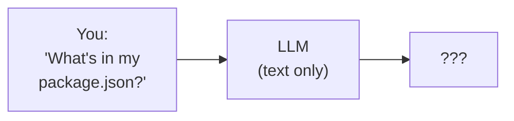
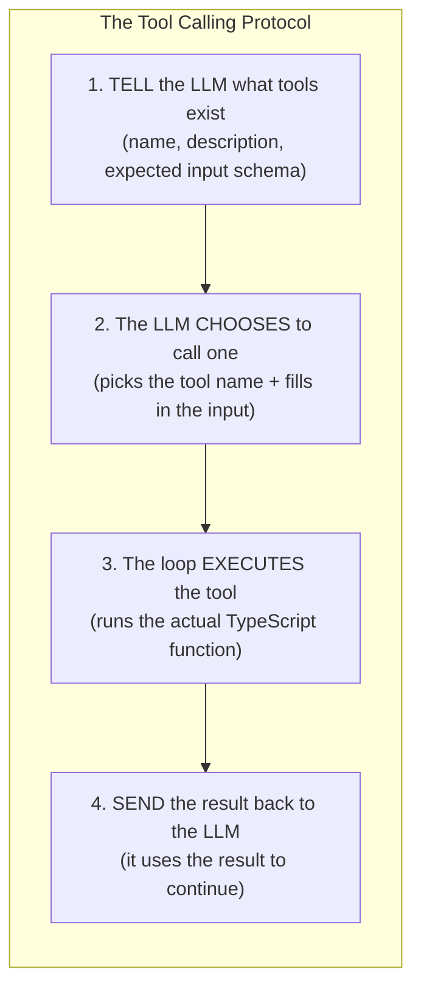
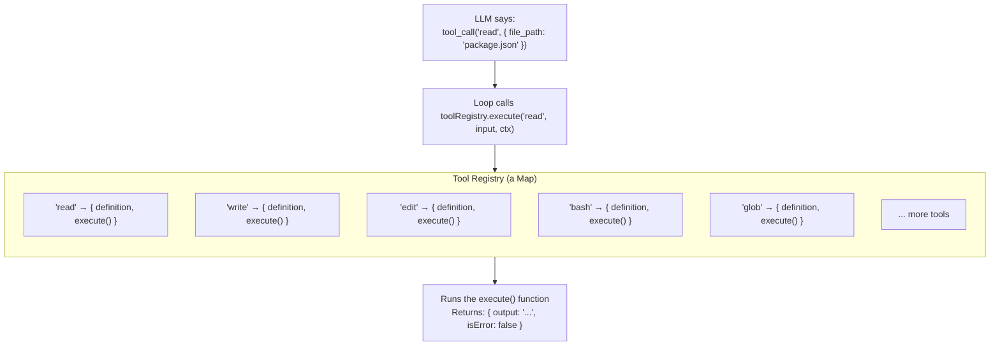
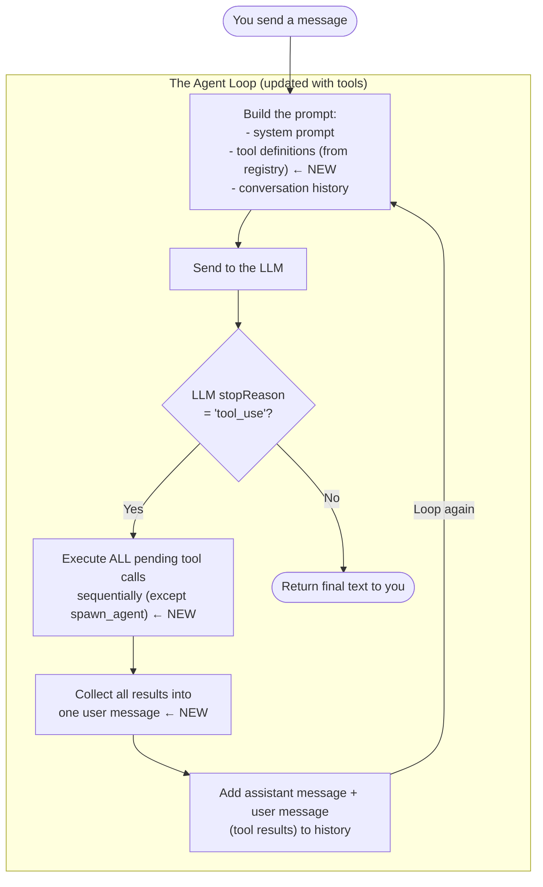
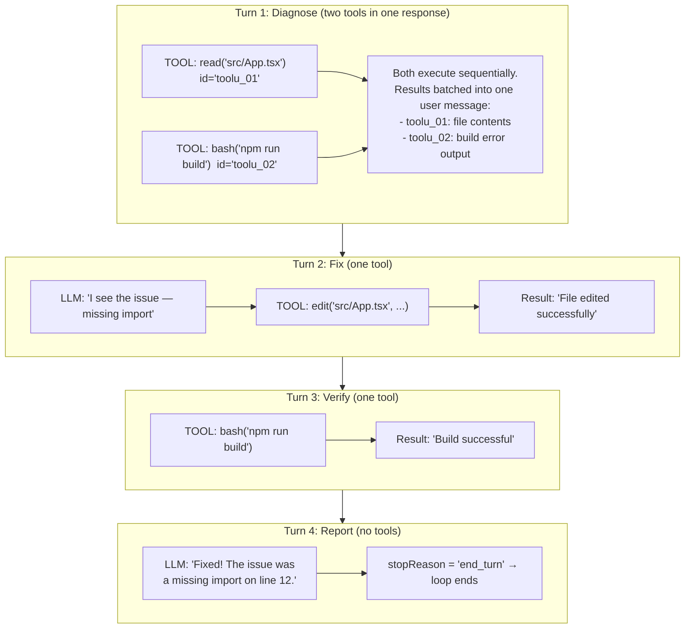
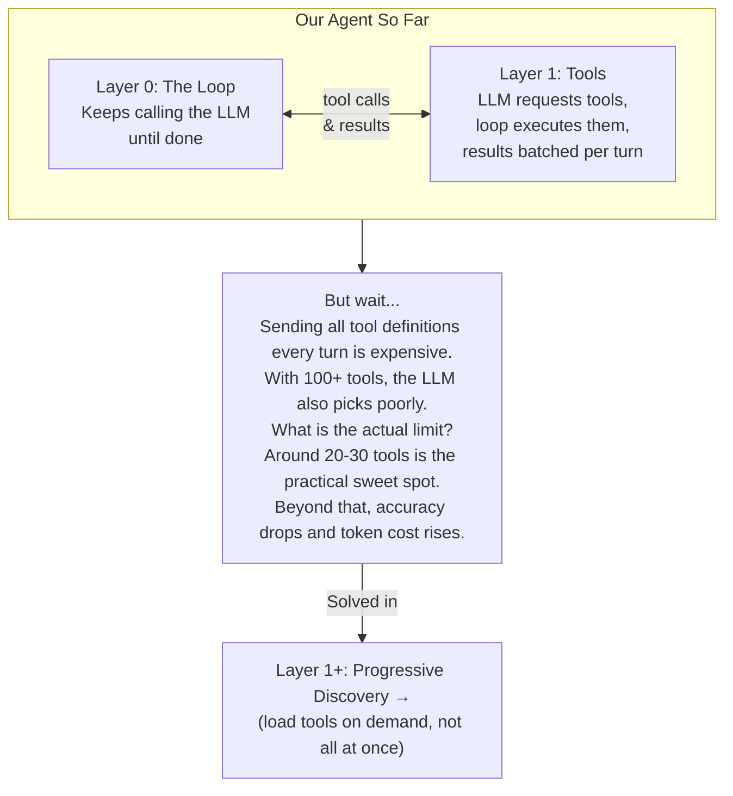

# Layer 1: Tools

> **Prerequisite:** Read [Layer 0: The Loop](./agent-loop.md) first.
>
> **What you know so far:** The agent loop keeps calling the LLM until it stops requesting "actions." The conversation grows each turn. The LLM has no memory — you re-send the entire message list every call.
>
> **What this layer solves:** HOW does the LLM request actions? What do they look like? How does the loop execute them? And how do results get back to the LLM?

---

## The Problem

In Layer 0, we said the LLM can "request actions." But we hand-waved over the details. The LLM is a text-in, text-out machine. It can't actually read files or run commands. So how does it tell the loop what to do?



Without a way to act on the real world, the LLM can only say: "I don't have access to your files."

**How do you give a text-only model the ability to act on the real world?**

---

## The Solution: Tool Calling

Tool calling (also called "function calling") is a protocol — a structured agreement between the LLM and the agent loop. Here's the idea:



Let's walk through each step.

---

### Step 1: Tell the LLM What Tools Exist

When the loop calls the LLM, it sends a list of **tool definitions** alongside the conversation. A tool definition is a JSON object — it tells the LLM what a tool is called, what it does, and what input it expects. Here's what two definitions look like:

```json
{
  "tools": [
    {
      "name": "read",
      "description": "Read the contents of a file. The file_path must be relative to the project directory.",
      "inputSchema": {
        "type": "object",
        "properties": {
          "file_path": {
            "type": "string",
            "description": "Relative path to the file to read"
          },
          "offset": {
            "type": "number",
            "description": "Line number to start reading from (1-based). Optional."
          },
          "limit": {
            "type": "number",
            "description": "Number of lines to read. Optional."
          }
        },
        "required": ["file_path"]
      }
    },
    {
      "name": "bash",
      "description": "Execute a shell command and return its output",
      "inputSchema": {
        "type": "object",
        "properties": {
          "command": {
            "type": "string",
            "description": "The shell command to run"
          }
        },
        "required": ["command"]
      }
    }
  ]
}
```

**Reading the `inputSchema`:** The schema uses [JSON Schema](https://json-schema.org/) — a standard format for describing the shape of JSON objects. The key parts:
- `"type": "object"` — the input is a JSON object (not a string or array)
- `"properties"` — the fields that object can have, each with its own `type` and `description`
- `"required": ["file_path"]` — the loop will pass these fields; the others (`offset`, `limit`) are optional

The LLM reads the `description` fields to understand when to use the tool and what each parameter means. **The description matters a lot** — a vague description means the LLM picks the wrong tool. A precise one means it picks the right one and fills in the right values.

Each tool definition has exactly three fields:

| Field | What It Is | Example |
|-------|-----------|---------|
| `name` | Unique identifier the LLM uses to call the tool | `"read"` |
| `description` | What the tool does — the LLM reads this to decide whether to use it | `"Read the contents of a file..."` |
| `inputSchema` | JSON Schema describing what input the tool expects | `{ type: "object", properties: {...}, required: [...] }` |

---

### Step 2: The LLM Chooses to Call a Tool

Instead of responding with only text, the LLM can include one or more **tool calls** in its response. Each tool call has three fields:

```
LLM response:
  - text: "Let me read your package.json"
  - tool_use: {
      id: "toolu_01ABC",
      name: "read",
      input: { "file_path": "package.json" }
    }
```

The `id` field is generated by the LLM. It is a unique identifier for this specific tool call. Its purpose is to correlate the tool's result back to the right call — which becomes critical when the LLM makes multiple tool calls in the same response (explained in the section below). When you send the result back, you reference this same `id` so the LLM knows which call the result belongs to.

The LLM chose `read` and filled in the path. It's like a function call — the LLM picked the function name and the arguments.

---

### Step 3: The Loop Executes the Tool

The agent loop receives the tool call, looks up the tool in the registry, and runs its `execute` function:

```
execute("read", { file_path: "package.json" })
  --> resolves path within project root
  --> reads the actual file from disk
  --> returns: { output: '{ "name": "my-app", "version": "1.0.0" }', isError: false }
```

This is where the real world gets involved. The loop is the bridge between the LLM's text world and your computer.

---

### Step 4: Send the Result Back

The tool result is added to the conversation and the LLM is called again:

```mermaid
sequenceDiagram
    participant You
    participant Loop as Agent Loop
    participant LLM
    participant Disk as Your Computer

    You ->> Loop: "What's in my package.json?"
    Loop ->> LLM: [tools list] + [your message]
    LLM ->> Loop: "Let me read that"<br/>+ TOOL: read("package.json") id="toolu_01ABC"
    Loop ->> Disk: read("package.json")
    Disk ->> Loop: { "name": "my-app", "version": "1.0.0" }
    Loop ->> LLM: RESULT for toolu_01ABC: { "name": "my-app"... }
    LLM ->> Loop: "Your project is called 'my-app', version 1.0.0"
    Loop ->> You: "Your project is called 'my-app', version 1.0.0"
```

---

## Message Format: Why Tool Results Go in User Messages

This is a technical detail that matters for implementing the loop correctly.

**The Anthropic API requires strictly alternating roles.** Every call must follow the pattern: `user, assistant, user, assistant, ...`. You cannot send two `user` messages in a row or two `assistant` messages in a row. The API will reject the request with a 400 error.

This creates a formatting problem. The agent uses a single internal `Message` object that stores everything from one turn together — the LLM's text, its tool calls, and the tool results. But the API requires the tool results to be in a `user` message, not an `assistant` message.

The message converter (`src/backend/agent/message-converter.ts`) handles this split. It converts the internal storage format to the API format every time the loop calls the LLM:

```
Internal storage (one Message object, role="assistant"):
  parts:
    - { type: "text", text: "Let me read that" }
    - { type: "tool_call", toolCallId: "toolu_01ABC", toolName: "read", input: {...} }
    - { type: "tool_result", toolCallId: "toolu_01ABC", output: "{ name: my-app... }" }

API format (two LLMMessage objects):
  { role: "assistant", content: [
      { type: "text", text: "Let me read that" },
      { type: "tool_use", id: "toolu_01ABC", name: "read", input: {...} }
  ]}
  { role: "user", content: [
      { type: "tool_result", tool_use_id: "toolu_01ABC", content: "{ name: my-app... }" }
  ]}
```

The `tool_use_id` field in the result matches the `id` from the original tool call. That is how the LLM knows which result belongs to which call.

---

## Multi-Tool Batching: Multiple Tool Calls in One Response

The LLM can return **multiple tool calls in a single response**. This is common — for a bug fix task, it might request `read("src/App.tsx")` and `bash("npm run build")` at the same time.

**The loop executes all of them before calling the LLM again.** It does not call the LLM after each individual tool. All results are collected and sent back together in one batch.

Here is what the loop does when it receives multiple tool calls:

```mermaid
sequenceDiagram
    participant Loop as Agent Loop
    participant LLM
    participant Disk

    LLM ->> Loop: TOOL: read("src/App.tsx") id="toolu_01"<br/>TOOL: bash("npm run build") id="toolu_02"

    Note over Loop: Execute all pending tool calls.<br/>Non-spawn_agent tools run sequentially.

    Loop ->> Disk: read("src/App.tsx")
    Disk ->> Loop: [file contents]
    Loop ->> Disk: bash("npm run build")
    Disk ->> Loop: "Error: Cannot find module './Button'"

    Note over Loop: All results collected.<br/>Now call the LLM with both results.

    Loop ->> LLM: RESULT toolu_01: [file contents]<br/>RESULT toolu_02: "Error: Cannot find module './Button'"
    LLM ->> Loop: "I see the issue — missing import..."<br/>TOOL: edit("src/App.tsx", ...)
```

**All results go in one user message.** The API receives a single `user` message containing multiple `tool_result` blocks, one per tool call. The `tool_use_id` on each block tells the LLM which result corresponds to which call.

**Execution order:** Most tools run sequentially, one after another. The one exception is `spawn_agent` — sub-agents run in parallel with each other (but still after all sequential tools complete). See [Layer 4: Sub-Agents](./subagents.md) for details.

**The loop exit condition:** After collecting all tool results, the loop checks the LLM's `stopReason`. If it is `"tool_use"`, the loop continues. If it is anything else (typically `"end_turn"`), the loop stops — even if there was also text in the response. A response can contain both text and tool calls simultaneously; the loop will always execute the tool calls and then decide whether to continue based on `stopReason`.

---

## The Tool Registry

An agent has many tools (this codebase has 20+). The tool registry (`src/backend/tools/registry.ts`) is a `Map<string, Tool>` that stores every available tool.

Each entry in the map holds **two distinct things**:

1. **`definition`** (`ToolDefinition`) — the JSON object sent to the LLM. Contains `name`, `description`, and `inputSchema`. This is what the LLM reads to understand what the tool does.

2. **`execute`** — a TypeScript async function that runs when the LLM calls the tool. This function receives the input the LLM provided and a context object with the session ID, project path, and other runtime information.

Here is the actual `Tool` interface from the code:

```typescript
// src/backend/tools/registry.ts
export interface Tool {
  definition: ToolDefinition   // what gets sent to the LLM (JSON schema)
  execute: (input: Record<string, unknown>, context: ToolContext) => Promise<ToolResult>
  //        ^^^^^^^^^^^^^^^^^^^^^^^^^^^^^^^^^^^^^^^^^^^^^^^^^^^^^^^^^^^^^^^^^^^^^^^^
  //        the live callable that runs on your machine
}
```

And here is a complete tool definition from the codebase (`src/backend/tools/read.tool.ts`):

```typescript
export const readTool: Tool = {
  definition: {
    name: 'read',
    description: 'Read the contents of a file. The file_path must be relative to the project directory.',
    inputSchema: {
      type: 'object',
      properties: {
        file_path: { type: 'string', description: 'Relative path to the file to read' },
        offset: { type: 'number', description: 'Line number to start reading from (1-based). Optional.' },
        limit: { type: 'number', description: 'Number of lines to read. Optional.' }
      },
      required: ['file_path']
    }
  },
  execute: async (input, context) => {
    const filePath = input.file_path as string
    // ... resolves path, reads file, returns contents
    return { output: content, isError: false }
  }
}
```

The loop uses the registry in two ways:

- **`toolRegistry.getDefinitions()`** — returns all `definition` objects, sent to the LLM on every call
- **`toolRegistry.execute(name, input, context)`** — looks up the tool by name and runs its `execute` function



**Who decides which tools the LLM can call?** The loop sends a filtered subset of the registry each turn — not necessarily all registered tools. In the agent loop (`src/backend/agent/agent-loop.ts`), tool definitions are filtered by MCP server and app activation state before being sent to the LLM. At startup with no plugins activated, around 22 core tools are included. The progressive-discovery layer (Layer 1+) explains why the full registry is not always sent and how the LLM can activate additional tools on demand.

---

## Input Validation: Who Validates the Schema?

The `inputSchema` in a tool definition serves two purposes:

1. **For the LLM** — it tells the LLM what fields to provide and what types they should be
2. **For the loop** — it could validate what the LLM actually sends before calling `execute`

In this codebase, the LLM is trusted to fill in the input correctly. There is **no automatic schema validation** run by the loop before `execute` is called. The tool's `execute` function is responsible for handling unexpected or missing inputs gracefully. For example, the `read` tool casts `input.file_path as string` and would fail if the LLM sent the wrong type — but in practice, modern LLMs almost always follow the schema correctly.

If the LLM calls a tool that does not exist in the registry (for example, due to a model hallucination), the registry returns an error result instead of throwing:

```typescript
// From registry.ts
async execute(name, input, context): Promise<ToolResult> {
  const tool = this.tools.get(name)
  if (!tool) {
    return { output: `Unknown tool: ${name}`, isError: true }
  }
  // ...
}
```

---

## How This Changes Layer 0

Remember the simple loop from Layer 0? Now we can fill in the details:



Two things changed from Layer 0:
1. **Tool definitions** from the registry are now part of every prompt
2. **Tool execution** replaces the vague "do the action" step — and all results from one response are batched before the next LLM call

---

## Error Handling: Errors Are Just Data

When a tool fails, the error is returned as the tool result — not thrown as an exception. The loop catches all errors in the registry's `execute` wrapper and returns `{ output: errorMessage, isError: true }`. The LLM sees the error and can decide how to recover:

```mermaid
sequenceDiagram
    participant LLM
    participant Loop as Agent Loop

    LLM ->> Loop: TOOL: bash("npm install")
    Loop ->> Loop: Runs command...<br/>npm ERR! 404 Not Found: some-pkg
    Loop ->> LLM: RESULT (isError=true): "npm ERR! 404 Not Found: some-pkg"
    Note over LLM: "That package name is wrong.<br/>Let me check the correct name in package.json first..."
    LLM ->> Loop: TOOL: read("package.json")
    Loop ->> Loop: Reads file...
    Loop ->> LLM: RESULT: { "dependencies": { "correct-pkg": "^1.0.0" } }
    LLM ->> Loop: TOOL: bash("npm install correct-pkg")
    Loop ->> Loop: Runs command... success!
    Loop ->> LLM: RESULT: "added 1 package"
```

This is one of the most important aspects of the design: **errors become information** that the LLM reasons about, rather than exceptions that crash the program. The `isError: true` flag is passed through to the API as `is_error: true` on the `tool_result` block, which signals to the LLM that the result is an error rather than successful output.

---

## Security: What Is Actually Implemented

Tools give the LLM real power over your computer. Here is what is implemented in this codebase today:

**1. Path traversal prevention (implemented in each file tool)**

The `read`, `write`, and `edit` tools resolve the provided path and check that it stays within the project root before doing anything. If the LLM tries to access `/etc/passwd` or `../../sensitive-file`, the tool returns an error immediately:

```typescript
// From read.tool.ts
if (fullPath !== projectRoot && !fullPath.startsWith(projectPrefix)) {
  return { output: 'Error: Path traversal detected', isError: true }
}
```

**2. Planning mode / read-only mode (implemented in the loop and as a tool)**

Planning mode blocks all file-mutating tools (`write`, `edit`, `multi_edit`). It is activated in two ways: (a) the caller passes `planningMode: true` to `runAgent`, or (b) the LLM calls the `enter_plan_mode` tool during a session. When active, the loop intercepts any blocked tool call before execution and returns a message explaining the restriction:

```typescript
// From agent-loop.ts
if ((options?.planningMode || sessionContext.isInPlanMode(sessionId))
    && FILE_MUTATING_TOOLS.has(tc.name)) {
  return `[PLANNING MODE] Tool "${tc.name}" is blocked in planning mode.`
}
```

The LLM can exit planning mode by calling `exit_plan_mode`.

**3. Abort signal propagation (implemented in the loop and tool context)**

The loop creates an `AbortController` at session start. Its `signal` is passed to every tool in the `ToolContext`. Tools that run long operations (like `bash`) can check `context.abortSignal?.aborted` to stop early. When you click Stop, the abort controller fires and the loop exits cleanly after the current tool finishes.

**4. Tool output truncation (implemented in the loop)**

Large tool outputs are sanitized before being sent to the LLM. The message converter filters out empty image blocks that would cause API errors. Individual tools (like `read`) accept `offset` and `limit` parameters to read files in chunks rather than loading the entire file into the context. This prevents extremely long tool outputs from consuming the entire context window. The context window is a finite limit — if the conversation (including tool results) gets too large, the LLM will not be able to process it. Layer 2 covers how the loop handles context overflow.

**5. Error isolation (implemented in the registry)**

All tool execution is wrapped in a try/catch in `toolRegistry.execute`. An unhandled exception inside a tool's `execute` function is caught and returned as `{ output: "Tool error: ...", isError: true }`. This means a crashing tool cannot crash the agent loop.

---

## Example: Multi-Tool Bug Fix

Here is a realistic example with multiple tools across multiple turns:



Turn 1 demonstrates multi-tool batching. The LLM requested two tools simultaneously. The loop ran them sequentially, collected both results, and sent them back in one user message before calling the LLM again.

---

## Common Tool Categories

The tools registered in this codebase fall into these groups:

### File and Code Tools

| Tool | What It Does |
|------|-------------|
| `read` | Read a file from disk (with optional line range) |
| `write` | Create or overwrite a file |
| `edit` | Make a targeted string replacement in a file |
| `multi_edit` | Apply multiple edits to a file in one call |
| `glob` | Find files by name pattern |
| `grep` | Search file contents with regex |
| `bash` | Execute a shell command |

### Preview / Browser Tools

| Tool | What It Does |
|------|-------------|
| `preview_screenshot` | Capture a screenshot of the preview pane |
| `preview_dom_snapshot` | Get the DOM as text |
| `preview_console_logs` | Read browser console output |
| `preview_interact` | Click, type, or scroll in the preview |
| `preview_network_logs` | Read network request logs |

### Agent Control Tools

| Tool | What It Does |
|------|-------------|
| `ask_question` | Ask you a question and pause the loop until you answer |
| `enter_plan_mode` | Switch to read-only planning mode |
| `exit_plan_mode` | Return from planning mode to normal mode |
| `activate_skill` | Load a skill's instructions into the conversation |
| `activate_app` | Activate an app plugin and register its tools |
| `spawn_agent` | Start a parallel sub-agent (see [Layer 4](./subagents.md)) |

> **Note:** This is the set of tools that ship with this codebase. It is not an exhaustive reference — the registry can be extended, and plugins (activated via `activate_app`) add more tools at runtime.

---

## What We Have So Far



The registry currently supports dynamic addition and removal of tools (`register` / `unregister`). However, the mechanism for doing this mid-session — activating plugins that add new tools while the agent is running — is explained in [Layer 1+: Progressive Discovery](./progressive-discovery.md). If you add a tool to the registry between turns, it will appear in the tool list on the very next LLM call, because `toolRegistry.getDefinitions()` is called fresh at the start of each loop iteration.

---

## Key Takeaways

1. **Tools are the bridge** between the LLM (text only) and the real world (your computer)
2. **Two separate things per tool**: a `definition` (JSON schema sent to the LLM) and an `execute` function (the TypeScript callable that runs locally)
3. **The `id` field** on a tool call is generated by the LLM and used to match results back to calls — critical when multiple tools are called in one response
4. **Multiple tool calls in one response** are all executed before the LLM is called again; all results go in one user message
5. **Tool results go in user messages** because the Anthropic API requires strictly alternating roles — the message converter splits internal storage into the API format
6. **Errors are just data** — tool failures return `{ isError: true }` rather than throwing; the LLM sees the error and adapts
7. **Real security measures** include path traversal checks (per tool), planning mode (blocks writes at the loop level), abort signal propagation (for cancellation), and error isolation (registry catches all exceptions)
8. **The loop does not validate input schema** — the LLM is trusted to fill in inputs correctly; tools cast and handle bad input themselves

---

> **Next:** [Layer 1+: Progressive Discovery](./progressive-discovery.md) — What happens when you have too many tools? How does the registry grow at runtime?
